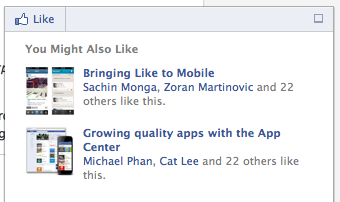

Facebook has launched a new way for you to stalk your friends: a [recommendations bar][1]. When you’re on a popular news site and reading a recently found article in your [newsfeed][2], a box will pop-up showing you recently read articles by your friends.

“As a person reads an article, a small pop-up surfaces at the bottom of the screen highlighting recommended articles and prompting them to like the page. Recommendations are based on content that friends have explicitly liked and shared in your app or website.”

Facebook’s Jeffrey Spehar writes that “In early tests, sites are seeing 3x the click through on the stories it recommends than through the Recommendation Box.” While it is great for the website to make it as sticky as possible, will this new box touch on privacy concerns?

Ed Oswald from PCWorld [voices some of these concerns][3]. “Since there’s no way to control what type of content is shared, except to not share or like it altogether, your personal reading habits will be on display for all your friends. Who knows–what you’re reading might reveal things about yourself that you’re not necessarily willing to share with the world.”

It might be time to keep an eye (pun intended) on what you read in the future, particularly if you are [Facebook friends with your boss][4].

[1]: https://developers.facebook.com/blog/post/2012/07/26/introducing-the-recommendations-bar/
[2]: /about-nfo
[3]: http://www.pcworld.com/article/259925/facebooks_recommendations_bar_a_privacy_concern.html
[4]: http://www.huffingtonpost.com/2012/03/26/facebook-friends-boss_n_1378669.html
