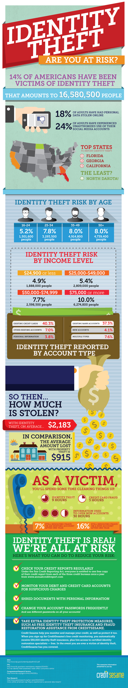

Did you know that 14% of Americans have been the victim of identity theft? Whether from stolen credit cards, bank accounts or personal information, cleaning up the mess with the banks will take hours, not to mention wreaks havoc on your credit score. The easiest way to deal with identity theft is prevention. Check your credit report regularly and monitor your bank accounts and credit cards for suspicious charges. Also, shred documents with your personal information and change your account passwords frequently (and remember to also have different passwords for each account!)

Want to go a step further? Sign up for Credit Sesame’s identity protection. The best part? It’s _free_. They’ve added new identity protection features to their award-winning free service to make your life easier and give you additional peace of mind. For a monthly fee, you can opt for a more complete set of tools to monitor and protect your credit and identity, including unlimited daily credit score updates, a monthly credit report, Social Security Number monitoring and a \$1,000,000 identity theft insurance.

Do you need an infographic to illustrate a segment of your business? We can do that for you! Get in touch at hello@brandgluecom or 307.207.4583.

_Infographic credit: Credit Sesame._

_Full disclosure: Credit Sesame is a client of BrandGlue._
