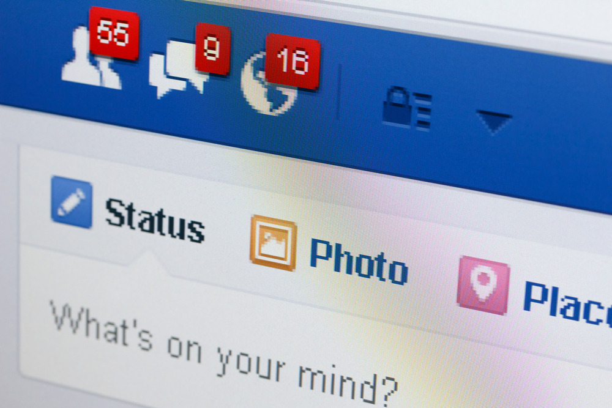

Have you ever thought of a clever post for a certain social outlet, typed it
out, only to find yourself re-writing and crafting it until you get it just
right? If so, it turns out you’re not alone. Most people are familiar with
that gut-check you experience right before hitting the “post/tweet” button,
and it actually is a good thing. It leads to self-censorship (which we all
appreciate the most when it is noticeably missing), and can be the impetus for
creative breakthroughs. According to a [study conducted by researchers at Facebook][1]
who tracked the activity of 3.9 million users over a 17 day period, 71% of users
typed out at least one status they later discarded.

Source: [Self Censorship on Facebook][2]

What’s even more interesting is that, on average, they changed their minds on
4.52 statuses and 3.2 comments. The uncertainty about what to post seemed to
rise in correlation to the uncertainty about the user’s audience. This
probably makes sense of your own experience. Facebook is by far the broadest
social media platform, with the most nebulous audience and farthest reach.

Let me give you an example. A few years ago, I tried to purge my Facebook
friends because I didn’t even recognize some of the names popping up on my
news feed. So I came up with a formula for who would and wouldn’t make the
cut. After much belaboring, I shaved my friend list down to just under 1,000.
That is a very broad audience, especially when you take into consideration
that when I comment on a post, I’m reaching friends of friends, so I am going
to be more more careful about what I say. That is self-censorship. We’ve all
seen the Facebook debates that ensue when this doesn’t happen.

LinkedIn, on the other hand, is a much more focused audience. These are
professional connections so self-censorship is much more simple. This is why
you won’t often find people posting about what they had for dinner on
LinkedIn.

So what is the takeaway here for marketers? The better we know our audience,
the more effectively we can communicate with them. Take the time to understand
your demographic by using analytics to understand who they are, where they are
from, what interests them, and why they connect with your brand. Analytics can
also help you hone your content and zero in on what strikes a chord in them,
what they respond to, and when they are listening. Courtney Seiter of the
Search Engine Journal gives [this advice][3], “To understand your own audience better, try developing [personas][4]. And remember: Just because you don’t always hear from your audience [doesn’t mean they’re not listening][5].”

What are the personas your brand is targeting? Need help identifying them?
Send an email to hello@brandglue.com for a free consultation with our team of experts.

[1]: http://sauvik.me/system/papers/pdfs/000/000/004/original/self-censorship_on_facebook_cameraready.pdf
[2]: http://sauvik.me/system/papers/pdfs/000/000/004/original/self-censorship_on_facebook_cameraready.pdf
[3]: http://www.searchenginejournal.com/7-social-media-psychology-studies-will-make-marketing-smarter/117647/
[4]: http://blog.bufferapp.com/marketing-personas-beginners-guide
[5]: http://blog.bufferapp.com/invisible-audience-social-media
