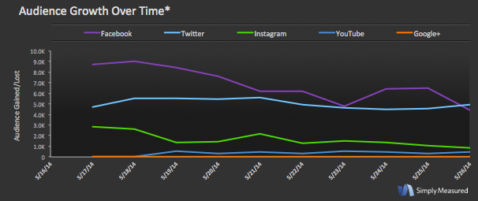
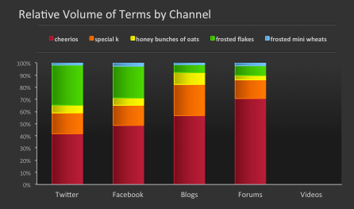

Social media marketers are constantly having to prove their value to the company with measurable results. The problem is that almost everything can be measured now, from audience size and engagement to content type and the best time of day to post. But just because it can be measured doesn’t necessarily mean it should be - so how do you decide what to watch and what to ignore?

Don’t focus on the “vanity metrics” that you think will make you look successful; instead, keep watch on the bigger picture analytics. [Simply Measured shared four kinds of analysis][1] that will help you take a different look at your social channels and look at things in a different way.

### 1. Your posting frequency

Instead of only focusing on which days, or times of the day to post, take a step back and evaluate your posting frequency. Too many times during the day and you will overwhelm (and possibly annoy) your audience. However, posting infrequently may cause them to forget about you.

Trial and error is the best method to find the sweet spot of how much content to share throughout the day or week. Just make sure that you are sharing valuable information and not simply posting just to post.

### 2. Your audience growth across all channels

By looking at audience growth across all your active channels at once, you get a broad and oft-overlooked perspective on how your networks stack up against one another.

You may be surprised by trends or patterns you notice when comparing your growth across a multi-channel graph. Do decreases and upswings on different networks mirror one another, or is there no correlation?

### 3. Relative competitive volume across all channels

It never hurts to keep track with how well your competition is doing in comparison to your own social efforts. An easy way to get an overview of the competition is by measuring key term volumes across multiple channels. Again, it’s important to take a step back and focus on analysis and metrics that give a big picture look at your social efforts and not bits and pieces.

### 4. Your top rebloggers on Tumblr

Tumblr is best known for viral content because the main action users take is reblogging posts from others. If you are active on Tumblr, it’s important to know who is sharing your content most often. The platform easily lends itself to collaboration and cross-promotion. Look out for opportunities to work with your largest brand advocates.

**Are there any analyses that you pay special attention to? How do you translate metrics into value for business-minded executives?**

[1]: http://simplymeasured.com/blog/2014/06/27/4-overlooked-types-of-social-media-analysis/
