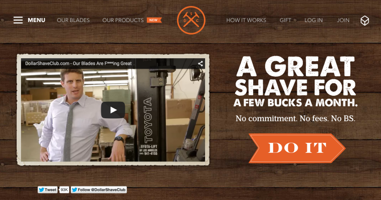
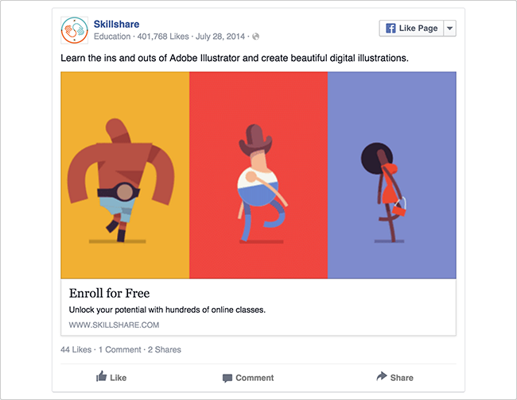
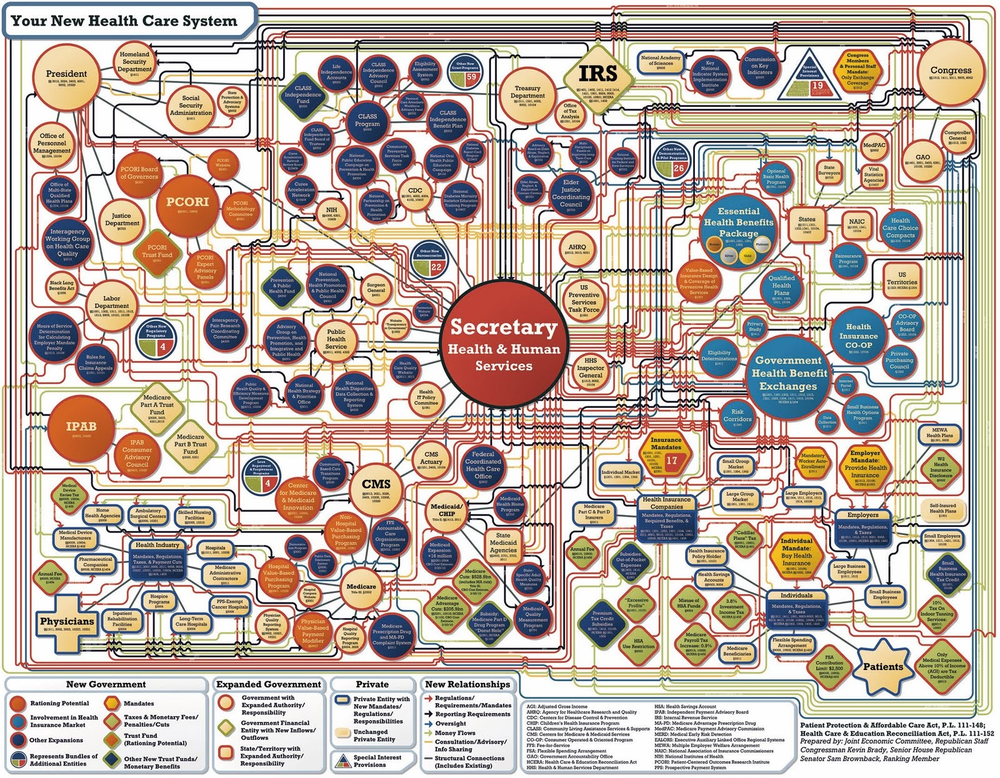
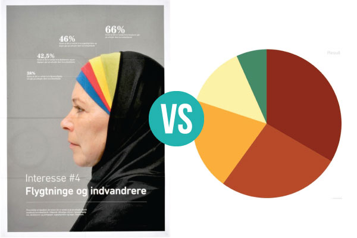
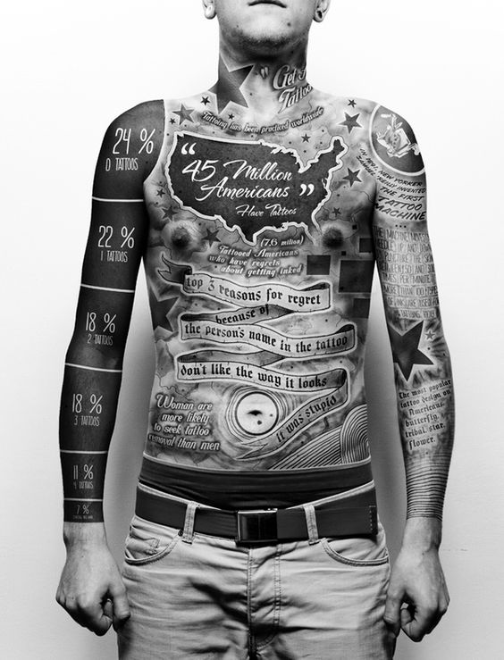

You’ve probably found yourself in the position at one point or another asking yourself, “Do we really need to spend money on graphic design?” Especially when you are thinking about presenting facts, you can’t help but wonder how much of a difference visuals really make.

As a designer, I’m (of course) biased, but here at BrandGlue we don’t just
share our opinions - everything we do is backed by data. Powerful design
can be your brand’s best friend, particularly when it comes to social
advertising. With that said, every brand and audience is unique, so it’s
always a good idea to conduct A/B tests with your own audience.
**The bottom line is: design choices influence audience behavior.**
So in order to connect with your people on the right level, here are 5 things
that you should be thinking about before you create your social ad design:

### 1. Know Your Audience

Who are you speaking to? It’s easy to say, “oh, we need this to be broad and
speak to everyone.” But the reality is, **if you are speaking to everyone, you are speaking to no one.** The design that your grandma responds to vs. your daughter is going to be vastly different. Don’t take the lazy road. Do your research to understand who your audience is for that particular post and craft an ad that fits that niche.

**Exhibit A:** Dollar Shave Club and the Infamous Millennial Audienc

What do we know about Millennials? They have lived through a terrible economy.
They have probably been unemployed or laid off or both. They probably didn’t
get the cushy 9 to 5 job right out of college. They don’t trust easily. They
require “courting” rather than “selling” to buy into a brand. Yet, they still
value locally-sourced, hand-made and quality products. So what did Dollar
Shave Club do? They met their audience where they were at. They knew that
Millennials didn’t want to spend a lot of money, but they still value craft.
So they offered a radical pricing model and reiterated their message over and
over again with their audience. So much so, that they included it in their
name.

As you can see from the ad below, they are hitting the nail on the head with
their ad. It communicates, “Hey, we get you. We know you can’t spend a fortune
on this part of your life. We’ve got your back.” We especially like the
tagline, “No commitments. No fees. No BS.” People (especially Millennials)
resonate with being genuine and authentic. They can see right through you when
your messaging is too “salesy.”

### 2. Know the Context

Secondly, you should be asking yourself where your audience is going to see
this ad. Questions to ask yourself are, is this design going to be posted on
Facebook, Instagram, Twitter, your website, blog, printed publication? Which
audience persona interacts most with that channel? Are you presenting your
design in one graphic or multiple, such as a Facebook album? Is your audience
most likely to view this content on their cellphones or computers?

Once you have the answers to those questions, you use this handy dandy social
media [advertising cheat sheet][1] that will give you the dimensions for your ad on each channel and different devices.

_Skillshare does a good job of creating enticing visuals accompanied by strong call to actions that speak to a very specific audience_

### 3. Translate Your Data into Visuals

You’ve done your research. You have some great statistics. You can’t wait to
share the information with your audience because you know this will help them
succeed. As great as it would be to hand over your entire research report and
believe that readers will excitedly pour over page after page, we all know
that just isn’t going to happen. So it’s up to you to choose which pieces of
information you want your audience to digest. Ask yourself, does this stat
help my audience? Is this what they need to know the most to help their
business succeed? Anybody can make an infographic look pretty, but if it
doesn’t communicate the true nature of the information, it just about as good
as handing someone who is dying of thirst a bucket of mud.

_Here is an example of a bad infographic. This is information overload. Does anybody know what’s going on here_

### 4. Test. Test. Test.

You can follow all of the marketing advice in the world to a T, but at the end
of the day, your audience is a unique group of people who will react
differently to content than the next guy’s audience. So get out there and try
things out! Especially when you have multiple audience personas and social
channels, one of those might react more strongly to your content than others.

If you need some help setting up your A/B test, [VWO has a great article][2]
to get you started.

### 5. Break the Rules (sometimes)

Charts and graphs can be great tools to feature your data, but don’t get stuck
using only traditional means to explain information. Depending on your
audience and content you can venture a little outside the box. Here are a
couple examples that stray away from traditional graphs but still accomplish
the same goal.

_Here is an example of a traditional graph that communicates the same information as the one with the photo. This is an example where it would make sense to go a little outside the box_

Feel free to send me some creative for a free review or [send me an email](mailto:joey@brandglue.com) to
chat about your social and design needs!

[1]: https://www.bannersnack.com/blog/social-media-ad-infographic-2015/
[2]: https://vwo.com/ab-testing/
