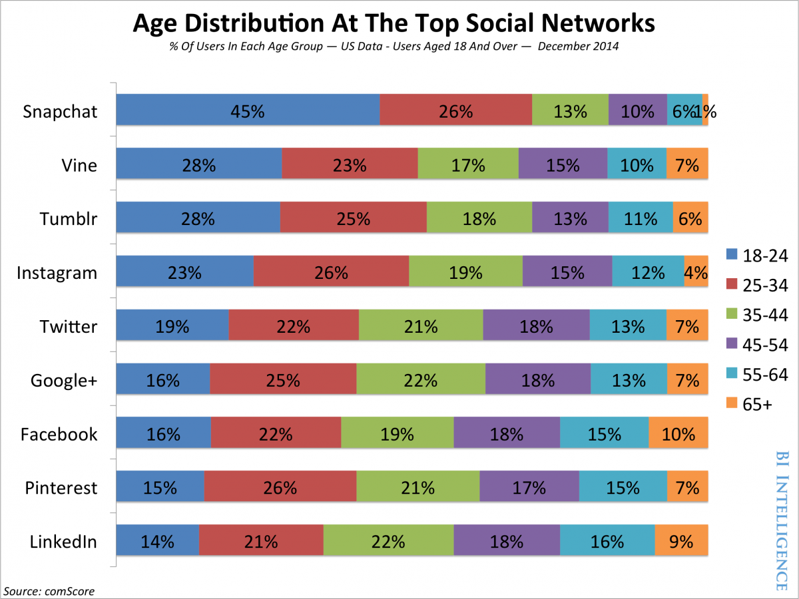
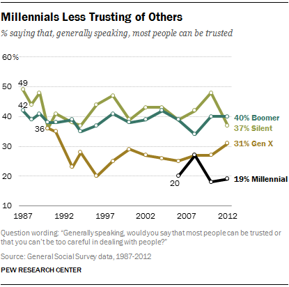

Millennials. That elusive group ranging in age from 18 to 33, soon to become
(yes, the years will fly by!) the B2B buyers and decision-makers of the
future. How will they make those decisions and interact with B2B brands? **While the future is never fully clear, B2B businesses need to prepare**
**_now_** **for a future of Millennial buyers.** This includes adapting your social media marketing strategy. Below I list out 3 tips that will help you position your B2B social efforts for success. I used a recent Pew Research Center study,
[Millennials in Adulthood][1], to help inform these tips.

### Be Adaptable

Millennials are part of a generation that grew up with social media. Not only
did they grow up with it, but they’ve lived through the launch, growth, peak,
and demise of social outlets (think MySpace). They are “digital natives” and
the most avid users of social media of any previous generation.

With this in mind, it’s critical to not put your B2B social media strategy
into too much of a box. It’s easy to think, “Oh well the [average age of Snapchat users is 18-24][2], they’re not my B2B decision-makers”. But, as I’ve already emphasized, those
Snapchatters will grow up and be the workforce of the future. You need to make
sure you are thinking critically about your social strategy and are willing to
be adaptable and adopt new social outlets that will set you up for success in
the future. Claim, for example, your Snapchat handle. Sure, you might not use
it in the future-but what if you do? What if you’re kicking yourself in
ten years as you shell out five grand to pay to acquire it? Be adaptable and
embrace the constant changes in the social media landscape. You can thank me
in the future.

[][3]

### Be Diverse

We all know we need to make sure our social imagery (and product imagery,
website imagery, email marketing imagery...you get the idea) needs to be
diverse, showcasing a variety of ethnicities and (brand audience appropriate)
images. This will become all the more true as the Millennial generation ages
and becomes your future buyers. 43% of Millennial adults are non-white, the
highest of any generation. Given that they also value authenticity, your
social marketing imagery needs to go beyond the classic Shutterstock images.

By 2043, the U.S. Census Bureau is estimating that most of the U.S. population
will be non-white. That can feel like a long way off, but we all know how
quickly time passes. Get your Design team and designers on board (or reach out
to our Design team [here][4]). Edit and adapt your B2B campaigns and imagery. You might say, “Oh we are
already doing this”. Great! Do more of it.

[][5]

### Be Trustful

Millennials are the most untrusting generation. When asked, “Generally
speaking, would you say that most people can be trusted or that you can’t be
too careful when dealing with people?”, only 19% of Millennials said that most
people can be trusted. Think it’s hard _now_ to get people to trust a brand? It’s only going to get harder.

While they have trust issues, 49% of Millennials say that the future of the
U.S. is bright and it’s best years are ahead. Tap into that optimism and hope.
Work _now_ to build a brand that people can trust for generations. Make a claim on social media? Back it up with real, accurate data. Promise to provide great customer service? Deliver day in and day out on that promise. Make a big social media faux pas? Apologize with grace and authenticity. Sell B2B products that work so you can run social ads around those products that drive results, not negativity and mistrust.

[][7]

These 3 tips are a great start as you think critically about the future and
setting your social efforts up for success. Have more tips to add? Let us know!

Here at BrandGlue, we’ve had the privilege of working with a wide variety of
B2B brands, helping them optimize their social media strategy and efforts to
capture their audience, [drive leads][8], and help retain current customers through helpful content. If you’re
struggling to have a vision for how to setup your B2B social efforts for
success for the future, shoot us an email at [hello@brandglue.com][9]. We’d love to assist you!

[1]: http://www.pewsocialtrends.org/2014/03/07/millennials-in-adulthood/
[2]: http://www.businessinsider.com/update-a-breakdown-of-the-demographics-for-each-of-the-different-social-networks-2015-6
[3]: /wp-content/uploads/2016/05/body1.png
[4]: /free-assessment
[5]: /wp-content/uploads/2016/05/body2.jpg
[6]: http://giphy.com/gifs/portlandia-9qlG9iHtTIaje
[7]: /wp-content/uploads/2016/05/body3.png
[8]: /portfolio/pgi
[9]: mailto:hello@brandglue.com
