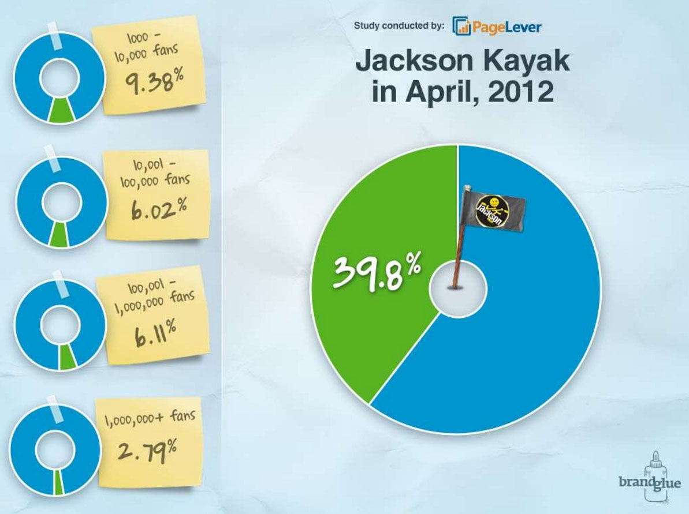

If you’re a social media junkie or marketer, you’ve probably heard the term “newsfeed optimization” (NFO). The term refers to the practice of trying to gain a visibility advantage in Facebook’s newsfeed, which launched nearly 10 years ago. In fact, the team at BrandGlue owes much of our early success as a social media agency to the newsfeed. The newsfeed is controlled by an algorithm commonly referred to as [EdgeRank][1].

We were one of the first firms to effectively reverse engineer the algorithm and provide our clients with a set of best practices to make sure their content got seen by their fans.

[][2]

As Facebook has evolved over the years, so has our list of best practices.
Eventually, NFO started to fade from social media marketers vocabularies. But
why? Is NFO dead? Is it no longer important to understand EdgeRank and how it
works? Before we start to explore that question, let’s quickly define
EdgeRank.

There are three main components to EdgeRank:

1. **Affinity:** This component directly corresponds to each user's affinity to an object on Facebook. That object can be a friend, a business page, or a Facebook features such as check-ins or Facebook LIVE.

2. **Edge (or weight):** The edge component has to do with the weight that
   is assigned to each object. This is something that Facebook adjusts more
   than any other component. Currently, video is one of the most highly
   weighted objects on Facebook. Previously it was photos. They will tweak this
   when they launch a new feature, making sure users see that features in their
   newsfeeds.

3. **Time Decay:** This simply has to do with the amount of time each set of
   content lasts in the newsfeed. In other words, it determines how long it
   takes until a post or story stops dispensing impressions in the newsfeed.

### The ‘Heyday’ of NFO

When the newsfeed first launched, there wasn’t near as much saturation as
there is today. It’s also important to note that Facebook had yet to develop
their ads platform. This meant that there was a lot of opportunity and space
in the newsfeed. The average page could typically reach anywhere from 7-13% of
their fans on each post without using any best practices and NFO techniques.
During this period, we were able to make incredible gains for our clients by
using little known (at the time) NFO techniques. The best part was, we didn’t
spend a dime in paid media. In just 4 short months we helped the world's
largest whitewater kayak manufacturer, [Jackson Kayak][3], increase their engagement by 300% and [double their visibility][4].

We also helped the Washington Redskins become the most engaged Facebook
fanbase in the NFL during a 4-12 season. We were able to replicate this
success for most of our clients. But over the years, as Facebook experienced
explosive user growth and became a public company, things started to change
and organic success became harder to obtain.

[][5]

### The Current State of NFO

It is certainly true that increasing the percentage of impressions thru NFO
techniques is much more difficult. Generally, the average Facebook page today
reaches around 2-3% of their fans. This decline in numbers lead to eye
catching headlines such as [‘EdgeRank is Dead’][6]. You can still move the needle a few percentage points by employing best practices, however, is that really worth the time and effort? Ultimately, each brand has to decide for themselves.

### So is NFO Dead?

The short answer is no. There is still an algorithm that dictates what is
shown in your newsfeed. There are still 3 main components (see above) that
have become more and more complex over time as Facebook has evolved. You can
still make an organic impact, however your expectation should be that you
won’t be able to grow your visibility by leaps and bounds as you once could.
So if your fan page doesn’t have 5 million fans, do you even need to spend
time learning this stuff?

### Why it is still important to understand EdgeRank and NFO

While many marketers have become very discouraged by poor organic results in
the newsfeed, they might be missing the bigger picture. Facebook is no longer
free. If you want to break through the noise, you have to dedicate an
advertising budget to your efforts. What marketers often forget, or simply
don’t understand, is that the algorithm plays a large role in your paid
efforts. If you set up your ads with a decent understanding of EdgeRank, it
will consistently lead to higher CTRs, which in turn leads to lower CPCs and
CPEs. Many of the core NFO best practices still apply and you must employ them
to make sure you are making the most of every penny you spend on Facebook. At
the end of the day, it still all starts with content, folks. Make sure you
write your copy to your audience, design [ads that stand out][7] and take advantage of [video][8]. Taking a holistic approach is key, and if you are spending money on
Facebook, NFO still needs to be a part of your strategy.

Not sure where you are at? Looking for help running ads on Facebook? Don’t
hesitate to [contact us][9]. We’d be happy to give you a quick assessment.

[1]: https://en.wikipedia.org/wiki/EdgeRank
[2]: /wp-content/uploads/2016/06/blog-06-07-2016-Newsfeedoptimizationdead.jpg
[3]: http://jacksonkayak.com/
[4]: http://www.socialmediaexaminer.com/master-facebook-edgerank/
[5]: /wp-content/uploads/2016/06/blog-06-07-2016-Newsfeedoptimizationdead2.jpg
[6]: http://marketingland.com/edgerank-is-dead-facebooks-news-feed-algorithm-now-has-close-to-100k-weight-factors-55908
[7]: /blog/social-media-tips/5-design-must-haves-before-creating-your-social-ad
[8]: /blog/social-media-tips/5-creative-video-ideas-for-social-media
[9]: /free-assessment
