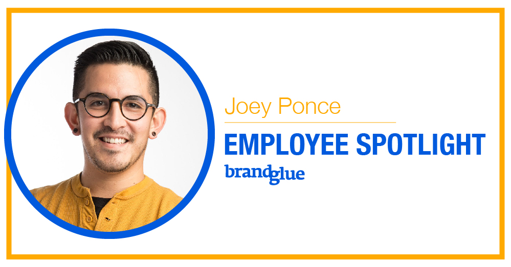

As promised, it’s time to highlight the next BrandGlue team member in our employee spotlight blog series. This week, I’m honored to showcase our awesome Creative Director, Joey Ponce. Joey is the mastermind and head honcho behind all of the graphics, video and animations that BrandGlue produces for our clients. He’s an amazing brainstorming partner with a keen eye for what will resonate with target audiences. His innovative, artistic vision has proved successful time and time again.

With more than 10 years of graphic design expertise, we’ve loved having Joey on the BrandGlue team the past 5 years. Check out his Q&A below to learn a little bit more about Joey and his approach to social media design.

1. **What's your favorite thing about designing social media content for brands?**

   Designing for different brands’ social media is a great exercise in versatility and attention to detail. Many of the brands we work with have worked hard to establish their visual identity and voice, so we do our due diligence in being a seamless extension of that in a very volatile space. In social media, new offerings and trends happen daily, and our clients depend on us to keep a pulse on those changes, as well as keep them relevant and consistent at the same time. This constant “keeping up” makes my job and the work my team does exciting and fulfilling, especially when we can keep our clients’ audiences engaged with relevant, fresh content.

2. **Where do you see social media headed in the future?**

   The future of social media is bound to be an exciting and influential one. The impact that social media has had in our current social, economic and political spheres are no longer able to be dismissed as “millennials walking around with their faces in their phones.” I believe that, as with any large-scale movement, there will be a rebound. We are already seeing this—people want to connect socially offline and re-engage in meaningful, authentic relationships. I believe we will see more social media activations happening at events, in-person and in our daily routines. Users of social media will likely want to take control of their information, data and privacy, thus we will likely see pushes for more transparency and more authenticity from social media’s biggest players.

3. **What's one thing you love about BrandGlue?**

   The thing I enjoy most about working at BrandGlue is my ability to stay informed and up-to-date with the innovations and influences of social media. I’m surrounded by people who each find themselves fascinated with the constant changes in this space, and keep one another informed on new trends, new platforms, and new offerings in a world that touches more and more people daily. It’s great to be informed by friends and co-workers who are truly curious about the world of social media.

4. **Have any WFH (work from home) tips, since we are a fully remote team?**

   My biggest advice for anyone who ventures into the world of fully-remote working is to maintain your relationships with those around you. It’s very easy to focus 100% on your work and creating an “office environment” for yourself, but the important thing to remember is that there is still a whole world right outside your window. Keep yourself active, get outside and take breaks. In a remote working environment, remember that you can trust your co-workers, and they can trust you too, so don’t be so hard on yourself and go on a walk every now and again.

5. **What's a current hobby, book you're reading, or podcast you're listening to that you'd recommend?**

   An ongoing hobby for me has been studying ceramics. I teach a couple of classes at a local clay center and spend nights and weekends working on my own projects. Getting away from the screens in my life, and getting my hands on a skill that takes the majority of my mental energy provides me with a good balance. It’s my opportunity to learn new skills that are very physical and also spend time teaching others to enjoy it as much as I do.

_Did you miss our last employee spotlight blog featuring our newest team member, Rai Masuda? [Check it out!](/blog/brandglue-employee-spotlight-rai-masuda)_
