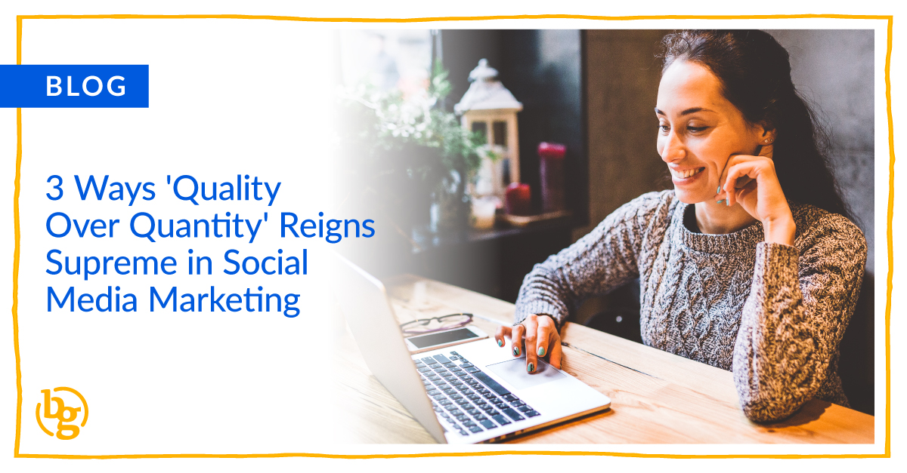

It’s no secret that organic reach has declined across all social platforms over recent years. Common sense would tell you that a simple way to combat that fact is to simply post more often. However, doing so can actually hinder your page’s performance.

Here are three ways that social media managers should embrace quality over quantity when [planning their content][1] calendars.

### Algorithmic Favorability

All of the major social channels favor engagement as a [ranking factor][2] when deciding which content to show in a user’s newsfeed. If a page posts too often and does not get quality engagement on their posts, otherwise known as “audience fatigue,” the platform will pick up on that signal and may actually _decrease_ your organic reach as a result.

### Audience Relevancy

Not every piece of content works on every channel and not every update needs to be posted on every channel. For example, your Instagram audience may be more aligned with humorous content, whereas Twitter users may crave technical updates. Don’t use a blanket approach when deciding where to post your content.

Facebook, Instagram, and LinkedIn’s algorithms aren’t time-based, meaning that if a certain piece of content that was posted several days ago receives more engagement or engagement that is more relevant to a specific user (ex. their friends commented on it), then it is completely possible that they can see the post several days after it was originally made.

For this reason, I try to recommend that our clients steer away from posting several updates about a similar piece of content in a short timeframe because you never quite know when fans and followers will actually see the content. If your post includes time-specific words such as “tomorrow” or “next week,” that may or may not be the case when the content is actually viewed.

Instead, try focusing on one or two strong and [highly-engaging posts][3] that can trigger the algorithm to expand your reach.

### Amplify and Personalize Through Paid

You might be wondering how you’re supposed to reach all facets of your audience if you’re not supposed to post too often. Well, that’s the beauty of paid social. Boosting your content, or even creating custom campaigns based on your target audiences, will help ensure your message is seen by the more relevant users. It will be more personalized, and therefore, should return better results.

The next time you’re considering your social calendar, or perhaps are facing pressure from other team members to post more often, remember these tips to help ensure you’re giving your audience the highest quality content possible - and that you, in return, are seeing the best results on social.

[1]: https://brandglue.com/blog/12-step-social-media-marketing-checklist-for-daily-weekly-monthly-and-quarterly-efforts
[2]: https://brandglue.com/blog/6-tips-on-how-to-work-with-social-platform-algorithms-to-maximize-post-performance
[3]: https://brandglue.com/blog/how-to-get-maximum-engagement-with-facebook-videos
