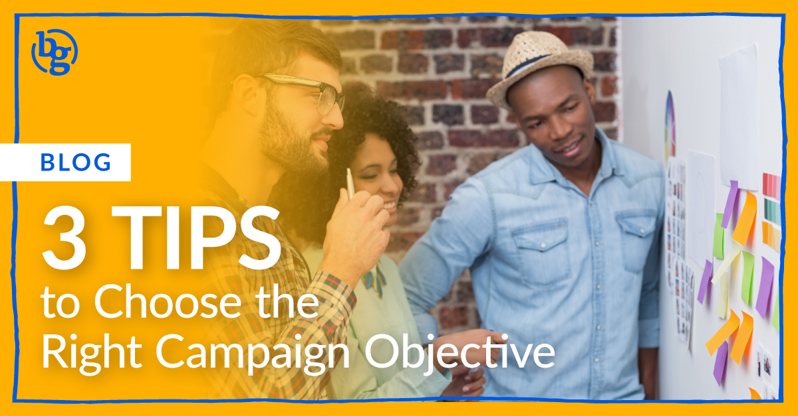

With Facebook now offering more than 11 [different campaign objectives][1], and LinkedIn recently adding [more objectives][2] to their advertising dashboard, it can sometimes be tricky to know which one will make your campaign the most successful.

Before jumping right into the ad dashboard to begin building your campaign, consider taking a step back and thinking about your budget and goals as this will help you determine your approach. Here are 3 tips to help you determine the right campaign objective.

### Determine Your Audience

How familiar are they with the project or brand? Is it a big audience or a small audience? Are they likely to buy soon, or do they need more nurturing before making a purchase or conversion? Generally speaking, you want to use high-level objectives like brand awareness, video views, or traffic for audiences who are still learning about your brand and lower-funnel objectives like App Installs, Lead Generation, or Purchase for people who are already familiar with your brand.

Sometimes, the right objective can be driven by content as well. Have a super engaging graphic you need some external-facing vanity metrics on? Drive likes, comments, and shares with an Engagement objective. Or what about that amazing video your team just produced? Make sure it gets watched with a Thruplay objective. With both of these features, you can also capture the audience of people who engaged with your post or watched your video and then retarget them in a future campaign. [Dynamic ads][3] are also a great way to test various creative options to your audiences.

### Know Your KPIs

Generally, there will be an overarching goal for your brand or campaign. Sometimes it’s a broad goal like generating awareness or driving traffic to the website, and other times it’s a focused goal like getting more purchases or conversions. Knowing exactly what the expectation is for driving certain KPIs will help determine where to focus your ad dollars most.

### Consider Going Full-Funnel

If you’re lucky enough to have a fairly generous budget, often your best bet is to take a “full-funnel” approach. What does that mean? Well, basically, it means allocating your budget across the entire purchase funnel from top to bottom, or from awareness to purchase. To properly do this, build broad audiences based on demographic information with ads tailored to introducing new people to your brand or product for the first time. Then, follow up with a traffic ad that highlights key benefits to drive website visits and get them more familiar with your business. And finally, once they have had the time to fully comprehend the offering, then you follow up with a conversion ad. Trust me, people are much more likely to buy from a brand they know something about already than being blindly targeted with a conversion ad!

Hopefully, these tips will help get your wheels turning for your next big campaign. Yes, it may sound like a lot to consider, but spending the time to properly set up your ads will absolutely pay off in the long run.

[1]: https://www.facebook.com/business/help/1438417719786914?id=802745156580214
[2]: https://www.linkedin.com/help/lms/answer/94698/select-a-marketing-objective-for-your-ad-campaign?lang=en
[3]: https://brandglue.com/blog/4-ways-to-optimize-facebook-dynamic-ads
