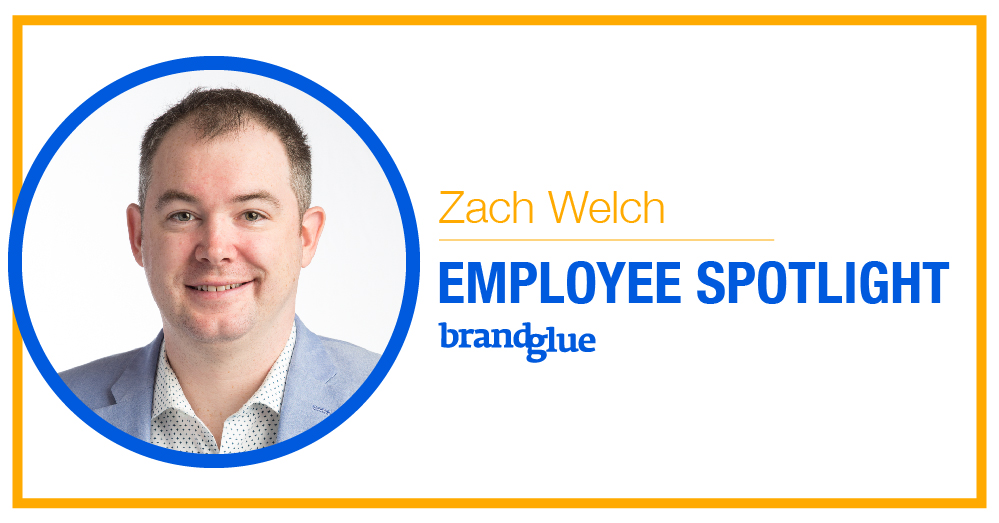
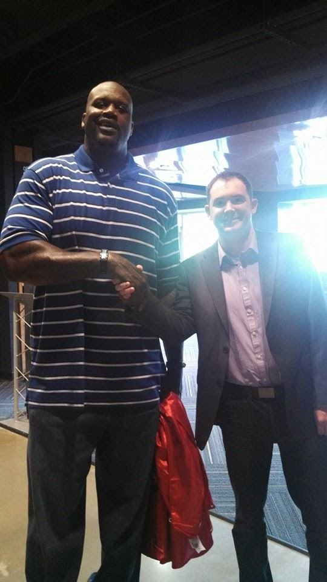

This week’s BrandGlue spotlight turns to my long-time friend and business partner, Zach Welch. Zach and I actually grew up together, though we both never dreamed we would manage a business together. We’ve been working at BrandGlue since before 2010, and it has been quite an exciting ride! From working with the NFL and the NBA to having numerous clients on the F100 and G100 lists, we’ve had the honor of working together on some truly amazing campaigns over the years. We always say that our client relationships reflect the relationships of the team at BrandGlue, and we are blessed to have formed strong and long-lasting relationships with our clients.

Read on to learn more about Zach below:

### How did you get started working in social media?

I graduated with my Bachelor’s Degree in Mass Communication with an emphasis in PR in 2008. It wasn’t easy to find a job with the financial crisis so I took a job as a beverage manager at a country club near Little Rock Arkansas. It was a great experience but not what I had planned for. So when an old friend who had started up a social media consultancy offered me a job, I jumped at the chance. While social media hadn’t been fully adopted at the time, I fell in love with the fast-paced nature of the role. I also got to employ the PR skills I learned in college from time to time. I have been at BrandGlue ever since!

### What is the strangest or craziest thing to happen to you while working in social media?

About 6 years ago my wife and I were traveling to her cousin's wedding in Atlanta. I made the mistake of listing that I would be in Atlanta on auto-responder. One of our newest clients saw that, and sent me an email saying ‘hey, we will be in Atlanta too! We should meet up.’ I had meant for this long-weekend to be a bit of a vacation for us but I agreed to meet them for a short visit. The meeting was arranged at the Georgia Tech Dome. My wife and I showed up a little early and walked into an empty venue. We sat down on the first set of bleachers and played on our phones to pass the time while we waited for my client to show. A few minutes pass and I hear a booming but very recognizable voice say ‘what’s up?’ I looked up from my phone and it was Shaquille O'Neal. We got to chat for a few minutes with him and it was great. Shaq is a very down to earth and nice guy!

### Where do you see social media headed in the future?

One thing that I continue to learn is that social changes so quickly. While we have been able to adapt quite well over the years, it can sometimes be a daunting task to keep up. We’re constantly having to evaluate new trends, or even new social networks, to see if they might be viable options for our clients. While trying to stay ahead of the curve is important, for most of our clients, I think trying to predict the future of society is an exercise in futility. What I think is most important is creating good and valuable content that is authentic and humanizes the brand. There are a multitude of ways to do that, but if you do it well, you’ll be able to naturally roll with the ever-changing tide of social media.

### What's one thing you love about BrandGlue?

I’ve been working with BrandGlue for almost 10 years and I’m really proud of the work we do. One of my favorite things about working here is that I have a strong relationship with each and every one of our clients. While we have seen tremendous growth over the past decade, we’re still small enough where I can keep and maintain that strong connection. We try to get on the phone with our clients at least once a week and it’s one of the things I look forward to most. Many of our new clients come from old contacts or people we have worked with in the past. That’s honestly one of the greatest compliments I could receive and it’s a very rewarding part of the job.

**What's a current hobby, book you're reading, or podcast you're listening to that you'd recommend? **

I’m an avid golfer. It has become one of the only things I do outside of the office and I love it. I started playing casually in my early 20’s but my passion really started about 6 years ago. I play about 3-4 times a week in the summer and have a small practice area at my home. With a lot of practice and patience, my handicap is now a 6. My goal is to get it under 5 this year. I love golf because it is mostly an individual game. You live and die by your own mistakes and you have nobody to blame but yourself. Most of the game is played between your ears and I love that. This past Christmas my in-laws surprised me with tickets to the Masters, which is one of the most prestigious sporting events in the world. I feel very lucky and blessed as it is extremely hard to get tickets and this is a once in a lifetime opportunity. I can't wait until April!

_Did you miss our last employee spotlight blogs featuring our other team members? Read more about [Rai Masuda][1],[Joey Ponce][2], and [Hannah Lushin][3]!_

[1]: https://brandglue.com/blog/brandglue-employee-spotlight-rai-masuda
[2]: https://brandglue.com/blog/brandglue-employee-spotlight-joey-ponce
[3]: https://brandglue.com/blog/brandglue-employee-spotlight-hannah-lushin
