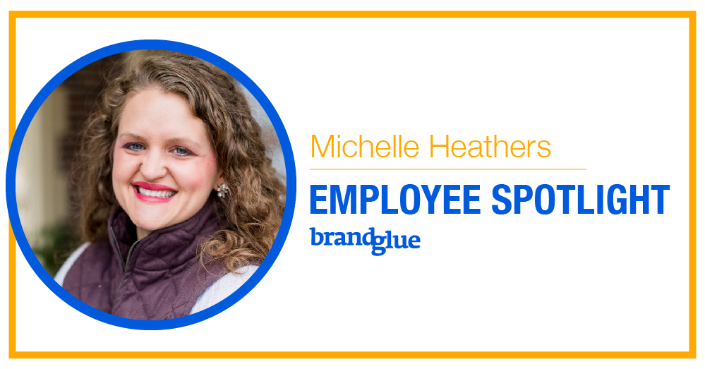

It’s time to showcase the “other half” of BrandGlue, VP of Community Management, Michelle Heathers. When Michelle and I decided to pursue this adventure together, we ventured into uncharted waters, but I could not be more happy with how things have evolved. We take pride in our close and long-standing client relationships, something that many agencies cannot boast. Michelle and I attribute a lot of that to our close involvement with all clients, our transparency, and our top-notch quality.

It’s hard to believe that I’ve known Michelle almost my entire life! Our journey in co-ownership of BrandGlue has been an exciting ride, and we can’t wait to see what lies ahead.

Here’s a bit more about Michelle:

### How did you get started working in social media?

Like many of us graduating from college in the mid-2000’s, I created my Facebook profile and Twitter handle while in college, and soon thereafter my LinkedIn account. Instagram followed a few years later. I only used social media back then for personal use, but I was a very active user being the extroverted socialite that I am.

My degree in college was actually in Human Services, which is similar to social work. When I graduated, I thought that I would be working overseas in under-privileged areas, or working at a non-profit Stateside. I spent a year in Zambia the year after I graduated, which was awesome and taught me a lot about myself. I realized through that experience that I most likely wasn’t going to work overseas long-term. When I got back to the States, I got offered a job at BrandGlue by my brother, who was running the agency at the time. I joined, soon realized that a full-time job in social media was the perfect fit for me, and a few years later I bought the business from my brother alongside my business partner, Zach Welch. As they say, the rest is history!

### What';s your favorite thing about designing social media content for brands?

I really enjoy the creative process and seeing ideas that our team has come to fruition. Social media allows for _so_ much creativity for content for brands. With video being such a huge player now, we can really get as creative as we’re allowed to get for our clients. I like pushing the edges of messaging and design for our B2B brands in particular. It’s really awesome to see the marketing team at a B2B company love a concept for a campaign and then see their broader team get behind it and share out the social posts once everything has gone live.

### Where do you see social media headed in the future?

With the issues around the last election cycle and the Cambridge Analytica scandal, it’ll be interesting to see how Faceobok fares though this next year and into 2021. Personally, I think the average person forgets and moves on fairly quickly, though if similar issues like last time happen this November, it’s going to be that much harder for Facebook to regain and rebuild their brand image.

LinkedIn is killing it and our B2B brands just can’t get enough of the platform. We are driving amazing leads and CPLs for clients across a variety of industries. As LinkedIn slowly catches up to Facebook on a number of fronts, it’ll be interesting to see how the platform grows and changes.

Instagram is all the rage for B2C, but B2Bs are really starting to catch on. As the outlet grows its user base, I see more and more of our clients upping their Instagram game and getting in on things like influencer marketing for B2Bs.

Twitter is doing some cool things with their sports partnerships and launching a few new tweet products, but I really think they are going to have to step it up if they want to keep their “top four” social outlet status. We have a number of clients who are seeing less results on this outlet and are spending less on Twitter ads, so it’ll be interesting to see what Twitter does the next few years to remain a key player in the social arena.

While the likes of Snapchat, Pinterest, TikTok, and other more niche social outlets come and go, I really believe that the main four will continue to reign supreme for a while longer. Time will tell!

### What's one thing you love about BrandGlue?

While there are numerous things I love about BrandGlue, I especially love the team. We have an awesome group of folks who are passionate about social media, smart, hard-working, have integrity, and are committed to serving our clients and each other. Everyone has a good sense of humor and even though we’re all fully remote, we have a great time together each week.

### What do you do on a typical weekend?

My family is a huge part of my life. I have two kiddos (Ethan is 4yrs old and Chloe is 2yrs old) and I spend most of my weekend doing fun stuff with them and my husband, Ryan. We enjoy games, sports, walks, seeing our extended family and friends, and stopping in at our local donut shop, Lafeens. My husband is my best friend and one of my biggest sources of encouragement. We really enjoy talking about business, eating at a foodie restaurant, and traveling together. I’m really thankful for his support and friendship. We are heavily involved in our church and do many activities through that and within our community.

_Did you miss our last employee spotlight blogs featuring our other team members? Read more about [myself][1], [Rai Masuda][2], [Joey Ponce][3], and [Hannah Lushin][4]!_

[1]: https://brandglue.com/blog/brandglue-employee-spotlight-zach-welch
[2]: https://brandglue.com/blog/brandglue-employee-spotlight-rai-masuda
[3]: https://brandglue.com/blog/brandglue-employee-spotlight-joey-ponce
[4]: https://brandglue.com/blog/brandglue-employee-spotlight-hannah-lushin
