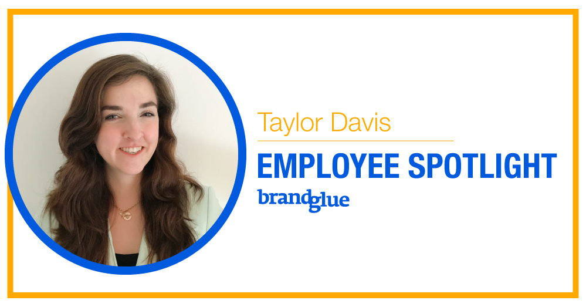
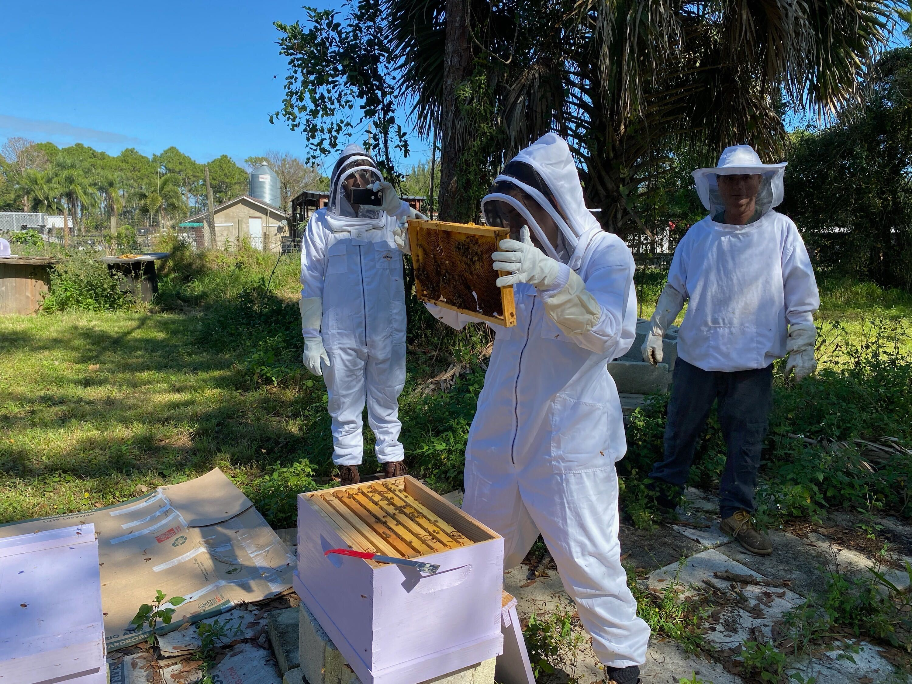

It’s been a busy couple of months here at BrandGlue! And I’m not just referring to every brand wanting to build out their social presence due to the pandemic. We also have added to our team! I’m very excited to share about our newest Senior Strategist, [Taylor Davis][1]. Hailing from the great state of Florida, she brings a combination of brand and agency experience, having consulted with Fortune 500 behemoths, scrappy startups, and everything in between. It’s only been a few months, but she’s already getting settled and working hard for our clients. Read on in our latest employee spotlight to learn more about Taylor and what she adds to the fantastic team at BrandGlue.

### How did you get started working in social media?

As a dual major in Marketing and Business Management, there was no escaping social media! While I feel like classes in academia really don’t do social media justice, I was fortunate to get some early practical exposure promoting my co-ed business fraternity, Alpha Kappa Psi. We would use it to get the word out on campus about becoming a member as well as professional and social events we were hosting or attending.

Looking back, I wish I knew then what I know now - there was so much more we could have done! But I’m proud of what we accomplished.

Next, I got the privilege to intern for a Fortune 500 company on some new product launches. Getting “the kid” on social media projects seemed like the obvious choice. Millennial = social native, right? As I grew in my career at that company, and transitioned to other roles outside of it, I learned how to expect business results more and more from social channels.

### Where do you see social media headed in the future?

If you Google image “social media buttons,” you’ll get results with 50+ badges that someone can use to indicate where they show up. While we are _certain_ to continue to see more and more platforms enter into the social media ring, it’s going to be harder and harder to beat out the current heavy weights with increased noise.

The giants have figured out (or are way ahead of figuring out) some of the hardest lessons of being a social media titan: administration of content to protect against fake information and cyberbullying, advertising algorithms that protect users and yield results for marketers, etc.

What we’re going to end up seeing, at least for the next few years or so, are smaller platforms paving the way for hip new features, but the giants will learn from their mistakes, modify the new feature to suit their own needs, and win.

Take TikTok for example. The platform, while trendy, struggles to pay content producers well. Vine died for the same reason. Guess who’s taking notes and coming out with “shorts”? YouTube.

### What’s one thing you love about BrandGlue?

You (Michelle) and Zach have good heads on your shoulders - and I’m not just saying that! I like how you’re deliberate about your growth, not just zealously pursuing “more,” intentional about who you bring on to your team, and smart and caring about how you handle clients. I’ve really never heard of an agency keeping clients for as long as BrandGlue has, either.

And to top it off, this has attracted some really awesome team members that I’m very fortunate to get to work with! Definitely a great mix of company qualities.

### What do you do on a typical weekend?

On a _typical_ weekend, my husband Josh and I would tire out our dogs in our backyard, check out local nurseries for additions to the permaculture forest we’re cultivating, and probably host a game night of Dungeons and Dragons with our friends. Coming onboard the team at the height of COVID-19, my weekends look similar just a bit more digital now!

### What’s a current hobby, book you’re reading, or podcast you’re listening to that you’d recommend?

Well lately I can’t seem to shut up about my newfound hobby, beekeeping. (Thanks to the BrandGlue team for humoring me as I gush!) I’ve been researching it for about a year and took the plunge this month with my very first hive! Super excited to “spoil” my bees and support their growth. They’re fascinating and books can be (and have been) written about how we can learn from them. But I’ll leave it at that!

Me during my first hive inspection! My husband is on the left taking video on his phone, our beekeeping mentor is on the right, and his wife was kind enough to take the picture. I'm glad she snapped it because I was soooo not thinking about my phone here!

_Curious to learn more about our team? Don’t miss our recent spotlight blogs_ [_Michelle Heathers_][2] _and_ [_Zach Welch_][3]_._

[1]: https://www.linkedin.com/in/taylorlynnedavis/
[2]: https://brandglue.com/blog/brandglue-employee-spotlight-michelle-heathers
[3]: https://brandglue.com/blog/brandglue-employee-spotlight-zach-welch
