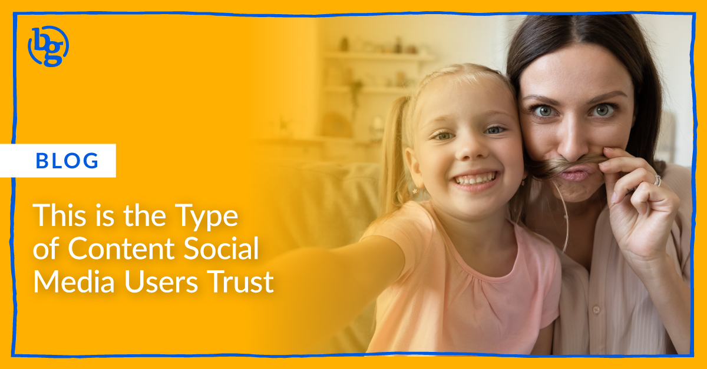

“Hey you! Buy our product. Who am I? It doesn’t matter. This thing is really cool, and will change your life, buy it now.” All too often this is how marketers choose to pedal their products, and all too often the user just strolls right on by.

I have to shake my head scrolling through my social media feeds, as these ads really do feel so inauthentic and salesy sometimes. Sure, marketers have a job to do, often to drive real results. But there’s a better way.

How can marketers get a user’s attention, trust, and ultimately drive the action they desire? One powerful way is via user generated content (UGC) - or content created by users discussing, demonstrating, or featuring your product in some way.

### User Generated Content Gains Attention

Try to think back to the last post that caught your eye. Was it an uber-polished car commercial or something closer to someone taking video of their cat making funny meow sounds?

User generated content gets the eyeballs because it more closely resembles what we’re already looking at. And here is the stumbling block many marketers fail to navigate: it really, really doesn’t have to be high production quality to grab that attention well.

I’m going to repeat that for the corporate marketers sweating bullets at the thought of brand erosion: it doesn’t have to be perfect! Try a self-recorded video of someone sharing their honest experience with your product or service (they can even use our [guide to create engaging Facebook videos][1]!) Heck, don’t even worry about it being shot in landscape mode either.

The star of the video probably stutters a few times or pauses to find the right words. Maybe they’re so animated and gesturing that they rattle the video every now and then. They probably don’t just talk about you, but also share other things relevant to their experience that are funny and relatable.

Good! There might be opportunities to buff it up a bit in post production, like adding captions to make it easier to follow. (Sidenote - We ALWAYS tell our clients to add captions since [85% of Facebook videos][2] are watched without sound. Captions also ensure people using assisted technologies can engage with your content). But the important thing is to get consistent, useful content - _not_ to get it perfect!

### User Generated Content Wins Trust

The single greatest failing of influencers, particularly in the social media space, is they are so often clearly paid, perfect, and polished that their message ends up losing all authenticity. Marketers using the cliche Instagram influencer are looking to make their viewers want to be more perfect. Sure, this tactic feeds on an important marketing concept, in which you market to the desires of the person your audience wants to be. But if it feels inaccessible or untrue, your audience won’t buy in.

In short, influencers represent the brand voice, and user generated content is the people’s voice. [54% of recent survey respondents][3] said they trust information from online star ratings and reviews from people, whereas only 20% trust information from the brand itself.

One of the biggest differences between user generated content and true “influencer” content is that UGC will be more likely to throw in a few negative comments on the brand experience, but with an overall positive message.

Why do you think Amazon lists both the topmost positive and most critical reviews for their products? They realize that people understand nothing is perfect, and users want to know the downsides before the purchase. So your goal is just to make sure the upsides are worth whatever strings may come attached.

### User Generated Content Drives Action

No marketer on the planet doubts the power of word of mouth to sell products. According to Nielson, [84% of consumers trust referrals from people they know][3]. The next best thing? Consumer opinions and experiences posted online.

The beauty of digital marketing is that what we do can be measured, so here are the stats:

- Ads featuring UGC won [4x higher click-through rates][4] compared to those without UGC
- UGC has been shown to drive a [73% increase in email click-through rates][5]
- When UGC is present in the digital purchase journey, [conversion rates increase by 10%][5]

Begone giant, costly video production crew and Instagram filters! Well, maybe not completely. But introducing a flair of genuine, authentic UGC into your usual marketing mix leads to results. Try handing over the mic to your users, see how it goes!

_What are some of your favorite examples of marketers successfully using UGC? Hit us up with some videos!_

[1]: https://brandglue.com/blog/how-to-get-maximum-engagement-with-facebook-videos
[2]: https://biteable.com/blog/video-marketing-statistics/
[3]: https://www.nielsen.com/us/en/insights/article/2013/under-the-influence-consumer-trust-in-
[4]: https://www.shopify.com/blog/user-generated-content
[5]: https://www.salesforce.com/blog/2016/02/user-generated-content.html
