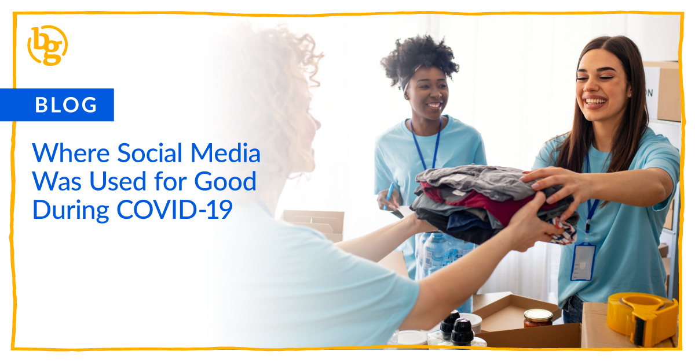

How has your social media feed felt lately? Can you easily picture a bunch of arguments and name calling? Us too. Tensions are high, and it can be tough to navigate all the conflict on social media.

Here at BrandGlue, our team is tuned in to social media every single day. And while the conversations nowadays are important and unique to our time, we feel it’s important to remember the good while dealing with the more aggressive side of social media. COVID-19 brought with it a lot of fear, confusion, and isolation. But people have used it, and social media, as an opportunity to rally in ways that inspire us.

We rounded up a few examples to brighten your day a bit. We hope you enjoy!

### John Krasinski Creates “Some Good News” Show

Any lovers of The Office have probably already heard of this one. For everyone else, our first example started in late March. I’m not sure if John Krasinski was actually prepared for the incredible success of his Some Good News Show, with [episode one already over 18M views][1]. He intended to bring some positivity to the darker times of quarantine, dedicating the show entirely to good news. Each of the eight episodes on YouTube are about 15 to 25 minutes, hosting stars such as Jon Stewart, Oprah, and the Jonas Brothers.

There was some backlash when he decided to sell the show to CBS News, but [he affirmed in a statement][2] that he still intends to be involved at a producer level, had only meant to do 8 episodes, and sold it so that a dedicated team could continue the show.

### Sofar Sounds Supports Performing Artists

The performing artist community is something really close to my heart, and when venues started getting shut down left and right, I was left wondering if I could help at all.

Then I saw Sofar Sounds promoting livestreams on [Facebook][3] and [YouTube][4] for individual artists. They schedule dates and times, and have moderators encouraging people in the chat to support the artists while live (which also shows when viewed at a later date). They also do a great job of curating playlists, so the artist gets more eyes and ears after the livestream.

Go check them out if you’re looking for your next independent and local artists to support! They could really use our help.

### Local Community Unity Shines on Social Media

National stories powered by celebrities or companies dedicated to helping others are awesome. But what gives me a deeper sense of hope is when regular people, like you and me, come together and make an impact in our local communities. And I don’t just mean in my community, either. A little research outside of our groups and we see plenty of examples from other areas.

At the heart of D.C.’s Capitol Hill, for example, the Eastern Market Main Street promoted a [“Porch Happy Hour” on Instagram][5]. They encouraged folks to order food and drinks from local businesses offering take out and enjoy dinner on their home porch balconies near (but not too near) one another.

Over in Michigan, downtown Owosso used Facebook to get the word out about a “[Support Local & Social Distancing Bingo][6].” In it, they incentivized players to complete tasks like “stream a workout from a local gym or studio” or “purchase a piece of art from a local artist.” They offered unique tasks by considering different types of local businesses that may be impacted by COVID-19 and how individuals could support them. Honestly, even if people didn’t play and only saw the bingo card, it may have planted enough of a seed for many who may have not otherwise known how else to support their community.

The list goes on and on. Quarantine can be challenging, and even talking about the coronavirus is exhausting. We encourage you (and ourselves!) to continue to look for ways to spread positivity and hope. Hang in there, mask up, and look out for one another.

_Have you seen neat ways people used social media to support others during COVID-19? Hit us up with your thoughts!_

[1]: https://www.youtube.com/watch?v=F5pgG1M_h_U&list=PL_7yEns96WJN5JtKJIL7Kw2_HUuiTjPdq&index=8
[2]: https://www.hollywoodreporter.com/news/john-krasinski-defends-selling-some-good-news-cbs-1296368
[3]: https://www.facebook.com/sofarsounds/
[4]: https://www.youtube.com/user/Sofarsounds
[5]: https://www.instagram.com/p/B99UFS5lkST/?utm_source=ig_web_copy_link
[6]: https://www.facebook.com/downtownowosso/posts/10158221292524124
