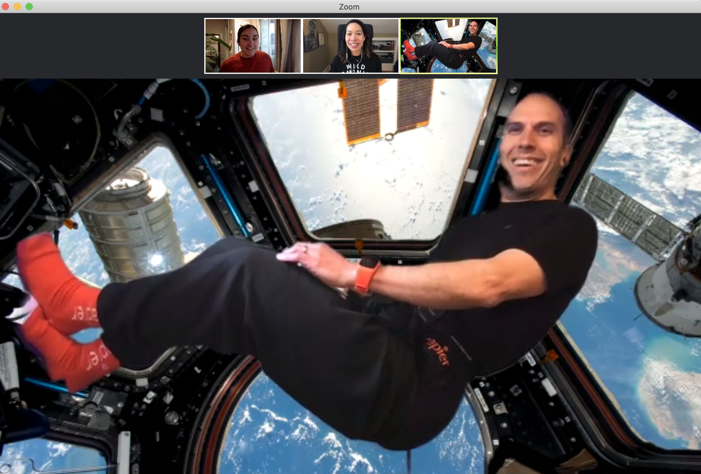
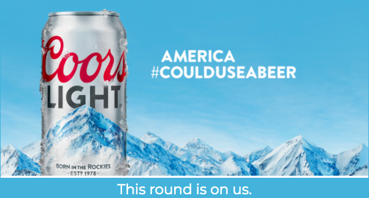
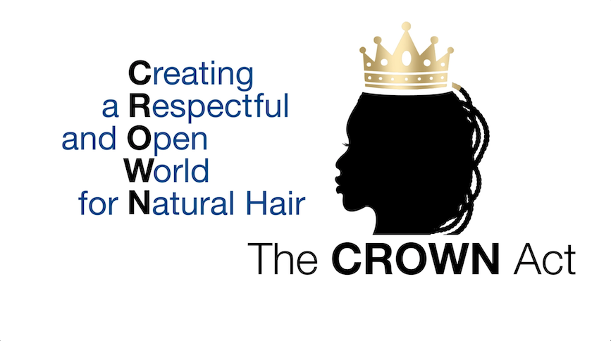
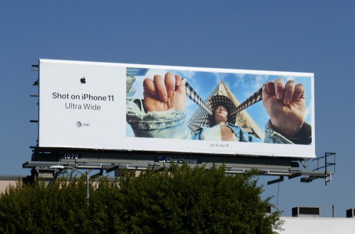
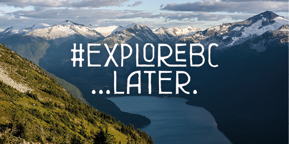

It’s hard to believe that 2022 is right around the corner, but with the dawning of a new year comes reflections on the previous. For social media managers, this means taking a look back at the best social media campaigns from 2021. The year saw a resurgence from well-known brands like Dove ([a regular contender for ‘Best of’ lists](https://www.commpro.biz/social-change-campaigns-how-dove-used-data-to-raise-the-bar/)) and welcomed newcomers like Zoom, who was an almost obvious choice given [how much society relied on this company’s tech](https://www.theverge.com/2020/6/2/21277006/zoom-q1-2021-earnings-coronavirus-pandemic-work-from-home) to continue work and life through the continued challenges of the pandemic.

With society’s ever-growing reliance on social media to stay connected, the number of active social media users has risen steadily into the [billions](https://www.statista.com/statistics/278414/number-of-worldwide-social-network-users/). For social media marketers looking to up their social game as we head into the new year, we’ve broken down the top 5 campaigns of the past year. What better way to ring in 2022 than with some [fresh and creative ideas](https://www.meltwater.com/en/blog/best-social-media-marketing-examples).

## Zoom Embraces the Shift to Virtual

While many brands focused on the transition to virtual in their social media marketing campaigns, none did it quite like video conferencing tool Zoom with their[ virtual background contest](https://sproutsocial.com/insights/social-media-marketing-examples/). Video conferencing backgrounds became a talking point around the virtual watercooler this past year, with remote and hybrid work bringing a person’s work life and colleagues into their living rooms (or kitchens, closets, basements, etc.). The Zoom community got creative, with winning backgrounds featuring exotic locations — NASA even got on board offering [amazing virtual background images to download](https://www.nasa.gov/stem-ed-resources/virtual-backgrounds.html) — and funny themes.

This campaign was twofold; increasing brand awareness while also driving new downloads. They accomplished this campaign through social media contests, awarding 3 new backgrounds a month to the ever-growing Zoom community.

## **America #CouldUseABeer, Says Coors Light**

Another successful giveaway came from beverage company Coors Light with their #CouldUseABeer social media campaign. They leveraged their authentic brand voice while empathizing with their online community in the early days of the pandemic. When it comes to marketing, this campaign hit the basics: the right message at the right time to the right audience in the right way. Coors Light ended up giving away over 500,000 beers while [highlighting the history of tough times in America](https://www.marketingdive.com/news/coors-light-boosts-morale-with-new-ads-free-beer-in-sucky-times/576975/), from the Revolutionary War to the Great Depression.

This predominantly Twitter-based campaign allowed friends to virtually send rounds of beer to each other and even lead the virtual happy hour efforts to keep communities connected. Beyond free beer, Molson Coors [donated funds to COVID relief efforts](https://nwdreno.com/molson-coors-pledges-1-million-to-support-bartenders-affected-by-covid-19-pandemic/#slide2) and provided a glimpse of hope in trying times.

## Defeating Hair Discrimination with Dove

Dove, a regular contender when it comes to [creating social media campaigns that resonate](https://www.prophet.com/2020/02/how-dove-real-beauty-uses-digital-marketing-to-stay-relevant/) with audiences, came through again in 2021 with their #PassTheCrown campaign, embracing the company’s core values of inclusivity, natural beauty, and positive body image.

Their 2021 campaign focused on embracing natural hair, a poignant conversation around ending [race-based hair discrimination in the U.S](https://www.popsugar.com/beauty/dove-crown-act-hair-discrimination-law-47859856). Beyond a social media marketing campaign, Dove even created the [CROWN Act](https://www.byrdie.com/the-crown-act-guide-5111864), showcasing the company’s commitment to not just creating conversation around social issues, but jumping to action as well.

## Apple Gets Trendy (Again)

No stranger to [rallying their social media community](https://www.adweek.com/creativity/apples-new-shot-on-iphone-ads-want-you-to-take-pet-portraits-like-a-pro/), Apple got creative this past year when it came to showcasing their new products as well as engaging their community. Enter their #ShotOniPhone campaign from earlier this year. Jumping on the cost-effective [user-generated content (UGC) trend](https://www.meltwater.com/en/blog/user-generated-content-examples), Apple was able to create an authentic conversation around their new products with compelling results; their campaign hashtag was used more than 16 million times on Instagram alone.

## Wanderlust … Later

Like many sectors, the travel industry was hit hard during the pandemic, with shutdowns causing a [complete lock on travel between countries and even states](https://www.cntraveler.com/story/coronavirus-air-travel-these-numbers-show-the-massive-impact-of-the-pandemic). Many brands had to pivot their social media marketing strategy, but HelloBC’s campaign is a standout. The British Columbia travel organization used the lockdown to their advantage in their cross-channel 2021 #ExploreBCLater campaign.

Their campaign message to “stop the spread of COVID” by adjusting travel arrangements highlighted the brand as [socially responsible](https://blog.hootsuite.com/social-media-campaign-strategy/). It was also a smart twist to their existing #ExploreBC campaign, utilizing the brand recognition and hashtag use they had already built upon steadily in the past.

Even though the pandemic left social media managers scrambling to create meaningful messaging that resonated with target audiences, several brands came out on top for doing so in an authentic way. For these brands, they nailed the basic marketing elements, creating the right content and messaging for their audience and distributing it at the right time and in the right way.

Check out some of our [past social media marketing campaign](https://brandglue.com/blog/5-inspiring-social-media-campaigns-of-2019/) round-ups for more inspiration!

*What was your favorite social media marketing campaign of 2021? Tell us in the comments!*