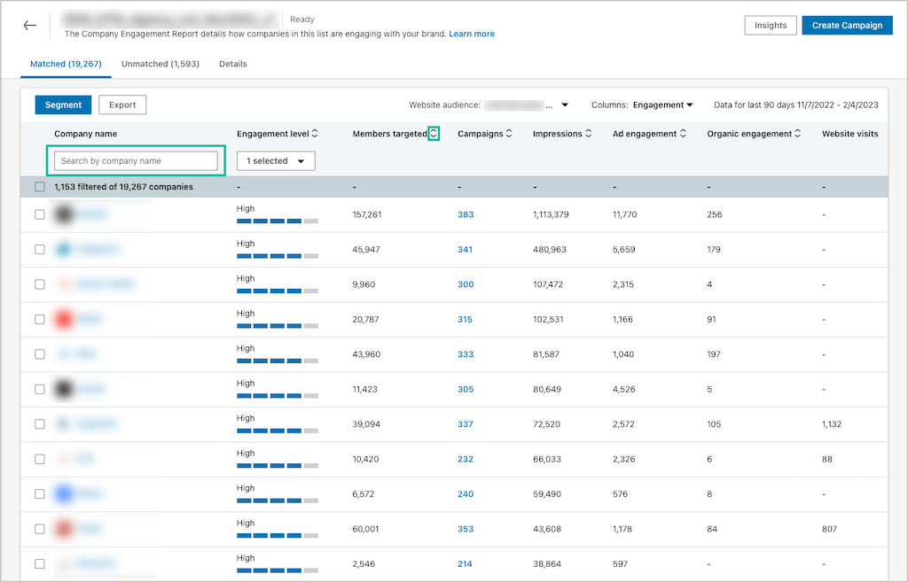

Social media ads are a great avenue for B2B marketers, and the targeting options on various social platforms are becoming more clever by the day.

LinkedIn has made major upgrades in the past few years to their ads platform to help marketers (see more in our blog post: [Is LinkedIn the new Facebook?](https://brandglue.com/blog/is-linkedin-the-new-facebook/)), but a recent update could bring account-based marketing to the next level. 

The platform just announced new segmenting options for its Company Engagement Reports to help marketers unlock deeper insights about their LinkedIn content, and how its reaching employees from specific companies. 

Let’s dive into what this is and what it means for marketers. 

## What is the Company Engagement Report?

The Company Engagement Report is the holy grail for account-based marketing. It’s a powerful tool that collects and displays engagement data about your target accounts.

After uploading a target company list to LinkedIn’s ad platform, you’ll be able to access the report by navigating to the Matched Audiences page in Campaign Manager.

Here’s what is included in the breakdown:

* Engagement Level: How engaged are the employees, measured across ads, organic posts, and website visits 
* Members Targeted: How many employees have been targeted by a campaign
* Campaigns: Which ad campaigns have served impressions
* Impressions: Amount of employees exposed to your ad
* Ad Engagement: Likes, comments, clicks, shares, and video views 
* Organic Engagement: Total number of interactions from posts from your organization’s LinkedIn Page
* Total Website Visits: Total number of times member accounts visited your web page tied to the LinkedIn Insight Tag

Learn more about how to set up a [Company Engagement Report](https://www.linkedin.com/help/lms/answer/a422150/company-engagement-report?lang=en).

## What Are the New Segmenting Options?

Company Segmentation will enable marketers to filter the report to create company list segments, which can then be used in outreach campaigns.

Now, you’ll have the option to sort the view by dynamic or static segments. Dynamic segments will update daily with companies from your original list that have a range of high to low engagement, so you can set up your campaigns to specifically speak to these different groups of companies. Static segments will be a snapshot of the engagement levels of companies at that moment in time.

## How This Will Help Your B2B Marketing Efforts

How will this help B2B outreach? For example, if you’re running a full-funnel marketing campaign, you could use the dynamic segments to sort and tailor content based on each stage of the funnel, depending on an employee’s engagement. 

This deeper segmenting leads to better targeting—and it’s a great capability for companies looking to improve their B2B and account-based marketing campaigns. Just make sure you [keep your social content stress level to a minimum](https://brandglue.com/blog/4-tips-boost-b2b-social-media-presence-reduce-content-production-stress/) as you work on building out your ABM marketing campaigns.

*Reach out to us to learn how to take advantage of more B2B advertising tools on social media.*