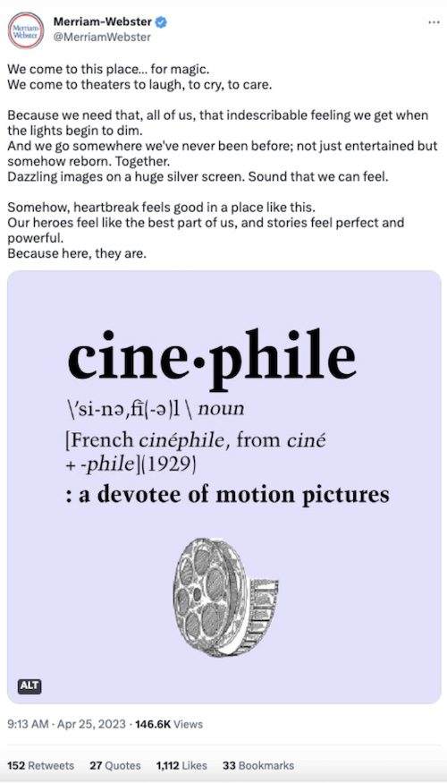

Twitter unveiled a major update back in April. After raising the Tweet character count from 280 to 4,000 back in February for Twitter Blue subscribers, [the platform again increased the character count to 10,000 in length](https://www.socialmediatoday.com/news/twitter-blue-subscribers-can-now-post-10k-character-tweets/647663/), with new bold and italic text formatting options.

Twitter Chief [Elon Musk is determined to make the social media platform more engaging](https://www.theverge.com/2023/4/14/23683082/twitter-blue-10000-character-limit-bold-italic-features-substack-newsletter), and he believes a key barrier to this is removing the length restrictions. That way users are more enticed to stay on the app, versus following a link to a blog, or Substack (Twitter’s rival). The new text formatting options, including italic and bold options, were added as a way to make the long format Tweets easier to read. Note, all of these changes are only available for organic Tweets so far, not for paid. 

But will these new, lengthy Tweet formats be a hit on the platform? Let’s evaluate.

## Will this change the way people use Twitter?

The recent change could provide companies with more creative ways to express themselves and make their Tweets stand out. A great example of a brand using the new length in a creative way is this tweet from [Merrian-Webster](https://twitter.com/MerriamWebster/status/1650865720467550209). 

\
\
Additionally, the ability to highlight certain words or phrases could help convey emphasis or tone more effectively. This could be helpful to a B2B brand that is posting about corporate social responsibility and wants to highlight a more serious tone. 

I predict that more brands might use the new formatting options to stress or highlight a call to action on a post. For example, if your B2B brand wants to get more clicks to your blog post, it could be worth testing a bold format option to “Learn more” followed by the blog link. 

These new options are always worth a test to see how they perform! Speaking of tests, have you tried out these [4 tactics to increase your organic engagement and traffic on Twitter](https://brandglue.com/blog/4-ways-to-increase-organic-twitter-traffic-and-conversions/)?

## Will the new Twitter text options be successful?

What it all boils down to is if the new text options will keep users' engagement up and on the app, as Elon Musk hopes. As we’ve seen over the past few months, if Elon sees a new feature not working, he isn’t scared to pull the plug. 

At the end of the day, if a new feature is rolled out well and enhances the user experience on an app, it’s probably going to be adopted quickly. In my opinion, the new text options meet both of those criteria, so I think it’s likely going to be here to stay. 

Will longer-form Tweets be successful for your brand? As with any social media copy, be sure your content is captivating, and it could just pay off. Here are a few of our team’s [favorite tips to writing social media copy that will stand out](https://brandglue.com/blog/captivating-copy-4-tips-social-media-copywriting/). 

*Do you think the new Twitter formatting will take off? Share your thoughts in the comments below!*