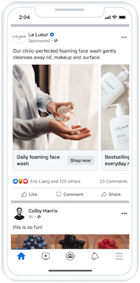
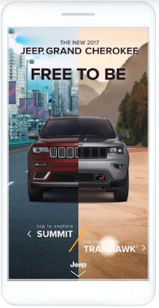
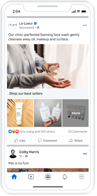

After releasing its guide to Instagram ad formats earlier this year, Meta just dropped a new cheat sheet for [Facebook ad formats](https://www.facebook.com/100064731428807/posts/638683158299393).

From image ads, to engaging videos, to dynamic carousels, this guide takes you through all the diverse range of ad formats available on the platform and how they can benefit both B2C and B2B campaigns. 

Now, you may be thinking, “Facebook ad formats? Isn’t that pretty rudimentary social marketing 101 knowledge?” However, as we all know, things change very quickly in the social sphere and it's smart to brush up on these year-to-year as the specifics and algorithms change. Now let’s get into it!

## Ad types and best practices

#### Images

 Image ads are a great option for marketers to showcase their products, services, or brand visually and include a compelling caption and call-to-action (CTA). Meta recommends using image ads to:

* Show off products
* Announce promos or sales
* Increase brand awareness

Best sizes for image ads are 4:5 aspect ratio for feed image ads, and 9:16 aspect ratio for story image ads. 

#### Videos

Video ads are a great option for marketers to offer a powerful medium to tell their brand story, demonstrate product features, share customer testimonials, or provide educational content. Meta recommends using video ads to: 

* Introduce your brand
* Highlight a service
* Show off your products’ unique features

Meta also recommends shooting in 9:16 aspect ratio for video ads so they fit into reels and story posts. 

We’ve written extensively on video in the past few years – here’s our latest blog on [repurposing video content](https://brandglue.com/blog/repurpose-video-content-social-media/). 

#### Carousels

Carousel ads allow marketers to showcase multiple images or videos within a single ad unit. This format is effective for highlighting various products, telling a sequential story, showcasing different features, or presenting a step-by-step process. Meta recommends using carousel ads to: 

* Increase conversion rates
* Feature up to 10 images and videos in a single ad with   individual links 

Meta recommends enhancing carousels with optimizations using Ads Manager.

#### Instant Experience

Instant Experience ads provide an immersive, full-screen mobile experience. These can include images, videos, carousels, and other interactive elements to create a captivating brand experience within the Facebook platform. Meta recommends using this format to:

* Highlight multiple products and/or services
* Increase engagement with an interactive ad

Meta recommends using their pre-selected templates to create an optimized Instant Experience.

#### Collections 

Collection ads feature a primary image or video along with several related product images that sit further below. When users click on the ad, it opens up an immersive, full-screen experience that showcases a range of products. Meta recommends using this format to:

* Promote an entire catalog in one ad
* Encourage multiple purchases
* Increase sales on mobile devices 

Meta recommends using a 1:1 aspect ratio for feed placements of collection ads.

Still yearning for more details on these formats? Check out [Facebook’s official ad guide here](https://www.facebook.com/business/ads-guide/update?content_id=FWGhVsNPUHOUvSF&ref=sem_smb&utm_term=facebook%20ad%20types&gclid=CjwKCAjwv8qkBhAnEiwAkY-ahhmX67TKS6gWsvEGlyLGpmqX4fBwzJlW0bob2YYzmctk52otLTQNZxoC6ZwQAvD_BwE).

## Facebook ad takeaways for B2B marketers 

In the realm of B2B marketing, Facebook ad formats provide an array of opportunities to engage, influence, and convert your target audience. By incorporating video ads, carousel ads, and captivating image ads into your campaigns, you can elevate your B2B marketing strategies and stand out from the competition. While collection ads and instant experiences may not be as popular in the B2B space as they are in B2C land, they could be worth testing – you’d just need to get a little creative! 

Speaking of creative, don’t be afraid to take some design risks in your ad types. We wrote all about this in our blog post, [5 Design Must Haves Before Creating Your Social Ad](https://brandglue.com/blog/5-design-must-haves-before-creating-your-social-ad/). 

Remember, in today's fast-paced digital and social landscape, keeping your finger on the pulse of the latest advertising trends is key. Be sure to keep up with all the social platforms and their latest tips on ad formats, as you may just tap into a new insight that could enhance your future B2B marketing campaigns. 

***Which ad format do you think is popular for B2B marketers in 2023? Comment below, let’s compare notes!* 🤓**