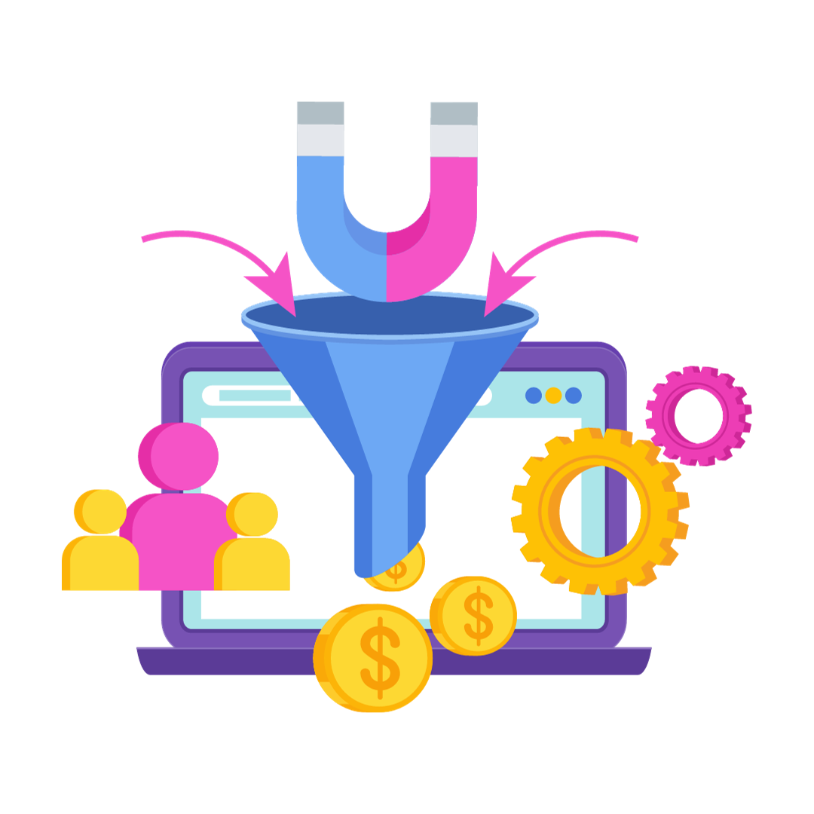

In today's digital landscape, a well-structured content marketing funnel is the cornerstone of any successful online marketing strategy. It's the roadmap that takes potential customers from first discovering your brand to becoming loyal advocates. And in this journey towards conversion and retention, one crucial element plays a pivotal role: social media.

SEM Rush just released a great infographic with [insights about the content marketing funnel](https://www.semrush.com/blog/content-marketing-funnel/) depending on where your customer is in their journey including what content type most resonates with them in that stage, what metrics are most important to track in that stage, and what channels should you leverage to market that content. Continue reading this blog post to learn how to master your content marketing funnel and unlock remarkable results.

## Content Marketing Funnels

#### Top of the Funnel Content (TOFU) 

Imagine this as the wide end of a funnel, where your goal is to cast a broad net to capture the attention of a vast audience. At this stage, your target audience may not even be aware of their specific needs or problems, let alone your brand or product. Your mission is to create awareness and establish your brand as a valuable resource. To capture those potential customers at this stage, focus on educating the reader, providing value, and sparking their interest in your brand.

##### The following types of content are best for the top of funnel:

* How-to guide
* Landing page
* Infographic
* Checklist
* eBook/whitepaper
* Video tutorial
* Success story 
* Webinar
* Product Overview 

##### The following metrics are best for measuring content effectiveness for top of funnel campaigns:

* Number of visitors
* Conversion rate
* Time on page
* Number of leads
* Bounce rate
* Social shares

##### And finally, the best ways to attract traffic to top-of-funnel content include:

* Organic search
* Social media marketing
* Email marketing
* Paid advertising/PPC
* Influencer marketing

#### Middle of the Funnel Content (MOFU)

As we venture deeper into the content marketing funnel, we arrive at the 'Middle of the Funnel' (MOFU) stage. By this point, you've successfully captured the attention of a broad audience in the TOFU stage. Now, in the MOFU stage, it's time to nurture the seeds of interest you've sown. Your audience has moved beyond mere awareness and is beginning to show genuine curiosity about your products or services.

##### The following types of content are best for the middle of funnel:

* How-to guide
* Product overview
* Case study
* Landing page
* Webinar 
* Success story
* Customer Review
* eBook/whitepaper
* Video tutorial
* Product manual

##### The following metrics are best for measuring content effectiveness for middle-of-funnel campaigns:

* Conversion rate
* Number of leads
* Number of visitors
* Time on page
* ROI/ROMI 

##### Finally, the best ways to attract traffic to middle-of-funnel content include:

* Email marketing
* Social media marketing
* Organic search
* Paid advertising/PPC
* Influencer marketing

#### Bottom of the Funnel Content (BOFU) 

As we descend to the final stage of the content marketing funnel, we arrive at the 'Bottom of the Funnel' (BOFU). At this point, you've successfully guided your leads through the awareness-building process (TOFU) and nurtured their interest (MOFU). Now, the spotlight is on conversion and sealing the deal. BOFU content needs to be persuasive and action-oriented. Your audience has moved beyond curiosity and is ready to make a decision.

##### The following types of content are best for the bottom of funnel:

* Product overview
* Customer review
* Success story

##### The following metrics are best for measuring content effectiveness for bottom-of-funnel campaigns:

* Free trials and demo requests 
* Conversions to registered and paying clients
* Revenue 
* Content marketing ROI

##### And finally, the best ways to attract traffic to bottom-of-funnel content include:

* Email marketing
* Organic search
* Paid advertising/PPC

## Conclusion 

As you can see, social media marketing is consistently one of the most helpful ways to get more eyeballs on your content, no matter what stage of the content marketing funnel your customer is in. Social media is a dynamic force that propels brands forward, and those who recognize its significance will undoubtedly thrive in this interconnected, content-driven era.

What questions do you have for our team on social media’s role in the content marketing funnel? Let us know in the comments.