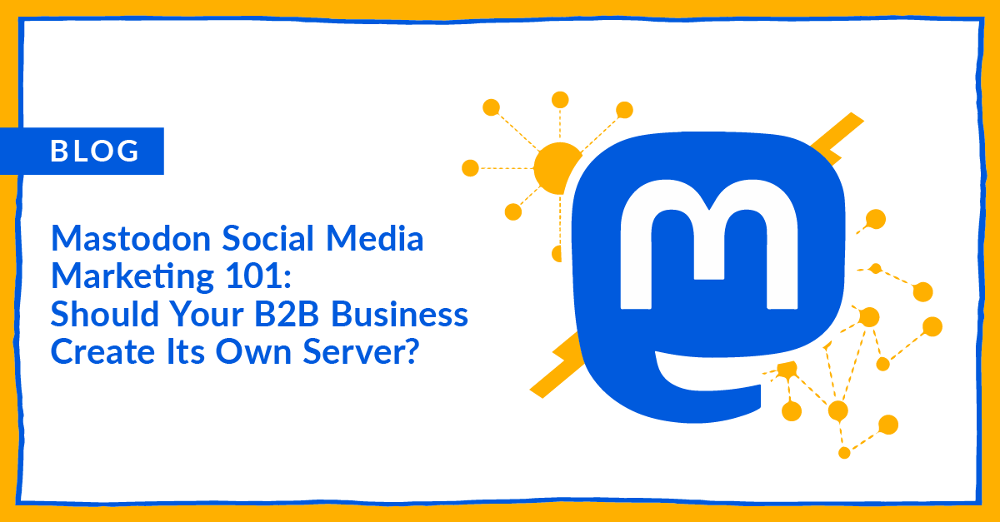

<!--StartFragment-->

As social media continues to evolve, [Mastodon](https://joinmastodon.org/) has emerged as a unique, decentralized platform gaining traction across the internet and among businesses. But is it the right fit for your B2B marketing strategy? Let's explore the benefits and challenges of Mastodon, and whether creating your own server could actually make an impact on your marketing efforts.

## What is Mastodon?

Mastodon is a decentralized social network consisting of independently hosted servers, or "instances," which are interconnected. This federated model emphasizes user control and community engagement, offering a refreshing alternative to traditional social media platforms controlled by algorithms.

## The Benefits of Mastodon for B2B Marketing

* **Community Building**: The [decentralized](https://planable.io/blog/successful-brand-mastodon/#benefits-of-using-mastodon) nature of Mastodon fosters focused community-building. Hosting your own server allows you to create a space tailored to your industry and brand, promoting deeper connections and meaningful interactions with potential clients and partners.
* **Brand Authenticity**: Smaller, niche communities enhance your brand's authenticity. Direct, unfiltered communication with your audience builds trust and loyalty, allowing you to showcase your expertise and establish thought leadership within your industry.
* **Control and Customization**: Running your own Mastodon server gives you significant control over content moderation, user experience, and data privacy. This is particularly beneficial for businesses with strict compliance requirements or those looking to offer a unique user experience that aligns perfectly with their brand.
* **Reduced Dependence on Algorithms**: Unlike traditional platforms, Mastodon relies less on algorithms to determine what users see. This allows your content to reach a wider audience within your chosen Mastodon instance, as long as it's relevant and engaging.
* **Longer-Form Content Potential**: Compared to character-limited platforms like Twitter, Mastodon allows for longer-form content. This can be valuable for B2B companies sharing complex information, white papers, or in-depth industry reports.

## How to Get Started with Mastodon

* **Create a Compelling Profile**: Ensure your profile is complete with a recognizable username, professional profile picture, and a compelling bio that clearly communicates your business's value proposition and target audience.
* **Share Engaging Content**: Post regularly and share content that is relevant to your industry and target audience. Utilize hashtags to increase visibility and join industry-specific conversations to draw engagement from users who will benefit from your posts.
* **Engage with the Community**: Participate in discussions on various topics related to your industry, follow like-minded users and relevant communities, and respond to comments - both on your posts and those from other users. Active engagement is the key to building a robust, [authentic community](https://planable.io/blog/successful-brand-mastodon/#how-to-use-mastodon-social-as-a-business) on Mastodon.
* **Leverage for Market Research and Outreach**: [Use Mastodon to gather insights](https://contensifyhq.com/blog/mastodon-for-b2b-content-marketing/) on industry trends, customer needs, and competitor activity. It's also an excellent platform for targeted outreach, potential affiliate marketing partnerships, and sponsorships, all while adapting to its decentralized and community-focused nature.

### Challenges to Consider

While Mastodon offers many advantages, there are also challenges to consider. B2B marketing here differs from established platforms like LinkedIn, with the focus on building genuine connections and fostering organic reach within targeted communities, rather than relying on paid advertising or algorithms to get your message across. Here are some of the top challenges to consider for B2B Mastodon marketing:

* **Limited Reach**: With a decentralized platform, it can be harder to reach a broad audience compared to traditional social media platforms with established user bases.
* **Technical Expertise Required**: Managing your own Mastodon server requires technical know-how for setup, ongoing maintenance, and potential security updates. There can also be associated costs depending on the chosen hosting solution.
* **Learning Curve**: Mastodon's decentralized nature can present a learning curve for new users. Navigating the platform, finding relevant communities, and understanding the etiquette might require some initial investment of time.
* **User Adoption**: Mastodon user adoption is still in its early stages, but it is growing. B2B companies in industries like tech, marketing, and design are already finding success here, but businesses in other industries may want to proceed cautiously in case the platform doesn’t catch on for the field. 

## Is It Worth It?

Deciding whether to create your own [Mastodon server](https://blog.hubspot.com/marketing/what-is-mastodon) for your B2B marketing strategy depends on your business goals and resources. If your primary aim is to build a tight-knit community, maintain close control over your social media presence, and enhance brand authenticity, then Mastodon could be a worthwhile investment to help your business create meaningful connections in a way that traditional platforms can not.

<!--EndFragment-->