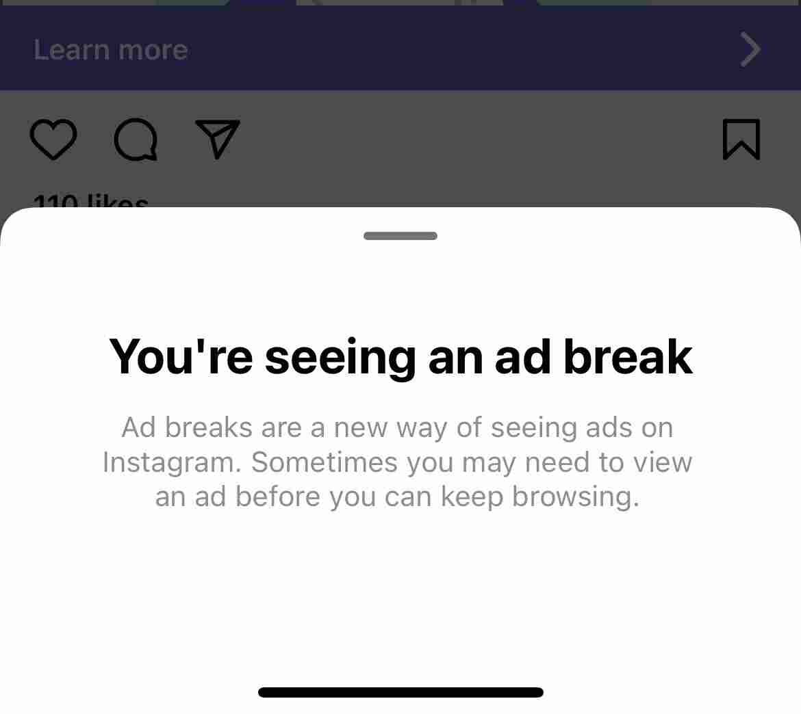
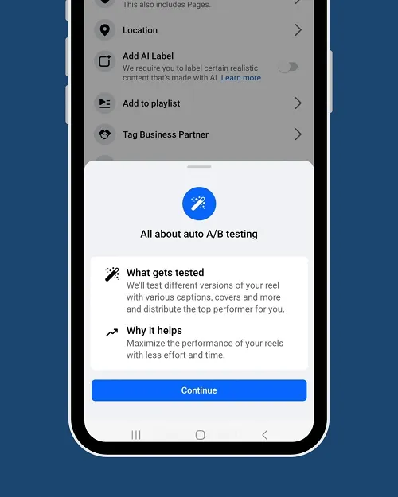

<!--StartFragment-->

Welcome to The Buzz from BrandGlue, your new monthly roundup of the latest updates in B2B social media marketing! Each month, we will curate the biggest, boldest, and most critical developments in the social media landscape to keep you informed and engaged. From platform launches and feature updates to industry trends and insightful research, The Buzz will be your trusted source for staying up-to-date with everything happening in the B2B marketing community. Let’s get started!

### \>  [LinkedIn Adds Premium Video Ad Placement, More AI Ad Tools](https://www.socialmediatoday.com/news/linkedin-premium-video-ad-placement-more-ai-ad-tools/718134/) 

Source: Social Media Today

LinkedIn is stepping up its ad game with enhanced AI tools and new premium video ad placements. Early in June, the professional networking platform announced it is integrating Microsoft Designer into its "Accelerate" ad tool, enabling generative AI for creative ad content. Additionally, the platform is introducing a new video sponsorship program called "[The Wire](https://www.lindseygamble.com/blog/linkedin-launches-wire-program-for-in-stream-video-ads-on-publisher-content)," allowing brands to run in-stream ads with reputable publishers like Bloomberg and Forbes. This move aims to tap into the increasing video consumption on LinkedIn, which has seen a 45% YoY rise. These updates promise more impactful ad placements and streamlined, automated ad creation, positioning LinkedIn as an even more potent tool for modern marketers - but we’ll see if these features actually produce results worth using!

### \>  [Instagram Seems to be Testing Unskippable Ads](https://www.threads.net/@thedanlevy/post/C7rPZZQgHfQ) 

Source: [@thedanlevy on Threads](https://www.threads.net/@thedanlevy) + [Reddit thread](https://www.reddit.com/r/Instagram/comments/1d52psw/ad_break_ie_unskippable_ads_now_on_instagram/)

While there has yet to be any official announcement from Meta, some Instagram users are reporting a new addition of unskippable “Ad breaks” being added to the main feed. When presented with one of these ads, users are unable to scroll past the ad post until the timer runs out. I find it interesting that this is being used in-feed vs. within Stories, but wouldn’t be surprised if it eventually is rolled over to Stories as well if Zuckerberg and team determine the test to be successful enough to roll out to all users. I’m extremely curious to know more about the advertisers’ side of this new test - what does the performance look like and what added features do these ads offer? 

### \>  [Facebook and Instagram are officially video platforms](https://www.marketingbrew.com/stories/2024/06/03/facebook-and-instagram-are-officially-video-platforms?mbcid=35624906.264727) 

Source: Marketing Brew

Apparently Facebook and Instagram are officially video platforms, with video watching now dominating user activity on these apps. According to eMarketer, last year marked the first time adult Facebook users spent more than half their time watching videos. On Instagram, this figure is expected to hit 60% this year. Despite Meta's success with Reels, which has driven significant growth, TikTok still leads the pack for video, with U.S. adults projected to spend an average of 54 minutes daily on TikTok, compared to 32 minutes on Facebook and 35 minutes on Instagram. Overall, social video will account for over a tenth of all U.S. digital media time in 2024, highlighting the growing importance of video content across social platforms. 

### \>  [X now hides your 'likes' from other users, whether you like it or not](https://www.npr.org/2024/06/13/nx-s1-5004515/x-likes-hide-users-elon-musk) 

Source: NPR

During the second week of June, the app formerly known as Twitter made the bold choice of making all user likes private. Likes aren’t going away completely - you can still see the likes on your tweets, but others cannot. This update, aimed at enhancing privacy and encouraging genuine interactions, was initially available to premium users only. Critics argue it complicates spam and bot management, while supporters believe it protects users from judgment. The timing of this is certainly interesting as the change was implemented less than 5 months out from the presidential election, and we all know social platforms love making updates during these times. As with many of Musk's changes to the platform, this new policy has sparked a mix of reactions, unsurprisingly reflecting the ongoing debate over how social media should balance privacy and transparency.

### \> [TikTok is copying Instagram again with Whee](https://www.theverge.com/2024/6/18/24181215/tiktok-whee-app-instagram) 

Source: The Verge

TikTok is expanding its social app empire with Whee, a “fresh” take on photo sharing tailored for your inner circle. It promises a space where you can share authentic snapshots exclusively with your closest friends, which sounds like a blend of Instagram and BeReal rather than something actually new and exciting. Featuring a sleek photo viewfinder, seamless messaging, and a personalized feed, Whee aims to redefine how we capture and connect. As of now, Whee is available on Android in select countries (not yet in the US), but there seems to be no known ETA for it arriving on the iOS App Store or in the US. 

### \> [Meta Is Testing Automated Creative Variations for Reels](https://www.socialmediatoday.com/news/metas-testing-automated-creative-variations-reels/719574/) 

Source: Social Media Today

Meta is at it again, rolling out another Advantage suite feature: automated creative variations for Reels. The "Auto A/B" process is currently in testing and automatically experiments with different variations of your Reels to find the top performer. This AI tool tweaks captions, covers, and more, optimizing engagement without you lifting a finger - which is both convenient and terrifying as there’s much less control in this feature than similar AI rollouts on the platform in the recent past. It's clearly a part of Meta's push towards AI-driven content optimization within its Advantage product suite. While still in testing, this feature might just be a game-changer for boosting your Reels' performance.

### \>  [Expanded Access to Newsletters and More Tools to Grow Your Voice on LinkedIn](https://www.linkedin.com/pulse/expanded-access-newsletters-more-tools-grow-your-voice-keren-baruch-vmm9f/) 

Source: Keren Baruch, Director of Product at LinkedIn

According to their Director of Product, LinkedIn’s Newsletters are thriving with a 59% rise in publishers and a 47% boost in engagement this past year, and the platform has added new features to encourage further use of the Newsletter tool. All LinkedIn members can now publish newsletters, offering the ability to share valuable insights across various industries without having to leave everyone’s favorite professional social network. The platform has introduced a more engaging reading experience, with comments displayed alongside articles for better interaction. Additionally, Microsoft Designer is now integrated into the tool to quickly craft eye-catching cover images with AI. Improved subscriber notifications, member and page embedding within articles, and new staging links for pre-publication sharing are also available. Personally, I’m curious if the AI-generated cover images feature people with the correct quantities of fingers. 🖐️

### \>  [X Will Soon Make Live Streaming a Premium Only Feature](https://www.socialmediatoday.com/news/x-formerly-twitter-making-live-streams-a-premium-only-feature/719572/) 

Source: Social Media Today

 As seemingly every other major social platform is going all-in on making video content more accessible, X is taking a turn and making live-streaming a Premium-only feature. Apparently, this is being done in a bid to tackle copyright violations and improve content quality on the bot-filled app. This means you'll have to pay up if you want to broadcast live events, which could reduce the amount of on-the-ground footage. While this move aims to curb illegal streams and boost X Premium subscriptions, it also clashes with Elon Musk's vision of "[citizen journalism.](https://x.com/elonmusk/status/1709475380715823349?lang=en)" With X Premium still struggling to gain traction, it'll be interesting to see how this shift impacts both users and the platform's revenue goals. 

### \>  [Instagram Experiments With Chat Widgets to Prompt More Engagement](https://www.socialmediatoday.com/news/instagram-experiments-chat-widgets-prompt-more-engagement/719571/) 

Source: Social Media Today

Instagram is testing new chat widgets to increase DMs and boost engagement. The latest features in development includes a countdown widget, a timezone widget, and a pinned content widget. And it’s not just for friends - brands could also leverage these widgets with things like creating time-sensitive offers and ensuring timely responses with the countdown feature. With private sharing on the rise, these widgets align with Instagram's shift towards more intimate, enclosed interactions. Although the intention behind it seems fun and truly about connection, I could see this going sideways if brands try to do too much with these widgets and turn DMs into even more of a spam center than they already can be. 

#### That's a wrap on this month's update!

Join us again next month as we continue to bring you the latest and greatest updates to help you succeed in the B2B social media marketing community. In the meantime, follow us on [LinkedIn](https://www.linkedin.com/company/brandglue-com/posts/?feedView=all) for additional updates. 

<!--EndFragment-->