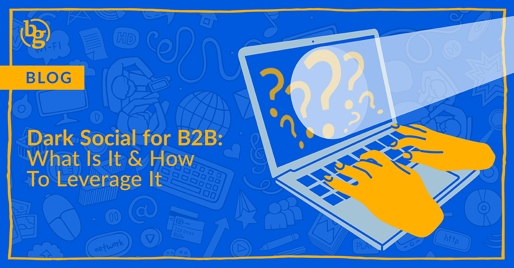

<!--StartFragment-->

Dark social might sound mysterious, but it’s simply the hidden side of social media that happens in private channels like discussion forums, DMs, messaging apps, email, and so on. Unlike the public platforms we’re used to, these social activities are hard to track, making it tricky for marketers to see how content is actually spreading. It’s like trying to read a book with half the pages missing—tough, but we LOVE a good challenge!

But, don’t mistake what you ***can’t*** see for something insignificant because these private convos are where key buying decisions are being made. So, how can brands influence what is happening behind the scenes and on dark social? Let’s find out. 

### Why Dark Social Matters for B2B Marketing

In the B2B world, buying decisions are all about trust. It’s those peer recommendations, internal chats, and private conversations that really drive the process. Whether it’s sharing an insightful industry report or discussing a product solution with colleagues, a lot of these interactions occur on dark social channels. This kind of private communication fuels word-of-mouth marketing, one of the most trusted forms of promotion. If you’re overlooking dark social, you’re missing out on a significant part of how decisions are influenced in your industry.

### Top Dark Social Channels for B2B (and How to Leverage Them)

**Reddit and Quora**: This is where many professionals go to have real, unfiltered conversations. On Reddit, you’ve got industry-specific subreddits where people swap advice, share experiences, and talk shop without any of the usual marketing fluff. Quora’s all about asking questions and getting expert answers, which makes it a goldmine for private discussions that can influence big decisions. The key to best use for both of these platforms is to add value organically—not via paid ads. 

**Private Messaging Apps** (like WhatsApp, Slack, or [Mastodon](https://blog.hubspot.com/marketing/what-is-mastodon)): These platforms host team and industry-specific chats where high-value content gets shared organically. B2B marketers can build relationships within these communities by offering valuable insights, reports, or exclusive content for group members to share.

**Email**: Email is still a major player in dark social. To best leverage it, craft content that’s worth forwarding within teams, like whitepapers, reports, and newsletters. Consider offering exclusive content or resources via email that are designed to be shared internally, making it easier for your content to naturally circulate in private discussions.

**Private LinkedIn Groups**: These groups are hotspots for industry-specific conversations. Marketers can engage by participating in discussions, offering expert advice, or even sharing thought leadership pieces within these closed communities. Building a presence here not only enhances credibility but also opens the door for organic sharing of your content within these networks.

### How Dark Social Influences B2B Sales

Dark social isn’t just about awareness; it influences every stage of the sales cycle. From initial discovery when a decision maker stumbles on a Quora thread about your brand’s product or service to final decision-making in a private discussion forum, dark social is where relationships are nurtured and deals are formed, entirely outside the spotlight of public channels. [Being strategic](https://www.revsure.ai/blog/shining-a-light-on-dark-social-strategies-for-modern-b2b-marketers) about where you engage will help you get the most out of these efforts.

#### Leveraging Dark Social: Key Strategies

* Create Shareable, High-Value Content: Industry reports, guides, and toolkits are the types of content that get passed around private channels.
* Track What You Can: Use UTM codes, branded URLs, and direct surveys to capture at least part of the dark social flow. These won’t reveal everything, but they do provide valuable insights.
* Encourage Employee Advocacy: Equip your team with content and let them share it within their professional networks. Trusted voices in a private context carry far more weight. And be sure to use those UTM codes in any content you provide!
* Engage in Niche Communities: Dive into subreddits, private LinkedIn groups, and even invite-only forums where decision-makers gather to get a direct view at some dark social. Being a part of the conversation offers the opportunity to help guide it.

### Balancing Dark Social with Traditional Marketing Channels

Dark social is powerful, but it should be a complement to your broader marketing strategy, not your only strategy. Its lack of visibility means it needs to be balanced with trackable, public-facing campaigns. By [combining dark social efforts](https://trafficandconversionsummit.com/blog/4-reasons-b2b-marketers-should-focus-on-dark-social-from-chris-walker-ceo-of-refine-labs/) with traditional marketing—like paid social advertising, SEO efforts, and [organic social media marketing](https://brandglue.com/services/)—you build a holistic strategy that covers both measurable and immeasurable touchpoints.

### Is Dark Social the Right Move for Your Brand? 

Dark social is where B2B buying decisions are happening, even if it’s out of sight. So, is it the right move for your brand? Absolutely—*if* you're ready to adapt. To really make the most of it, blend dark social strategies with what you're already doing. Focus on creating valuable, shareable content that naturally ends up in private chats and emails. When you embrace dark social alongside your traditional tactics, you’ll spark more genuine conversations and see stronger results.

Curious about your brand’s potential on dark social? Reach out to [our team](https://brandglue.com/about/) at BrandGlue and we’ll help bring it to light! 

<!--EndFragment-->