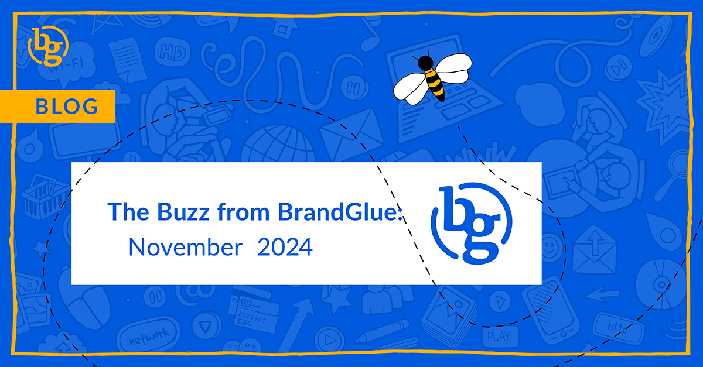

The month of November brought a variety of updates across social media. From new ad product updates on LinkedIn to restrictions on custom audiences on Meta to follower engagement data on X, there have been updates across all major platforms. Let’s dig into the top updates and trends for B2B social media marketing from the month!

### \> [LinkedIn Tests Paid Boosting for Personal Updates](https://www.socialmediatoday.com/news/linkedin-tests-boosting-personal-updates/735687/)

Source: Social Media Today

A new valuable option for users looking to build their personal brand on LinkedIn is coming. Some users are now able to pay to amplify their personal posts in order to get more reach on LinkedIn. Currently, only paying users are able to access this option but it appears that the option to quickly amplify updates is on its way sooner rather than later. This can be a valuable option for an executive looking to expand their LinkedIn presence since it does not require the user to be affiliated with a company page like Thought Leader Ads do.

### \> [No Edit Tag for Instagram Stories](https://www.threads.net/@oncescuradu/post/DDcFUCyI2hJ)

Source: Randu Oncescu

In the age of AI-generated and/or edited images, Meta is trying to offer new ways for users to indicate that their chosen image hasn’t been altered in the app. The label will be a small “No edit” under the user name and could theoretically add a level of authenticity to your content. This may facilitate a higher level of trust and be something worth paying attention to if and when it is rolled out to everyone.

### \> [Restrictions on Customer List Custom Audiences on Meta](https://www.jonloomer.com/restrictions-on-customer-list-custom-audiences/)

Source: Jon Loomer

Meta is going to impose new restrictions on custom audiences in 2025. These restrictions will apply to advertisers who use customer lists to promote housing, employment, and financial products and services. Once the clock hits January it will be important to keep an eye on your Meta ad accounts to ensure you don’t see any new alerts related to this change.

### \> [Latest LinkedIn Ad Product Updates](https://www.linkedin.com/business/marketing/blog/linkedin-ads/new-ways-to-get-even-more-out-of-your-linkedin-ads)

Source: LinkedIn

The latest updates to LinkedIn Ads are designed to help marketers be more efficient while still achieving good results. Reporting for Companies, Data Driven Attribution, Measurement Insights, and Qualified Leads Optimization are the four main update areas. Our team here at BrandGlue is especially excited about the insights provided by Companies and the targeting possibilities offered by Qualified Leads Optimization.

### \> [Follower vs. Non-Follower Engagement Data Added on X](https://x.com/xDaily/status/1864520831402979558)

Source: X Daily News

X’s analytics tab now shows the ratio of followers to non-followers who are engaging with your posts. Most users are seeing more non-followers engaging with their content than followers, which likely means X’s algorithm is shifting more to the “For You” feeds since fewer and fewer users are tapping the follow button. This can certainly be good for engagement rates, but can pose a challenge for brands who still place a big value on follower count.

### \> [Threads Reaches 100M Daily Active Users](https://www.threads.net/@mosseri/post/DDqIYmpy25M)

Source: Adam Mosseri

Threads is celebrating a major growth milestone as Adam Mosseri announces the platform has hit 300 million monthly active users and 100 million daily active users. They still trail X who sits at 570 million monthly active users and 250 million daily active users. However, Threads is now over halfway towards X’s monthly number. It will be interesting to see which features and updates Threads makes to continue this momentum.

That’s a wrap on this month’s updates!

Join us again next month as we continue to bring you the latest and greatest updates to help you succeed in the B2B social media marketing community. In the meantime, follow us on [LinkedIn](https://www.linkedin.com/company/brandglue-com/posts/?feedView=all) for additional updates.