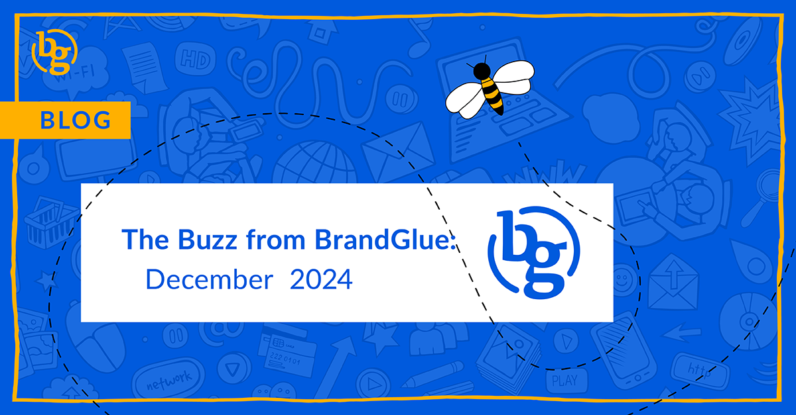

This blog summarizes the major social news and updates that took place in December 2024. From new, larger videos displayed in-stream on LinkedIn to a round-up of Meta ad changes to being able to pay for engagement on Instagram, there were a number of updates that got squeezed into the last month of the year. Read on to stay in-the-know as we head into 2025.

### \>  [New, Larger Video Display In-Stream on LinkedIn](https://www.linkedin.com/posts/jakeposes_were-testing-a-new-design-for-videos-in-activity-7275224371206504449-YgyT/)

Source: Jake Poses (Director of Product, LinkedIn)

You may have noticed some larger videos being shown in your LinkedIn feed recently. This new format includes rounded corners on the display in an effort to make the video clips stand out even more in-stream. While past ideas like LinkedIn Stories were quickly scrapped, the platform’s immersive TikTok-like video feed has seen a 36% usage growth in 2024. This current format is being tested with selected iOS users at the moment, but it likely won’t be long before it’s rolled out to a larger audience.

### \> [Revolving Slideshow Option for Banners on LinkedIn](https://www.linkedin.com/posts/oralevit_your-linkedin-cover-image-the-customizable-activity-7269789349066498048-bAzf/)

Source: Ora Levit (Vice President of Product Management, LinkedIn)

The cover image on your LinkedIn profile has always been a great way for users to visually express their personality, interests, business, or brand. Now, in an update that can be a big benefit to executives with a presence on LinkedIn who are Premium Business subscribers, these members can now select up to five photos to create a rotating slideshow.

### \> [Meta Ad Changes in 2024](https://www.jonloomer.com/qvt/meta-ads-changes-in-2024/)

Source: Jon Loomer

Social media moves really fast and it can be hard to keep track of all of the latest updates and new features. Meta advertising is certainly no exception to that. Jon Loomer put together an end-of-year walkthrough that highlights major changes like:

* Addition of Audience Segments
* Scaling high performing ads without re-entering the learning phase
* Expanded images and video 

### \> [Paying for Engagement Coming Soon to Instagram?](https://www.socialmediatoday.com/news/instagram-surveys-users-paid-engagement-options/737125/) 

Source: Social Media Today

It appears that Meta may be considering an option that would enable brands to pay for views, likes, or other engagement in the Instagram app. Select users are currently getting surveys from Meta in the app that presents them various scenarios including ones that seem to indicate a follower growth option. This is a little odd since Meta’s current Community Standards forbid buying followers, but it could just be an expansion of Meta’s Verified program.

### \> [X Algorithm Update to Focus on Entertaining Content](https://www.socialmediatoday.com/news/x-formerly-twitter-flags-algorithm-update-entertainment/736502/)

Source: Social Media Today

In an effort to cut down on the platform’s negativity, an algorithm update is coming which claims to put more focus on “informational/entertaining” content. While Meta has taken queues from X when it comes to subscriptions and content moderation, this shift sounds similar to the changes Meta made recently to reduce the reach of political content in response to user feedback.

### \> [Threads Launches New Creator Hub](https://creators.instagram.com/threads)

Source: Threads Creators

If you’re struggling to grow your presence on Threads then the recently launched Creator Hub is a great resource to consider. Brands who are looking for new ways to find their followers or grow their reach will find creative examples and a set of FAQs that can help optimize their profiles for success.

**That’s a wrap on this month’s updates!**

Join us again next month as we continue to bring you the latest and greatest updates to help you succeed in the B2B social media marketing community. In the meantime, follow us on [LinkedIn](https://www.linkedin.com/company/brandglue-com/posts/?feedView=all) for additional updates.