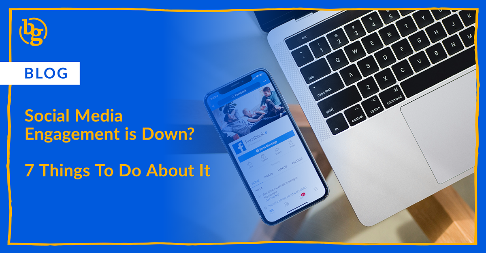

*Dropping social media engagement can be frustrating, but with the right strategy, analyzing performance, refining content, and building community, you can reignite interactions and keep your audience engaged. Here’s how.* 

If you've noticed a drop in engagement across your social media channels, don’t panic. Algorithm changes, shifting user behaviors, and content fatigue can all contribute to declining likes, shares, and comments. Luckily, there are strategic ways to turn things around. Here’s how to boost engagement and keep your audience actively involved.

### 1. Audit Your Content Performance

Before making drastic changes, analyze your recent posts to identify trends. Which types of content are performing best? Which posts are falling flat? Look at metrics like reach, comments, shares, and saves to determine what resonates most with your audience.

### 2. Reevaluate Your Content Strategy

If engagement is dropping, your content might not be hitting the mark. Ask yourself:

* Are you still speaking to your audience’s needs and interests?
* Have you kept up with content trends in your industry?
* Are you experimenting with different formats, like videos, carousels, or interactive polls?

Adjust your strategy based on what your audience wants now, not what worked six months or a year ago.

### 3. Lean Into Video & Interactive Content

Video remains the most engaging type of content on social media. If you’re not leveraging short-form videos (think Instagram Reels, TikTok, or YouTube Shorts), now’s the time to start. Polls and interactive stories also encourage direct engagement. 

If you’re a B2B marketer with limited resources to put videos together, don’t worry. Try experimenting with document carousels on LinkedIn. These can be a great way of turning a few images into an easily-clickable carousel and don’t require the same amount of resources as videos.

### 4. Focus on Community, Not Just Content

Social media isn’t just about broadcasting your content, it’s about building relationships. Respond to comments, ask questions in your captions, and engage with your followers’ content. Creating a two-way conversation makes your audience feel heard and valued, increasing their likelihood of engaging with your posts.

### 5. Don’t Be Afraid to Experiment

If your engagement is down, it might be time to shake things up. Test new content formats, use trending sounds, collaborate with influencers in your space, or try to look at new ways to present older content. Social media platforms reward engaging posts, so don’t be afraid to take creative risks.

### 6. Encourage Meaningful Engagement

Surface-level interactions won’t help your engagement rates. Instead, craft captions that prompt discussion, use calls to action, and create content that sparks curiosity and comments. 

### 7. Leverage Paid Promotion (Strategically)

Organic reach isn’t what it used to be, and a smart paid strategy can help put your content in front of the right audience. Experiment with boosting high-performing posts or running engagement-focused ads to reach more people.

A dip in engagement isn’t the end of the world, it’s an opportunity to reassess, refine, and reinvigorate your strategy. By staying proactive, experimenting with new approaches, and genuinely engaging with your audience, you will begin to see stronger results.

Need help revamping your social media strategy? **[Our team](https://brandglue.com/contact/) is here to help.**