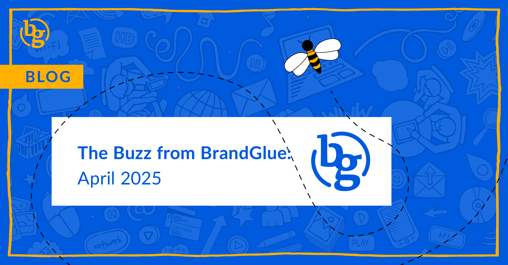

This blog summarizes the major social news and updates that took place in April 2025. From new LinkedIn dynamic UTMs to Meta expanding AI innovations to Threads adding multiple profile links, there were a number of updates that happened last month. Read on to stay in-the-know as we head further into 2025. 

### \> [LinkedIn Live Event Ads Drove 77% lower CPR](https://business.linkedin.com/marketing-solutions/case-studies/snaplogic)

Source: LinkedIn

LinkedIn Live Event Ads are something we’ve been keeping our eye on, and it seems that one company recently saw significantly lower cost per registration using these ads on LinkedIn. According to a recently published case study, this approach also resulted in a much higher CTR compared to their single-image ads for the same event. They also successfully utilized lead routing and were able to collect registration data in real time and send it to their CRM tool. This is an interesting read for anyone considering this ad strategy.

### \> [LinkedIn Adds Dynamic UTMS](https://www.linkedin.com/business/marketing/blog/linkedin-ads/new-linkedin-campaign-manager-updates-empowering-marketers-for-greater-success)

Source: LinkedIn

Manually creating UTM parameters for each ad variation can be extremely time-consuming. It also has the potential for errors, which can lead to tracking inconsistencies and lost insights. LinkedIn now allows users to automatically generate UTMs, which ensures a consistent approach to performance tracking.

### \> [AI Innovations Driving Advertiser Performance on Meta](https://www.facebook.com/business/news/ai-innovation-in-metas-ads-ranking-driving-advertiser-performance)

Source: Meta Announcements

We’ve been hearing how AI and machine learning are the future of advertising. But how is Meta combining the best of human insight with the speed and scale of AI? The social media giant is using multiple AI-powered systems that have been trained on its user database, making them more highly attuned to what each user wants to see and increasing the chances of them engaging within the app. The four innovations are called Meta GEM: The Super Brain, Meta Lattice: The Giant Library, Meta Andromeda: The Personal Concierge, and Sequence Learning: The Memory Game.

### \> [Instagram Creators Getting More Reach in Main Feed](https://www.socialmediatoday.com/news/instagram-chief-answers-creator-questions/744813/)

Source: Social Media Today

Some people may think Stories are the way to go to reach more people, but according to Instagram CEO Adam Mosseri, the average creator is reaching a lot more people in feed. This is due to Instagram relying heavily on recommendations as a way to keep users on the app. It sounds like the platform is really trying to boost the discovery of creators and other accounts that people may be interested in, but might not even know exist. If you’re a regular user, Stories and DMs see far more activity, but creators will still want to prioritize the feed.

### \> [Updated Post Analytics Display on X](https://x.com/ZachWarunek/status/1911950460589932856)

Source: Zach Warunek (X Engineer)

In an effort to make it easier to understand how an individual post performs over time, X has revamped its UI for these analytics pages. The new display includes a complete overview of all of the engagement and reach metrics, including re-posts, shares, video views, Premium viewers, and more. There is also a chart showing relative post activity over time. Unfortunately, like many new nice X features, this is only available to Premium Subscribers.

### \> [Adding Multiple Profile Links on Threads](https://www.threads.net/@alex193a/post/DIL0JjGNoiI)

Source: Alessandro Paluzzi

Following in the footsteps of Instagram’s five-link option, it appears that Threads is now testing a new feature that allows users to add multiple links to their profile, significantly expanding on the single link that is currently allowed. It does not appear that this is being rolled out anytime soon since it is still in early testing, but it wouldn’t be surprising if a launch date is revealed in the near future.

**That’s a wrap on the updates!**

Join us again next month as we continue to bring you the latest and greatest updates to help you succeed in the B2B social media marketing community. In the meantime, follow us on [LinkedIn](https://www.linkedin.com/company/brandglue-com/posts/?feedView=all) for additional updates.