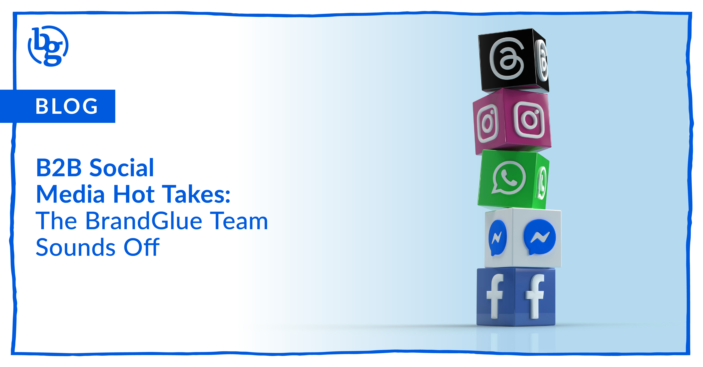

If there’s one thing we know at BrandGlue, it’s that the B2B social sphere is full of various strategies, and well… hot takes. Our team of seasoned social pros decided to spill a few of theirs. Buckle up because these aren’t your average "post more on LinkedIn" tips. These are some of our bold takes.

### Michelle Heathers, VP of Community Management

**Follower Counts Are Overrated**\
Follower count is one of the most overused KPIs in the game. While it can indicate growth, it’s often misunderstood and misused. Inflated or fake follower counts are a red flag to savvy users, especially if your content doesn’t measure up. Chasing numbers for vanity’s sake? Hard pass.

**Video Isn't King >  Context Is**\
The obsession with video overlooks a key truth: content needs to match how your specific audience consumes information. Not everyone is watching Reels. Some folks are reading carousels, clicking through blog links, or skimming infographics. Diversify your content to meet people where they’re at.

**Paid and Organic Can’t Be Silos**\
If your paid and organic teams don’t talk, you’re missing out. Each side fuels the other. Data, content performance, messaging insights – they all work better together. Don’t separate what should be a symbiotic relationship.

### **Rai Masuda, Director of Social Campaigns**

**Stop Commenting "Commenting for Reach"**\
You’re not fooling the algorithm — or your audience. Commenting for the sake of visibility screams inauthenticity. Focus on genuine engagement instead.

**Don't Dismiss Long-Form Copy**

You often hear "keep it clear and concise". I agree with keeping it clear, but I wouldn't dismiss copy that's beyond 1-2 sentences. Two benefits of a longer post are that you can provide more detail, allowing you to better qualify your traffic. If a user is willing to take action to read more of your post and then clicks through to the landing page, they will be more educated on your offer and have a better chance of taking the desired action.

### Adrian McLaughlin, Sr. Social Strategist

**Not Every Post Should Sell**\
Your audience knows when you’re just pushing product. Mix it up. Educate. Entertain. Empathize. The strongest brands sound human.

**People Connect with People — Not Logos**\
Even enterprise brands get more traction when they show faces, voices, and personalities. A logo can’t create a connection, but your people can.

**Short Form Hooks, Long Form Converts**\
Quick content may get the scroll, but long-form content earns the save. Give your audience something worth their attention, and they’ll give you their trust.

### Zach Welch, Director of Client Services

**TikTok Might Be Toast - But Vertical Video Isn’t**\
With increasing political pressure and legislation aimed at banning TikTok, we’re telling clients to be cautious about going all-in. But don’t abandon the format — vertical video isn’t going anywhere. Invest in the style, not just the platform.

### Giuliana Webb, Social Account Director

**Value > Volume**\
Publishing well and with intent is the long game. High-value content always wins in the end.

**Invest in Content Days**\
The best video content doesn’t happen accidentally. Dedicate days to film content - in person, at your HQ, during events. It’s how you get authentic, on-brand footage.

**Even the Best Targeting Can’t Save a Bad Ad**

Even with perfect targeting, boring creative and messaging won’t land. Your ad has a second,  maybe two, to make someone care. Lighten up. Have fun. Ironically, the less you try to sell, the more you'll actually sell. That’s the reverse psychology most B2B brands still haven’t figured out.

**Screen Recordings Disguised as Videos = Gives off Lazy**\
Don’t pass off low-effort screen grabs as video content. It undermines your brand’s quality.

Our teams’ hot takes aren’t just opinions, **they’re how we help B2B brands grow smarter, show up better, and connect more meaningfully with their audience.** 

Want in? Let’s talk. hello@brandglue.com