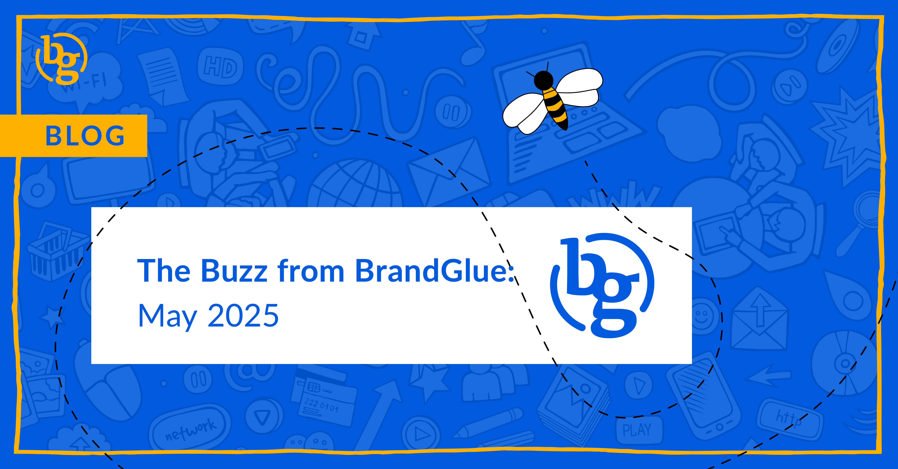

This blog summarizes the major social news and updates that took place in May 2025. From LinkedIn launching Qualified Leads Optimization to Meta announcing more GenAI features to Instagram’s new unlockable Reels nearing launch, a lot took place this past month. Read on to stay in-the-know as we head further into 2025.

### \> [LinkedIn Launches Qualified Leads Optimization](https://www.linkedin.com/pulse/introducing-qualified-leads-optimization-maximize-profits-lrxyc/) 

Source: LinkedIn

In an effort to help advertisers focus on leads that are more likely to become paying customers, LinkedIn’s new Qualified Leads Optimization is supposed to focus ad delivery on people who have signaled readiness to buy. The platform also claims that this tool provides deeper attribution to prove both pipeline contribution and revenue impact. However, it really is only as strong as a client’s CRM. This is because the lead quality is defined by the company’s lead gen system or third-party CRM (i.e., HubSpot, Salesforce). If your CRM is a mess, you will need to clean that up before taking advantage of this new option.

### \> [First Impression Ads Come to LinkedIn](https://linkedinsnewfront2025post.splashthat.com/) 

Source: LinkedIn

Announced at their recent NewFronts presentation, LinkedIn is aiming to further capitalize on the growth of video on its platform. First Impression Ads will enable marketers to ensure that their video is the first promotion their target audience sees in-stream. This is a big opportunity to capture users’ attention.

### \> [Meta Announces More Generative AI Features Coming](https://www.facebook.com/business/help/2305851046477353) 

Source: Meta

Meta will soon let advertisers test out their experimental AI ad features ahead of the widespread release. The Early Release program is designed to allow a select group to contribute to external testing of these tools, which will allow for additional performance and suitability testing before they are rolled out on a broader scale. Early rumors are that the latest tools will focus on video generation and AI-created prompts. If you are one of the select advertisers chosen, the new early release features will have an Early Release label at the ad set level in Ads Manager.

### \> [Unlockable Reels are Nearing Launch on Instagram](https://www.socialmediatoday.com/news/instagram-launches-lockable-reels-secret-code/747440/) 

Source: Social Media Today

This will help that exclusivity feel. Instagram appears closer to officially launching lockable Reels, giving video creators the ability to share Reels that can only be viewed by those who have a code. This is a pretty cool way to build excitement and buzz around content. It’s one of the best FOMO tools we’ve seen in a while. It is also a great way for companies to offer discounts or region-specific updates to a targeted group of followers. The only caution is, don’t overuse it and don’t over-promise and under-deliver.

### \> [X Releases New Website Card CTAs](https://www.socialmediatoday.com/news/x-formerly-twitter-updates-link-format-ads-adds-cta-button/748010/) 

Source: Social Media Today

Is it a blast from the past? X has updated their ad format to display the headline and CTA button along the bottom of the main image to help the ads stand out in-stream compared to the organic posts that have the headlines overlaid on images or videos. If this sounds familiar, it’s because it is very similar to how tweets used to look before they were updated in 2023.

### \> [Threads Ads Now Available Globally](https://www.facebook.com/business/news/introducing-ads-in-threads) 

Source: Meta

In an announcement that we knew was coming eventually, Meta has expanded ads in Threads to all global advertisers. The new Threads feed placement will be on by default for new campaigns that use either Advantage+ or Manual Placements in Meta Ads Manager. Previously, Meta suggested they wouldn't implement ads on Threads until the social network reached one billion users. With just over 320 million users worldwide, Meta must feel that they are in a comfortable enough position to begin the transition to in-stream ads.

**That’s a wrap on the updates!**

Join us again next month as we continue to bring you the latest and greatest updates to help you succeed in the B2B social media marketing community. In the meantime, follow us on [LinkedIn](https://www.linkedin.com/company/brandglue-com/posts/?feedView=all) for additional updates.