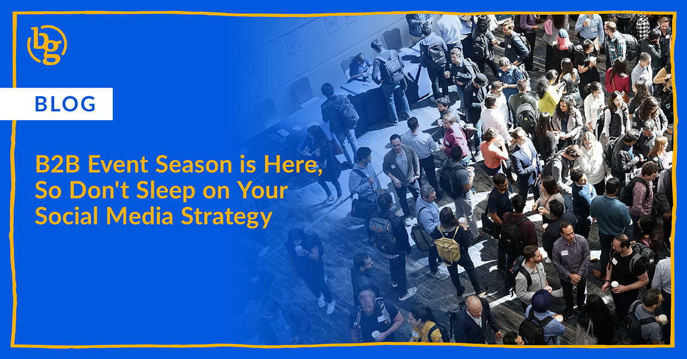

BrandGlue breaks down why B2B event season is the perfect time to show up on social, with tips for creating intentional, engaging content that goes beyond the booth.

Ah, yes, B2B event season. The expo halls are booked, swag is shipped, and someone on your team is triple-checking if the demo still works after the last software update. It’s a chaotic, exciting time, and social media ***should*** be part of the action. But too often? It gets left behind. 

Candidly: You’re already investing big $$$ in events. Flights, hotels, signage, maybe even those branded socks everyone weirdly loves. So why would you not show up on social like you mean it?

### Events Are Content Goldmines

Let me say this louder for the folks in the back: if your event presence isn’t being amplified online, you’re missing out. Panels, keynotes, behind-the-scenes setup moments, candid team selfies, catchy one-liners from your product demo, they all have potential on social.

Events are one of the few times you’ve got real humans engaging with your brand in real time. Show that off! Capture the energy. Be a little scrappy. You don’t need a full video crew following you around (though if you’ve got one, we love that for you). A couple of well-timed iPhone shots and a good caption can go a very long way.

### It’s Not Just Onsite Coverage, It’s Pre and Post Too

Social strategy for events isn’t just about live posting during the week of. That’s part of it, sure. But what are you doing before to tease your presence? Who on your team can start hyping panels, sharing travel playlists, or shouting out customers they’re excited to see?

And after the event? Don’t let all that content just sit on your camera roll. Recap posts, team reflections, or Q&A snippets make for great follow-up pieces. 

### If You're Thinking “We Don’t Have Time,” Here's My Pep Talk

Totally fair. Events are overwhelming and a big lift to successfully pull off. Here’s my take: a strong social strategy **doesn’t** have to be overly polished or complicated. It just has to be intentional.

Start with a few key goals. Are you trying to drive traffic to your booth? Highlight a new product update? Build thought leadership by spotlighting a speaker? Pick your focus, then reverse engineer your content around that. 

And if you’ve got a good social partner (hi 👋), they can help you plan and execute without making your to-do list 10x longer.

### Don’t Ghost Your Audience During Event Season

B2B events are high-touch and high-cost opportunities, and your audience wants to come along for the ride. So, whether you’re posting from the show floor or queuing up content in advance, show up, be real, and have fun with it. Your social channels (and your prospects) will thank you.

Need a hand amplifying your next event on social? That’s kind of our thing. Reach out here: [hello@brandglue.com](mailto:hello@brandglue.com)