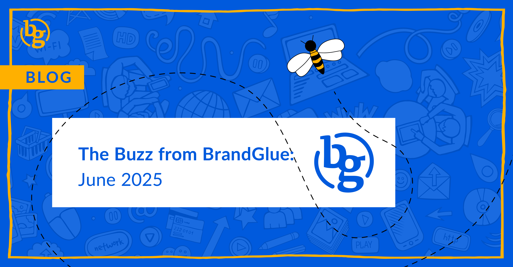

This blog summarizes the major social news and updates that took place in June 2025. From First Impression ads launching on LinkedIn to removing links from posts on Facebook to customizing the profile grid on Instagram, it was another busy month in the social sphere. Read on to stay in-the-know as we head further into 2025.

### \> [Don’t Demand Too Much of Your Audience’s Time on LinkedIn](https://www.linkedin.com/business/marketing/blog/content-marketing/13-top-tips-for-compelling-b2b-video-content-on-linkedin)

Source: LinkedIn

You’ve likely heard of most of LinkedIn’s latest tips for creating compelling B2B video content, but one of the most important ones is buried further down the list. When it comes to top-of-funnel awareness campaigns, LinkedIn strongly recommends keeping ads between 15-30 seconds. If you are launching a mid or bottom-of-funnel campaign, LinkedIn recommends longer videos but cautions that they shouldn’t be longer than two minutes. As more companies look to target senior audiences, it’s important to remember that watching video is not the most time-efficient way of accessing information.

### \> [Extend Visibility on LinkedIn with Reserved Ads](https://www.thekeyword.co/news/linkedin-introduces-first-impression-ads-for-single-day-campaigns) 

Source: The Keyword

LinkedIn recently announced First Impression ads, a vertical video format that gives advertisers the first ad impression a user sees each day. If you’re looking to extend visibility beyond day one, then Reserved Ads is a great solution for you. This locks in the first Sponsored Content slot in the feed for a longer stretch, and can include formats like single image or document ads.

### \> [Time to Remove Links From Posts on Facebook?](https://www.socialmediatoday.com/news/facebook-advice-suggests-adding-links-in-comments-not-post-caption/750754/) 

Source: Social Media Today

It isn’t an official confirmation, but users are starting to see a recommendation in their post-specific insights in the Professional Dashboard for their Facebook Pages that says a link in your caption can reduce your reach. This has been a hotly debated topic amongst marketers, but this is the first official word from Facebook that you should consider adding your links in the first comment as opposed to including it in your post body. As video continues to be pushed by all platforms, it isn’t a huge surprise that Meta is looking to drive users away from link posts. We recommend testing this to see if you notice any big difference in reach.

### \> [Customized Profile Grid on Instagram](https://about.instagram.com/blog/announcements/inspiring-instagram-creativity)

Source: Adam Mosseri

As businesses become more aware of the first impression they give off, Instagram is going to help by giving brands more control over what people see when they visit your profile. According to Adam Mosseri, Head of Instagram, this was rolled out earlier in June, and so you can now feel free to let those creative rearrangements begin.

### \> [Is it Time to Try Something Old on X?](https://business.x.com/en/advertising/formats#collection-ads)

Source: X Business

Carousel ads have a high ceiling when it comes to engagement. A similar ad format that has never really taken off on X is their Collection Ads. The main benefit compared to Carousels is that all of the images are displayed within a single view, meaning the audience does not have to swipe through individual cards. We understand the limitations of X’s advertising, but this can be a low-cost way of getting all of your creative in front of the audience without requiring them to swipe through. 

### \> [Threads Rewards Program Coming?](https://www.threads.com/@oncescuradu/post/DK4HARMMFuw)

Source: Adam Mosseri

On his personal Instagram account, Adam Mosseri shared that a rewards program is in development for Threads. The goal is to continue to grow the popularity of the platform, and it sounds like it will be based on incentivizing the “most creative and impactful users”. It will be interesting to see what the standards are for being termed a “culturally relevant voice”, but this is nonetheless another step in getting people with bigger followings to consider prioritizing Threads.

**That’s a wrap on the updates!**

Join us again next month as we continue to bring you the latest and greatest updates to help you succeed in the B2B social media marketing community. In the meantime, follow us on [LinkedIn](https://www.linkedin.com/company/brandglue-com/posts/?feedView=all) for additional updates.