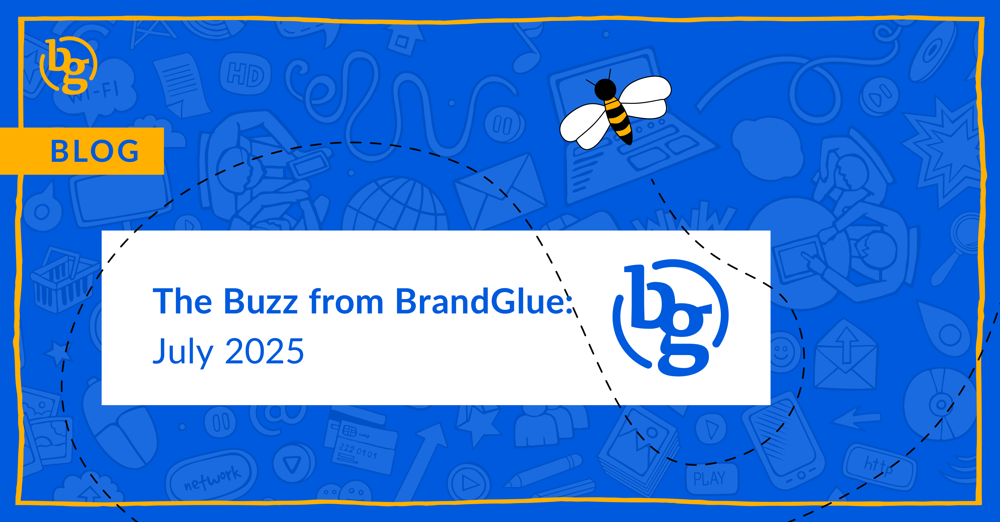

This blog summarizes the major social news and updates that took place in July 2025. From LinkedIn clarifying how to use hashtags to the latest Reels Guide from Meta to Threads enabling signups via Facebook, it was another busy month in the social sphere. Read on to stay in-the-know as we head further into 2025.

### \> [Maximizing LinkedIn ROI with Advanced Full Funnel Metrics](https://www.linkedin.com/business/marketing/blog/linkedin-ads/maximizing-roi-linkedin-full-funnel-metrics)

Source: LinkedIn

Measurement Insights is a central hub that simplifies campaign management by delivering actionable data at the member, company, and ad levels. With this access, marketers are able to see their buyers’ entire journey, view targeted insights to improve strategies/targeting/ad formats, and view a streamlined dashboard that is designed to reduce workflow complexity and bolster efficiency. LinkedIn has also made updates to its Google Tag Manager setup for Conversions API, making it easier to track online and offline conversions

### \> [LinkedIn Hashtags and Algorithm Update](https://www.mediaweek.com.au/why-linkedin-users-are-seeing-old-posts-in-their-feed/)

Source: [Media Week](https://www.mediaweek.com.au/why-linkedin-users-are-seeing-old-posts-in-their-feed/) and [Rishi Jobanputra](https://www.linkedin.com/posts/rishij_i-was-asked-recently-if-you-should-include-activity-7351729382903762944-4v4M/) (LinkedIn Senior Director

LinkedIn confirmed (again) that hashtags can be useful for people who are searching for a specific trend, but ultimately don’t help increase reach as they have in the past. Also, you may have noticed older posts appearing in your feed recently. No, you aren’t crazy. A recent algorithm update led to more older content being shown in-stream. According to LinkedIn, this was part of a test to try and strike a balance between prioritizing relevant and recent content, but it has since been rolled back after user complaints

### \> [Latest Reels Ads Guide from Meta](https://scontent-mia5-1.xx.fbcdn.net/v/t39.8562-6/512647534_770545312317272_7863548927237106230_n.pdf/Reels_Ads_Guide.pdf?_nc_cat=104&ccb=1-7&_nc_sid=e280be&_nc_ohc=OtvhkjNYcQ8Q7kNvwE0Ae71&_nc_oc=AdmNzxh9mWAJRo4UkbzsqD54xOVWJFbBSuAh2a1KCGc4jrRLqTVby7AulvlVJIUsbM8&_nc_zt=14&_nc_ht=scontent-mia5-1.xx&_nc_gid=e62Doyu70pB-VPFNaBx2tw&oh=00_AfRJ_L1nmnZZwb_FLrTrddA6L2XtRImhSMN1COlrs3bOkQ&oe=6889580E)

Source: Met

With video making up over 60% of the time spent in Facebook’s app, and with the company recently announcing that all video uploads will be categorized as Reels, it’s a good idea to have the latest creative tips to help your advertising efforts. Meta recently released a short, six-page overview of Reels promotions best practices, which also includes data on ad performance. The top tips are to build 9:16 video (or allow Advantage+ creative to crop or expand to 9:16 automatically) and ensure your messaging isn’t overlapped by the Reels user interface

### \> [Saying Link in Bio Isn’t Getting Your Reach Restricted on Instagram](https://www.threads.com/@oncescuradu/post/DMdCL_FMr5b/media)

Source: Adam Mosser

Various Instagram creators have speculated that Instagram’s algorithm restricts the reach of posts that contain “Link in bio” in the copy. The reasons for this make sense, as it encourages users to leave Instagram and is an overused term. Adam Mosseri, Head of Instagram, recently commented on this and tried to assure users that no reach restrictions are in place. It’s entirely possible that there is no algorithmic limitation; rather, users are just experiencing a level of fatigue with the term link in bio

### \> [Emoji Use Restricted in X Promoted Posts](https://www.threads.com/@mattnavarra/post/DMYB6Mqq55g)

Source: Matt Navarra

If you want to use more than one emoji in your ad on X, get ready to pay more for it. With hashtags no longer allowed or improving reach, this new restriction is also designed to improve the look and feel of ads. If you want to run an ad with more than one emoji, you won’t have your ad rejected outright, you’ll just be given a lower quality score and face higher pricing as a result

### \> [Now You Can Signup for Threads via Facebook](https://help.instagram.com/1433134547812993/?helpref=related_articles)

Source: Instagra

Following strong app download numbers, Meta is looking to add new users by allowing them to sign-up for Threads using their Facebook profile, rather than cross-linking their Instagram account. This also gives users the ability to populate their Threads feed based on their Facebook account info instead of their Instagram connections

**That’s a wrap on the updates!**

Join us again next month as we continue to bring you the latest and greatest updates to help you succeed in the B2B social media marketing community. In the meantime, follow us on [LinkedIn](https://www.linkedin.com/company/brandglue-com/posts/?feedView=all) for additional updates.