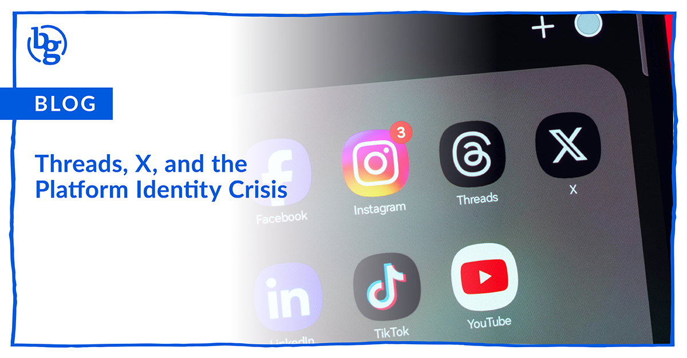

Threads and X are battling for the public conversation space. Here’s how to decide which platform deserves your brand’s time and energy.

There was a time when social platforms had clear roles. Facebook was for friends, Instagram for aesthetics, [Twitter (now X)](https://brandglue.com/blog/everything-about-the-everything-app/) for real-time conversation, and LinkedIn for, well, pretending you love corporate culture. Now, platforms are having full-on identity crises and it can make marketing tricky. 

The biggest offenders right now? Threads and X. Both are battling to own the “public conversation” space, but they’re doing it in very different ways and if you’re running brand accounts, deciding where to spend your time (and budget) is becoming a real question.

So, let’s break this down.

### X: The Platform That Won’t Quit (Yet)

Say what you want about the rebrand or the algorithm, X hasn’t fully lost its grip on real-time conversation.

* If your audience is news-driven, loves live commentary, and enjoys seeing your [on-site events](https://brandglue.com/blog/b2b-event-season-social-media-strategy/) unfold in real-time, X is still where those conversations are happening.
* Sports and entertainment, and tech communities? Still active.
* That said, [engagement](https://brandglue.com/blog/social-media-engagement-down-seven-things-do/) is harder to earn organically, and ad spend comes with a risk conversation you probably need to have internally.

Bottom line: If you need to be “in the moment,” X still has a place, just know it’s no longer the most popular game in town.

### Threads: Aka the Sibling That’s Growing Up (Albeit Slowly)

Threads launched as Instagram’s quieter, friendlier alternative to X, and for a while, it felt like a coffee shop where everyone whispered instead of screamed. But more recently, it’s leaning harder into real-time news and searchability, trying to mature into the platform it probably should have been at launch.

Why it’s worth watching:

* Less pressure, more authenticity. For many, Threads feels like early Twitter - casual, conversational, and not overrun with ads (yet).
* If your brand is lifestyle, community-driven, or thrives on softer storytelling, Threads is a great place to test a more approachable voice.
* But… audience expectations are still forming. It’s not where people instinctively go for breaking news or strong opinions, at least not yet.

Bottom line: Threads is a great playground if you have the bandwidth to experiment, but it’s not a must-have for every brand as of right now. 

### So, Where Should You Be (or Stay)?

Ask yourself three things before committing to either:

1. **Where is your audience ACTUALLY active?** Check analytics. Don’t chase platforms just because they’re trendy or shiny.
2. **What type of content are you built for?** If you thrive on in-the-moment takes, X still matters. If you’re more conversational and community-first, Threads is worth the effort.
3. **What’s your bandwidth?** Being mediocre on five platforms is worse than being great on two.

### The Move for Brands Right Now

If you’re already on X and seeing ROI, stay - but re-evaluate if you’re spending time there just out of habit. If you’re not on Threads, consider a soft launch: repost some IG-friendly content, test a conversational tone, and see if your audience bites.

The best brands aren’t picking sides, they’re strategically choosing where to show up with intention. Platform identity crises will come and go, but clarity on your brand’s voice and audience will always win.