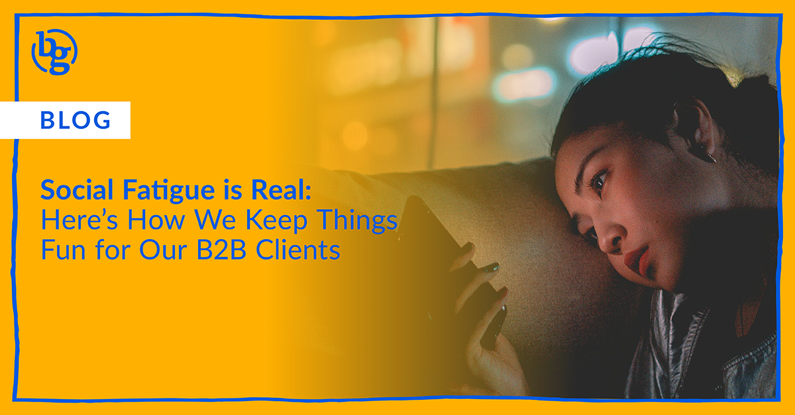

Check out how our team helps B2B brands avoid social fatigue by building human, relevant, and flexible social strategies that actually connect.

If you’ve noticed your social metrics slowing down or your content underperforming the way it used to, it might not be your product. It might be fatigue.

Not yours. Theirs.

Your social audience is tired of being sold to. They’re exhausted by posts that sound the same, look the same, and request the same next action. They scroll right past them without making a dent. And in the B2B space? That fatigue gets amplified. Because far too often, brands treat social media like a checkbox, not a channel for connection.

We specialize in helping B2B brands stand out in the scroll. Here’s how we keep social fun, fresh, and engaging for our clients and their audiences.

## 1. We Lead with Personality

Social fatigue thrives on sameness. That’s why one of our top priorities is dialing in your brand voice, then actually using it.

We don’t default to “industry standard” language. We write like people. We shift tone depending on audience and platform. And we help clients own a voice that feels distinct, whether that’s confident, curious, helpful, cheeky, or a mix.

Because your audience can sense when you're showing up authentically.

## 2. We Design for Real Engagement

If the only posts getting [engagement](https://brandglue.com/blog/social-media-engagement-down-seven-things-do/) are your hiring announcements and team photos, it’s time to rethink the content mix.

We build strategies that make room for interaction, not just information. Think polls, myth-buster carousels, opinion statements, and timely nods to pop culture (yes, even in B2B).

It’s not about being trendy for trend’s sake. It’s about staying *relevant* to the humans on the other side of the screen.

## 3. We Rotate Series to Create Rhythm

Relying only on ad-hoc posts is one of the fastest ways to lose momentum and fall into repetitive territory. That’s why we help clients establish series content: recurring formats (like GIFs or animations) or themes that audiences start to recognize (and look forward to).

Give your brand a cadence and your audience something familiar to latch onto. Social fatigue hates consistency. We love it.

## 4. We Make Space for Moments

Yes, we’re planners. But we also know how to leave space for in-the-moment and reactive content that builds connection. Whether that’s a behind-the-scenes story, a shoutout to a partner, or a quick reaction to breaking industry news.

By keeping the calendar flexible, we allow space for the unexpected amongst the regular cadence, which is often where the magic happens. (Spoiler: If done correctly, these often become top-performing posts.)

## 5. We Treat Social Like a Conversation, Not a Press Release

B2B companies often default to one-way communication: “Here’s our update.” “Here’s our product.” “Here’s our next webinar.” Boring! 

We create content that invites conversation, feedback, and participation. We ask questions. We highlight your people, not just your product.

Because when you sound like everybody else, your audience tunes out. When you sound like you? They lean in.

## B2B Doesn’t Mean Boring

Social fatigue isn’t solved by posting more. It’s solved by posting *smarter*. Want to breathe new life into your B2B social presence? [Let’s chat](https://brandglue.com/), and in the meantime, check out [our team’s social media hot takes.](https://brandglue.com/blog/b2b-social-hot-takes/)