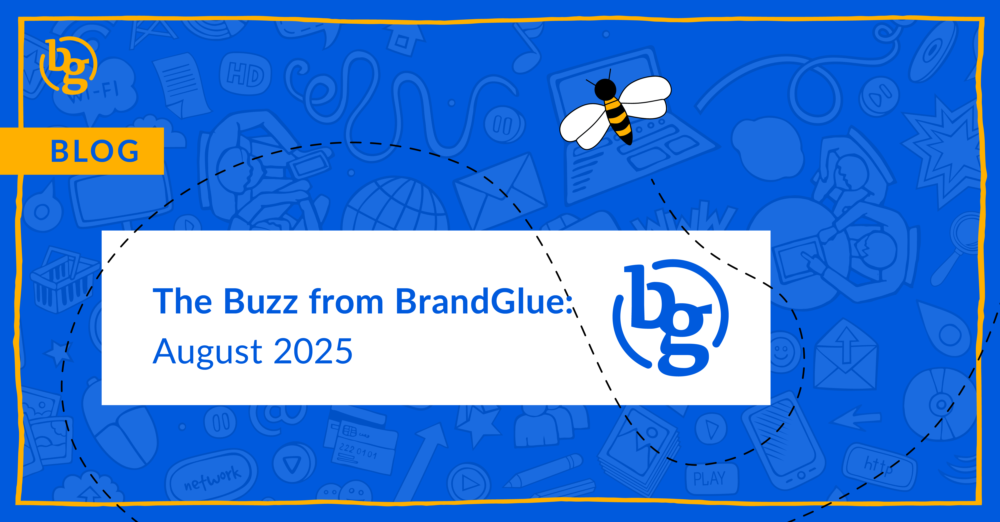

This blog summarizes the major social news and updates that took place in August 2025. From LinkedIn cracking down on fake engagement to Meta launching a new ads delivery system dubbed Andromeda to Instagram possibly counting screenshots as an engagement metric, it was another busy month in the social sphere. Read on to stay in-the-know.

### \> [Data Shows LinkedIn’s Algorithm Rewards Activity](https://buffer.com/resources/how-often-to-post-on-linkedin/)

Source: Buffer

It turns out more is actually better. Based on an analysis of over 2 million LinkedIn posts that came from over 94,000 LinkedIn accounts, Buffer found that posting frequency has the biggest impact on increasing your reach and impressions. It sounds like a no-brainer, but with strategies ranging from once a week, daily, and bi-monthly, it can be hard to know which advice to follow. It’s important to remember not to force it, as your company’s professional reputation is in the spotlight, but the data shows that consistent activity is very important.

### \> [LinkedIn Tackles Fake Engagement](https://www.linkedin.com/help/linkedin/answer/a524166)

Source: LinkedIn

Ever notice that some posts seem to have a flood of “commenting for more reach”, “CFMR”, or some other coordinated phrase to boost a post’s engagement via comments? It turns out LinkedIn has noticed, too. Whether it’s engagement pods or automatic engagement via AI tools, LinkedIn is actively looking to reduce the reach of this activity when it’s detected. The acknowledgement shows that the platform considers it important, and we encourage keeping comments authentic so they don’t come off as auto-generated.

### \> [What Meta’s Andromeda Means for Ad Strategy](https://www.jonloomer.com/meta-andromeda/)

Source: Jon Loomer

It’s not a Michael Crichton book, but it does still read pretty convoluted and technical. In simple terms, Andromeda is the first step of Meta’s evolving ad delivery, where their system decides which ads will be shown. It doesn’t rank the winning ads; it basically picks a short list and is supposed to be Meta’s answer to the surge of new ad variations created by Advantage+ creative. We will see if this leads to their system being able to learn who responds to each angle and variation, and whether the ads end up feeling more personalized and custom in the process.

### \> [Could Screenshots on Instagram Soon Be Counted as Engagement?](https://www.threads.com/@oncescuradu/post/DNZDtvRsDXQ)

Source: Adam Mosseri

In response to a question during a Q&A session, Head of Instagram Adam Mosseri was intrigued by the idea that screenshots could be another metric added to Instagram’s insights. Tracking this is possible on iOS, and there is a good argument to be made that this would add value since many posts are shared 1:1 or 1:few in DMs vs in social feeds. At the very least, a screenshot would certainly constitute an extra view, or perhaps the Instagram team will implement it as another type of measurement.

### \
> [The Future of X Ads](https://www.socialmediatoday.com/news/x-formerly-twitter-adds-dedicated-video-tab-US/737884/)

Source: X Business

With an updated ad targeting system that relies heavily on Grok, X’s AI engine, as well as new presentation formats designed to make X ads more visually appealing, there is a fair amount of development worth monitoring when it comes to X ads. In addition to saying that Grok is enabling more effective interest targeting, the other big improvement claim is that brand safety has seen major improvements. X’s ad revenue is slowly improving, so we’ll see if these updates lead to an even bigger turnaround.

### \> [Use the Threads API to Create Posts with Polls](https://developers.facebook.com/docs/threads/create-posts/polls)

Source: Facebook Developers

One of the latest and most interesting updates to the Threads API is the ability to add polls when publishing new threads. You’re also able to retrieve poll results from existing ones. The major limitation is that this can only be done with text-only posts, but this walkthrough from Facebook Developers shows how to create a poll attachment with the options you create.

**That’s a wrap on the updates!**

Join us again next month as we continue to bring you the latest and greatest updates to help you succeed in the B2B social media marketing community. In the meantime, follow us on [LinkedIn](https://www.linkedin.com/company/brandglue-com/posts/?feedView=all) for additional updates.