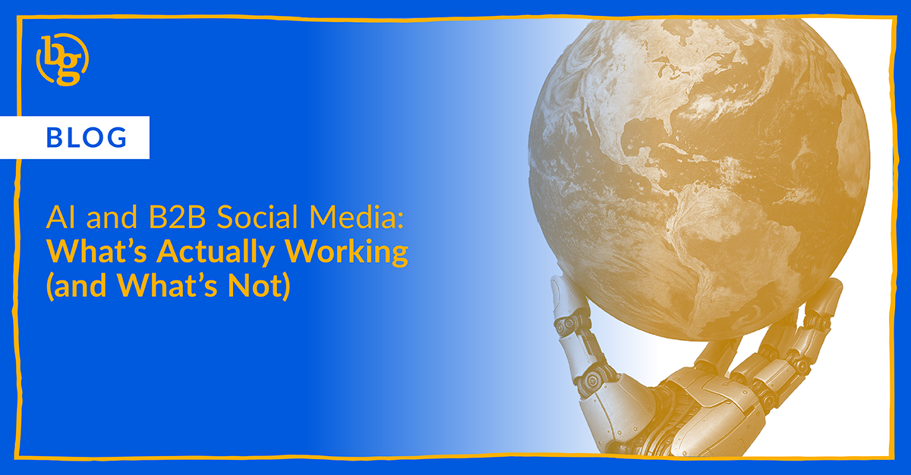

AI is reshaping B2B social media, but it’s not replacing the humans behind it. After testing top AI tools, BrandGlue found they’re great for saving time, analyzing data, and sparking ideas — but they still miss the emotion, timing, and creativity that make content connect. The best results come when AI supports human marketers, not replaces them.

AI has transformed marketing faster than almost any other industry, with 74% of marketers using at least one AI tool at work, up from 35% last year ([Hubspot](https://www.hubspot.com/company-news/marketers-double-ai-usage-in-2024)). Social media, in particular, has become a major testing ground for what’s possible.

At BrandGlue, our team spent months testing a wide mix of AI platforms that promised to make our jobs easier, faster, and more creative. Some tools were genuinely impressive, others were confusing or unreliable, and a few didn’t even work properly. We wanted to understand what actually helps B2B social media managers deliver stronger results and where the technology still falls short.

The truth is, AI is powerful, but it’s not magic. It can lighten workloads, organize data, and generate ideas, but it can’t replace the human instincts that make great marketing work. The ability to read a moment, craft a message that feels authentic, and connect with people online still belongs entirely to the humans behind the screen.

## Why Humans Still Matter Most

AI can support the creative process, but it doesn’t understand timing, emotion, or culture. A B2B social media manager knows when a post feels off, when a topic is sensitive, or when a trend has already passed. That kind of awareness is what turns a good post into one that people remember, or prevents a post that people remember for the wrong reasons. The best marketers use AI as a tool to work more efficiently, not as a substitute for creativity or judgment.

## Where AI Helps (and Where It Doesn’t)

### Personalizing content

* **Tools we tested:** [Jasper](http://jasper.ai), [Copy.ai](http://copy.ai), [ChatGPT](https://chat.openai.com/)
* Great for adapting tone, creating quick variations, and tailoring posts for different audiences
* Not so great at understanding deeper brand nuance, which can lead to copy that feels repetitive or off-brand

### Creating visuals and video

* **Tools we tested:** [Runway](https://runwayml.com/), [Canva Magic Design](https://www.canva.com/magic/), [Pika](https://pika.art/login)
* Great for generating fast ideas, mockups, and simple background removals
* Nice for quick edits but not so great at producing truly creative or emotional content that feels unique to a brand (yet)

### Repurposing existing content

* **Tools we tested:** [ChatGPT](https://chat.openai.com/), [ContentFries](https://www.contentfries.com/), [Lumen5](https://lumen5.com/)
* Great for turning long videos or blog posts into short clips, captions, or summaries, giving your [B2B content](https://brandglue.com/blog/social-media-mileage-b2b-content/) more mileage
* Not so great at recognizing which moments are meaningful or what content deserves the spotlight

### Reporting and insights

* **Tools we tested:** [Supermetrics](https://hub.supermetrics.com/), [Narrato](https://narrato.io/), [ChatGPT](https://chat.openai.com/)
* Great for organizing data and turning metrics into clear visuals
* Not so great at interpretation, since AI can miss context or misrepresent what the data actually says

### Spotting trends

* **Tools we tested:** [Exploding Topics](https://explodingtopics.com/ai-topics), [SEMrush](https://www.semrush.com/apps/collection/ai-apps/), [SparkToro](https://sparktoro.com/)
* Great for discovering early patterns, identifying what audiences are talking about, and sparking new ideas
* Not so great at explaining why something matters or how to turn a [social media trend](https://brandglue.com/blog/b2b-social-trends-2025/) into a lasting brand opportunity that part’s still our job — and we happen to love it.

## The Bottom Line

AI is changing B2B social media, but it’s not replacing the people who make it meaningful. These tools can streamline the process and help us move faster, but they still need experienced marketers who know how to think critically, tell stories, and connect with audiences in a way no algorithm can.

At BrandGlue, that’s what we’ve learned most through all our testing. When AI is treated like a teammate that supports your productivity rather than a shortcut to skip it, it actually makes the work better. The best campaigns still come from people who know how to listen, adapt, and build something worth sharing, and that’s not something any tool can automate.