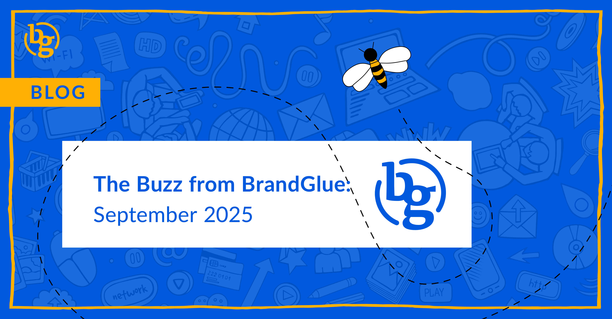

This blog summarizes the major social news and updates that took place in September 2025. From LinkedIn releasing new post send and save insights for profiles to Meta using AI interactions to improve ads to more ad formats coming to Threads, it was another busy month in the social sphere. Read on to stay in-the-know.

### \> [New Post Send and Save Insights from LinkedIn](https://www.linkedin.com/posts/samclanon_weve-been-cooking-up-some-new-metrics-this-activity-7371552201904922624-Zr0r/)

Source: Sam Clanon (Create Org Leader at LinkedIn)

In an effort to better measure how your on-platform performance is going, make sure to prioritize the “Saves” and “Sends” metrics that are in the process of being rolled out. Saves will tell you how many people have bookmarked your post, while Sends shares how often your post was sent in a private message. For executives or other influencers that you manage, this new data should provide a more complete picture of your content’s performance, as behaviors like direct message engagement continue to rise on LinkedIn.

### \> [More Ad Automation on LinkedIn is Here](https://www.linkedin.com/business/marketing/blog/linkedin-ads/launch-small-business-campaign-linkedin-new-tools)

Source: LinkedIn

In an effort to get you up and running more quickly, LinkedIn has added additional AI tools to expedite the process of building and launching campaigns. Auto-targeting, AI-generated ad variants, and “improved recommendations” are designed to get you to launch with fewer inputs. BrandGlue has watched these recommendations since LinkedIn began showing them, and many times the suggestions have nothing to do with the campaign. The tools will get better, but we recommend not going full automation with setup.

### \> [Meta Using AI Interactions to Improve Ads](https://about.fb.com/news/2025/10/improving-your-recommendations-apps-ai-meta/)

Source: Meta

Have you engaged in conversations with Meta AI? Well, those are soon going to help inform Meta which ads to show you. The chats that you’ve had are being used to build your data profile, and starting December 16, 2025, this profile will be used by the platform to personalize the content and ads that users see. This is probably a good time to remind everyone that when you use a free product like Facebook or Instagram, your data is, in fact, the cost of using that free product.

### \> [Reels Trending Ads Expanding on Meta](https://www.facebook.com/business/news/from-culture-to-conversion-with-metas-brand-building-tools)

Source: Meta

Reels trending ads are being expanded to more advertisers. This is great news and gives brands the ability to be alongside trending and relevant Reels content. According to Meta’s early testing results, Reels trending ads can boost unaided awareness by over 20%. The only caveat is that to access it, your brand must have a Meta sales representative. This is clearly an attempt by Meta to get more people engaged with their reps, which can often be a very time-consuming and not necessarily productive exercise.

### \> [More Ad Formats Coming to Threads](https://www.facebook.com/business/news/from-culture-to-conversion-with-metas-brand-building-tools)

Source: Meta

Carousel and expanded image ads are coming soon, as well as a 4:5 rendering for video ads. This will be really helpful for advertisers who have found success with carousels on other Meta platforms, but who have to uncheck the Threads placement because they were not supported. If your company isn’t on Threads, then don’t worry. They announced that they will let brands that don’t have an account use their Instagram or Facebook posts as the basis for their Threads ads.

### \> [Introducing Boost on X](https://x.com/XCreators/status/1968392794000474147)

Source: X Creators

X is looking for a quick way to amplify your content. You may have noticed a new Boost button on your posts, and if you tap it, you’ll see a range of options that can increase the reach of your posts. Currently, the costs range from $50-$1,000, and since they aren’t technically ads, there isn’t too much incentive here unless you really need to hit some reach goals.

**That’s a wrap on the updates!**

Join us again next month as we continue to bring you the latest and greatest updates to help you succeed in the B2B social media marketing community. In the meantime, follow us on [LinkedIn](https://www.linkedin.com/company/brandglue-com/posts/?feedView=all) for additional updates.