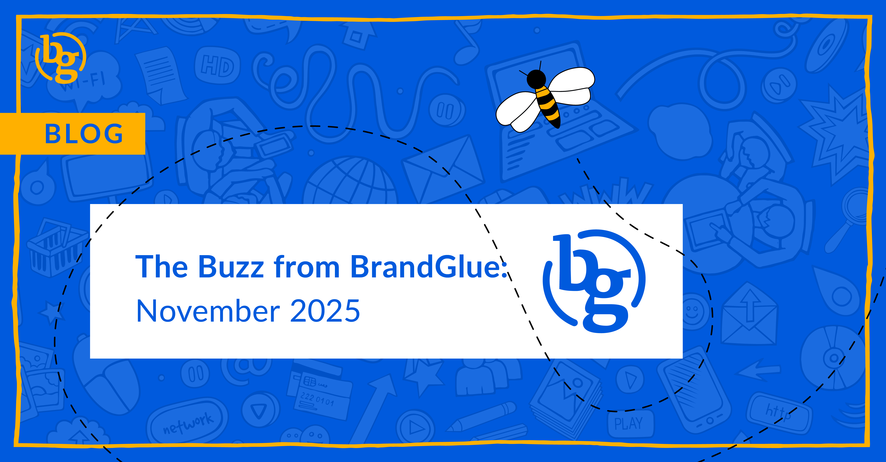

This blog summarizes the major social news and updates that took place in November 2025. From LinkedIn launching Enhanced Discovery to Meta automatically expanding lookalike audiences in ads to competitor insights becoming more available on Instagram, it was another busy month in the social sphere. Read on to stay in-the-know. 

### \> [Enhanced Discovery Expanding Thought Leader Ads on LinkedIn](https://www.linkedin.com/pulse/boost-reach-build-influence-enhanced-discovery-thought-m5alc/)

Source: LinkedIn

If you need help with Thought Leader ads or are just wondering which content to focus on, LinkedIn has launched Enhanced Discovery to help brands easily find and boost organic content. This allows marketers to easily search and identify expert voices across 1st, 2nd, and now 3rd+ degree connections and sponsor organic posts mentioning their brand or event. This is being touted as a big expansion of collaboration opportunities beyond your immediate network.

### \> [LinkedIn is Coming for the Engagement Pods](https://www.linkedin.com/posts/gyanda_sharing-an-update-on-how-we-think-about-keeping-ugcPost-7392019891865931776-bNwQ/)

Source: Gyanda Sachdeva (VP of Product Management, LinkedIn)

LinkedIn wants to be very clear...a group of people coordinating to like, comment, and share posts to boost virality inauthentically violates their policies, and they are doing everything they can to put a stop to it. According to LinkedIn’s data, thousands of updates are being boosted by these artificial networks, leading to less relevant content being pushed into LinkedIn feeds. Admittedly, this is difficult to enforce, but given the number of complaints LinkedIn has received, it’s nice to see them acting on this user request.

### \> [Lookalike Audiences on Meta Will Automatically Expand to Improve Performance](https://www.jonloomer.com/lookalike-audiences-expand-performance-goals/)

Source: Jon Loomer

As Meta moves more and more towards algorithmic targeting, lookalike audiences are becoming less and less defined, which means it can be nearly impossible to prevent Meta from showing your ads to people outside of that audience. Currently, if you are looking to maximize the number of conversions, landing page views, link clicks, app events, conversations, calls, leads, or conversion leads, the box that you can click to further limit the reach of your ads is no longer available. Going forward, it looks like there will be at least nine performance goals that Meta will automatically expand your targeting on to help you reach your performance goals.

### \> [Professional Accounts Can Now See Competitor Insights on Instagram](https://www.threads.com/@sarah.roizman/post/DQg1FOciJo_)

Source: Sarah Roizman

If you’ve been curious about how your brand’s page compares to other profiles like yours, you can now get more insights via the Competitive Insights feature. If you have a business or creator account, you can choose up to 10 handles to do a side-by-side comparison when it comes to follower growth and posting frequency. While it doesn’t share in-depth cumulative performance metrics, it is still a nice start and likely something that will be expanded on in the future.

### \> [Grok Will Process Every X Post to Improve Engagement](https://www.socialmediatoday.com/news/elon-musk-discusses-future-developments-for-x-xchat-grok-ai-algorithm/804466/)

Source: Social Media Today

In an effort to improve relevancy and match posts to more users who will find them interesting, Grok is now going to start reading every one of the hundreds of millions of posts that are sent on X in order to understand and categorize them. Given we’ve recently seen Grok choose Elon Musk as the answer to every either-or hypothetical question, it will be interesting to see how X’s AI interprets the posts and what types of changes users see in their feeds moving forward.

### \> [Threads Adds Reply Approvals](https://www.androidcentral.com/apps-software/meta/metas-threads-ups-its-game-with-new-controls-to-keep-trolls-at-bay)

Source: Android Central

In an effort to give posters more conversation control, Meta has introduced reply approvals to help keep the comments section free of trolls. Each reply can be approved or ignored individually. Users also have the ability to do so with all pending replies at once, whether it's designating them as acceptable or all spam.

**That’s a wrap on the updates!**

Join us again next month as we continue to bring you the latest and greatest updates to help you succeed in the B2B social media marketing community. In the meantime, follow us on [LinkedIn](https://www.linkedin.com/company/brandglue-com/posts/?feedView=all) for additional updates.