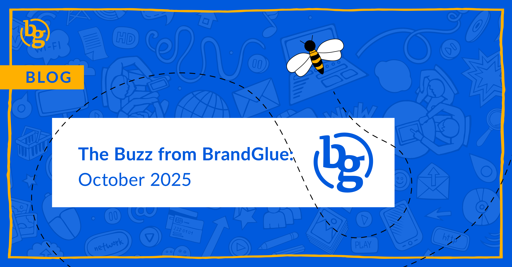

This blog summarizes the major social news and updates that took place in October 2025. From LinkedIn putting the previously free and self-serve competitor analysis behind a paywall to Meta taking over a small portion of targeting for exclusions in ad campaigns to Threads announcing disappearing posts, it was another busy month in the social sphere. Read on to stay in-the-know.

### \> [LinkedIn Limiting Competitor Analysis for Non-Paying Pages](https://www.linkedin.com/help/linkedin/answer/a553615)

Source: LinkedIn

Suppose you relied on Competitor Analytics to see how your company page is doing in metrics like follower growth, post performance, and engagement rates against your competitors. In that case, you will need to be enrolled in LinkedIn Premium Company Pages for at least $99/month to continue to have access to this data. Up until now, users were able to compare their company against multiple competitors for free, but now they will only be able to see how they stack up against a single one.

### \> [New B2B Playbook from LinkedIn](https://www.linkedin.com/business/marketing/blog/measurement/b2b-marketing-measurement-strategy)

Source: LinkedIn

With the average sales cycle in B2B being 211 days, it’s critically important that marketers are able to prove ROI. In the latest B2B Playbook from LinkedIn, they found that 87% of marketers struggle to measure long-term campaign impact. The big focus in this update is on creating an effective measurement strategy, so if you’re struggling or need research to back up the importance of tracking, this playbook is one you can’t afford to miss.

### \> [Could Meta’s AI Soon Be Taking Over More of Your Targeting?](https://developers.facebook.com/blog/post/2025/10/08/introducing-limited-spend-on-excluded-placements-in-marketing-api/) 

Source: Meta

If you use Meta’s Marketing API and exclude certain placements in your campaigns, you might still need to explain why your ads are showing up in those places. With a recent update to its Marketing API, Meta’s new feature within placements will allocate five percent of your ad spend to your excluded placements when Meta’s systems determine that they will likely see good performance. So, if for any reason you exclude placements like Threads, IG explore, or the right-hand column, Meta is saying that they will still spend a small amount of your budget in those places if they believe they can get results.

### \> [Here’s Your Chance to Control Your Instagram Algorithm](https://www.threads.com/@rpn/post/DPjR2xcADjv) 

Source: Creator of Threads

Instagram is looking to get people to manually guide the Reels content that they see in the app. This new algorithm overview highlights the topics that the platform thinks you want to see, but it gives you the ability to easily add or remove topic groups. It has the feel of an RSS feed and will be available in a new “Your Algorithm” section within the Reels settings. At the end of the day, this is just Instagram asking you to help them build a more accurate profile of your interests, but at least there is some “control” over your content.

### \> [Dormant X Usernames Headed to Marketplace](https://x.com/XHandles/status/1979714051665260601)

Source: X Marketplace

If you’ve been keeping an eye on a dormant @handle on X, you are in luck...if you’re an X Premium subscriber. X has recently announced that it will allow Premium+ the ability to acquire any vacated X handle, in some cases for free, but in others for a yet-to-be-determined price. The marketplace has not gone live yet, but interested users can sign up for the waitlist. There will be two categories: rare and priority, with the priority ones typically being available for free while the rare ones might end up going to auction.

### \> [Introducing Disappearing Posts on Threads](https://about.fb.com/news/2025/10/introducing-disappearing-posts-on-threads/) 

Source: Meta

Right before Halloween comes Threads’ ghost posts. These posts will be automatically archived after 24 hours, and all replies are sent to the user’s messaging inbox. The cynic might say this is an attempt to get people to push the envelope, but that’s exactly the benefit that Meta is promoting. Here today and gone tomorrow, brands can feel confident trying new things and posting spontaneous thoughts. And that can never, ever go wrong, can it?

**That’s a wrap on the updates!**

Join us again next month as we continue to bring you the latest and greatest updates to help you succeed in the B2B social media marketing community. In the meantime, follow us on [LinkedIn](https://www.linkedin.com/company/brandglue-com/posts/?feedView=all) for additional updates.