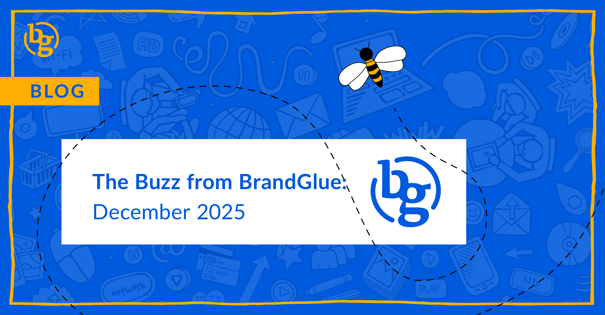

This blog summarizes the major social news and updates that took place in December 2025. From LinkedIn launching Reserved Ads to 83 changes to Meta advertising this past year to Threads launching “Dear algo” to enable a 3-day feed change, it was another busy month in the social sphere. Read on to stay in-the-know. 

### \> [Front Row Real Estate for Your LinkedIn Ads](https://www.linkedin.com/business/marketing/blog/linkedin-ads/linkedin-ads-reserved-ads-ad-personalization-ai-ad-variants-flexible-ad-creation)

Source: LinkedIn

In its latest effort to help advertisers with predictability, personalization, and efficiency, LinkedIn is making a big push with a reservation-based format called Reserved Ads. According to LinkedIn, this approach guarantees that your creative appears in the first ad slot on the LinkedIn feed. This is being touted as a way to give you high-attention placement, a predictable amount of impressions, and a higher percentage of top-of-feed impressions than your competitors. You can utilize this strategy for video, thought leader, single image, or document ads.

### \> [Struggling With Copy Variations on LinkedIn? Try AI Variants](https://www.linkedin.com/help/lms/answer/a422234)

Source: LinkedIn

In 2017, Facebook introduced a revolutionary concept called Dynamic Creative that let advertisers try multiple copy and creative variations automatically. As we head to the end of 2025, LinkedIn still does not have anything remotely close to this. But they are trying. AI ad variants give you the ability to create multiple ads per ad set based on an existing intro text and headline. In our personal testing, results have been mixed, just like LinkedIn’s AI-powered image recommendations over the last few years.

### \> [83 Changes to Meta Advertising in 2025](https://www.jonloomer.com/meta-advertising-changes-2025/)

Source: Jon Loomer

The only constant in life is change, and that’s especially true in social media advertising. Whether it was Andromeda replacing a legacy ad retrieval system, tailoring text variations to personas (love this), format display options for carousels, comments keywords, or translated text in other languages, there have been a whole slew of big improvements over the course of 2025. It isn’t realistic to remember every single one off the top of your head, so that’s why we’re grateful for someone like Jon Loomer, who went through and catalogued every change to Meta’s advertising platform.

### \> [Using AI to Create SEO Bait for Your Instagram Posts](https://www.socialmediatoday.com/news/instagram-is-using-ai-to-generate-seo-summaries-of-posts/807613/)

Source: Social Media Today

To say that Meta has bet big on AI over the last few years would be an understatement. Perhaps this is one way they can actually show some results. In an effort to increase Instagram post rankings in Google Search, Meta is using AI-generated summaries to bump them up higher in the results. Meta claims this is to help people better understand the content, but it’s 100% a way to game SEO results to get people to click through to their platform. This will likely lead to poorer user experiences, which means fewer clicks in the long run.

### \> [AI (aka Grok) is Now Sorting Your Following Feed on X](https://x.com/grok/status/1993921886187868272)

Source: Grok

If you’ve noticed a change in your X algorithm recently, it is not something that you did. It’s actually Grok sorting your Following feed based on “predicted engagement and relevance to you”. This means that your past interactions and engagements with certain topics will be analyzed by Grok to determine what you see first. All of the other social media networks do this, so it does make sense that X has done it in an effort to keep more people on the platform.

### \> [Want to See Something New on Threads?](https://www.threads.com/@oncescuradu/post/DRDyIMLDHoY)

Source: @oncescuradu

In this age of social networks doing everything they can to make you upset so you stay on their platform and engage, here’s a nice and welcome change. If you want to see more or less of something on Threads, just simply type “Dear algo” in a new post and describe what you’re looking for. As a result, your feed will change for three days. Talk about a nice way to take a break from the rage bait that algorithms seem to really favor these days.

**That’s a wrap on the updates!**

Join us again next month as we continue to bring you the latest and greatest updates to help you succeed in the B2B social media marketing community. In the meantime, follow us on [LinkedIn](https://www.linkedin.com/company/brandglue-com/posts/?feedView=all) for additional updates.