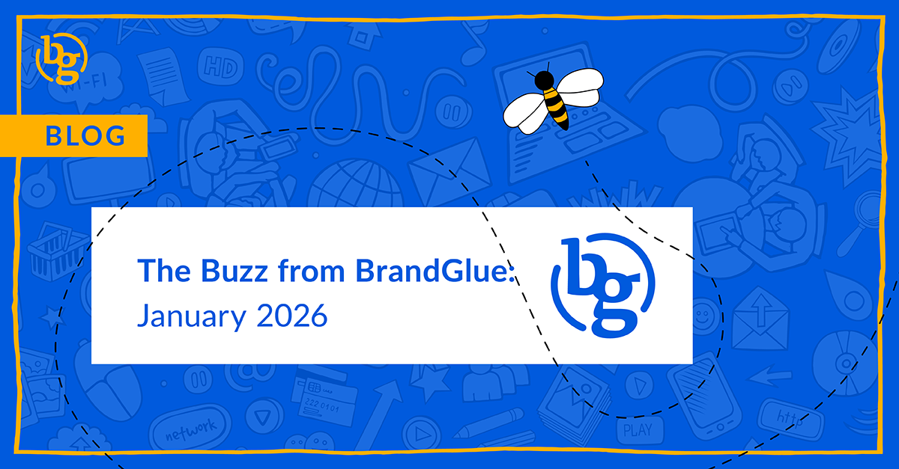

This blog summarizes the major social news and updates that took place in January 2026. From LinkedIn content making a splash in chatbots to a new ads library view on Meta to hashtags dying out on Instagram, it was another busy month in the social sphere. Read on to stay in-the-know. 

### \> [LinkedIn Only Trails Reddit in Chatbot Citations](https://www.semrush.com/blog/most-cited-domains-ai/)

Source: SEMRush

In an attempt to increase the credibility of their responses, AI tools like ChatGPT, Google AI, and Perplexity are citing LinkedIn more than any other source besides Reddit. According to an SEMRush study of over 230,000 prompts, 78% of the LinkedIn sources cited came from LinkedIn Pulse articles. As more noise around ads in LLMs comes out, this study shows the importance of getting your company and executives to show up in AI search responses by posting articles directly to LinkedIn.

### \> [Top LinkedIn Feed Questions of 2025](https://www.linkedin.com/pulse/top-linkedin-feed-questions-2025-gyanda-sachdeva-anl2e/)

Source: Gyanda Sachdeva, VP of Product at LinkedIn

Whether it’s how LinkedIn’s Feed works, what companies should post about, distribution, how often you should post, or just how the latest algorithm works, LinkedIn’s VP of Product took some time to address the most frequently asked questions in a LinkedIn Pulse article. With LinkedIn seeing content sharing up 15% and comments in feed up 24% in 2025, there is a greater sense of urgency to make sure you have the latest best practices from the people who are constantly tweaking and fine tuning LinkedIn.

### \> [New Impression Insights in Meta Brands’ Ad Library](https://www.linkedin.com/posts/stefan-298152133_looks-like-meta-just-flipped-the-lights-on-share-7415812813736013824-9EhI/)

Source: Stefan, Teacher of Modern Day Marketing

Your underperforming ads may no longer be a secret for much longer on Meta. A few users are reporting that you can now click into any brand’s Facebook Ad Library and see which ads are getting a tiny impression share. On the bright side, you can now truly see what your competitors are doing that isn’t working and gain valuable insights on which approaches to avoid when going after similar audiences. While this may get framed as bringing more ad transparency to users, the cynic might say that this puts more pressure on advertisers to improve faster, which requires more ad spend dollars and leads, ultimately resulting in more profit for Facebook.

### \> [Hashtags Are Really Dying Out on Instagram](https://www.threads.com/@creators/post/DSalXGPCWM4/media)

Source: Creators

LinkedIn has said they’re useless. So has X. Now, you can add Instagram to the social networks that are trying to do away with the once-popular posting strategy. Rather than ripping the band-aid off, they are going with the “let’s let them down easy” approach. With AI algorithms playing a bigger part in highlighting relevant content, and more users associating excessive hashtag use with spammers and scammers, limiting posters to five hashtags seems to be the last chance that hashtags have to survive on Instagram.

### \> [Maximizing Ad Campaigns on X](https://business.x.com/en/resources)

Source: X Business

Despite a constant stream of challenging headlines, X is trying to remind advertisers that there is still an opportunity to achieve a positive ROI on X ads thanks to its high engagement around live events and approximately 600 million users. These best practice guides are designed to help ensure that your ads follow the latest changes to X’s algorithm. If it’s been a long time since you’ve run an ad campaign on the platform, there is also a three-step guide to getting yourself back up and running.

### \> [Has Threads Finally Edged Out X?](https://techcrunch.com/2026/01/18/threads-edges-out-x-in-daily-mobile-users-new-data-shows/)

Source: TechCrunch

According to TechCrunch, when it comes to daily mobile users, the answer is yes. A recent study showed that Threads had around 141.5 million daily active users on iOS and Android, with X coming in with 125 million on the same mobile devices. While it’s always easy to point to the headlines around X, Threads has been rapidly rolling out new features recently, and combined with more cross-promotions on Meta’s other apps like Facebook and Instagram, it was only a matter of time before they caught up in the mobile users race.

**That’s a wrap on the updates!**

Join us again next month as we continue to bring you the latest and greatest updates to help you succeed in the B2B social media marketing community. In the meantime, follow us on [LinkedIn](https://www.linkedin.com/company/brandglue-com/posts/?feedView=all) for additional updates.