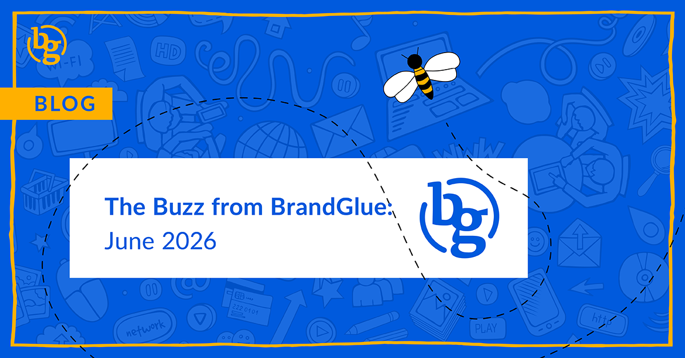

This blog summarizes the major social news and updates that took place in June 2026. From LinkedIn announcing collaborative posts to the launch of Instagram Plus to Meta releasing integrated booking for lead ads, it was another busy month in the social sphere. Read on to stay in-the-know. 

### \> [Collaborative Posts are Coming to LinkedIn](https://www.linkedin.com/posts/linkedin-guide-to-creating_its-official-collaborative-posts-are-coming-activity-7474808448682102784-zBoB/) 

Source: LinkedIn Guide to Creating

Brands have been using collaborative posts on Meta to increase reach and engagement across two sets of audiences. Now it seems that LinkedIn wants to get in on the action. Currently being tested with select members and brands at Cannes, this new feature will eventually be accessible from a new Add Collaborators option within post settings. These types of posts are a great way for companies to tap into the value of individual member or page networks, which can certainly drive more reach than a single company page post.

### \> [Meta Launches Integrated Booking for Lead Ads](https://www.facebook.com/business/news/book-appointments-directly-from-your-lead-ads) 

Source: Meta

While capturing a lead is extremely important, it’s only half the battle. The biggest challenge is getting that person to book an appointment or demo. Up until recently, this involved multiple extra steps like going to an external site, re-entering contact information, and adding multiple steps that risk conversions. Meta is hoping to solve that with its new Embedded Appointment Booking for Lead Ads Instant Forms on Facebook. Users will now be able to reserve time directly within Instant Forms, and their auto-prefilled contact information will help to reduce abandonment. All that is needed is your scheduling link and selecting “Book time” as the CTA.

### \> [LinkedIn Sponsored Messaging Lead Gen Ads Now Optimized for Leads](https://www.linkedin.com/posts/anthonyblatner_fiiiinally-sponsored-messaging-lead-gen-activity-7467938164125622272-Zmi9/) 

Source: Anthony Blatner

This sounds like one of those “wait, wasn’t this always the case” type of updates. It wasn’t, but it is now, thankfully. Before this update, these would just rotate evenly. With this improvement, if you select the lead gen objective, they will now optimize and be funneled to the warmest of the warm prospects. We try not to get too carried away when a social network makes a seemingly “no-brainer” update, but it is nice that this one has finally been released.

### \> [Instagram Plus is Here: Is it Worth it? ](https://about.instagram.com/blog/announcements/introducing-instagram-plus)

Source: Instagram Announcements

Giving your story priority for your friends, extending your story to 48 hours, custom bio fonts, and pinning six posts to your profile are some of the features that Instagram is touting that will “give you more of what you love about Instagram”. For $3.99/month and available in the U.S., there will certainly be more features offered over the coming months. None of these are groundbreaking, but it will be interesting to see how this shifts Instagram’s priorities from improving the overall experience to only improving the paid members' experience.

### \> [X’s New Video Reaction Feature for iOS](https://www.socialmediatoday.com/news/x-formerly-twitter-adds-dedicated-video-tab-US/737884/) 

Source: X

X users can now respond to a post with video commentary. In the post reply options is a new recording window that can be placed over the original post. This activates your front-facing camera and allows you to film a video response. You are then able to choose between a split-screen formatting option or overlaying your selfie video over the original post. For better or worse, most of the engagement on X comes from replies in content, so this could be a valuable option if, and it’s a big if, X users are willing to show their faces.

### \> [New Features for Communities on Threads ](https://about.fb.com/news/2026/06/meta-launching-new-features-500-million-monthly-threads-users/)

Source: Meta News

To celebrate 500 million monthly active users, Meta announced that it is bringing more updates to the communities feature that was launched last year. An improved Hub that makes it easier to find and switch between communities can be added to the left of your feed, and you can also see when a topic is close to becoming a community and what you can do to help get it there. Meta teased that Live Chats are coming to more communities, so that is another update on the horizon to look forward to.

**That’s a wrap on the updates!**

Join us again next month as we continue to bring you the latest and greatest updates to help you succeed in the B2B social media marketing community. In the meantime, follow us on [LinkedIn](https://www.linkedin.com/company/brandglue-com/posts/?feedView=all) for additional updates.