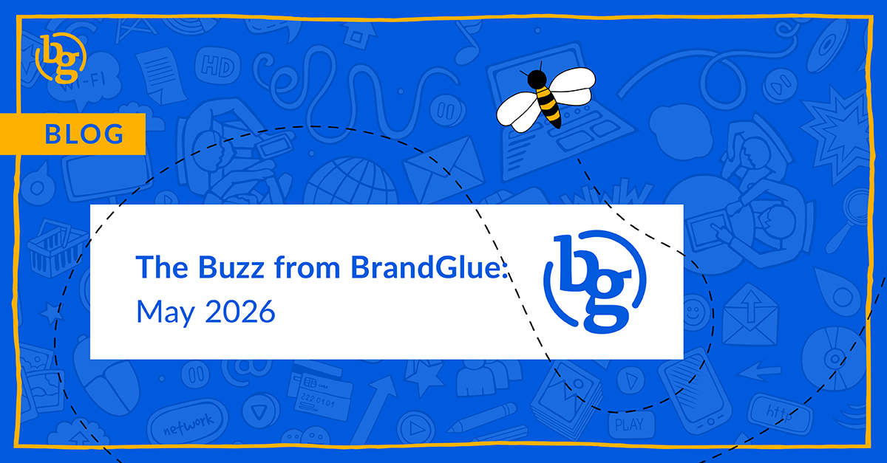

This blog summarizes the major social news and updates that took place in May 2026. From LinkedIn using AI to monitor “AI slop” to Meta launching the new Forum app to captions coming to posts within carousels on Instagram, it was another busy month in the social sphere. Read on to stay in-the-know. 

### \> [Think Again About Relying on AI-Generated Content on LinkedIn](https://www.linkedin.com/pulse/keeping-conversations-real-linkedin-laura-lorenzetti-9821e/)

Source: LinkedIn Pulse

Even though you’ve probably seen a lot of articles on how LinkedIn is leaning into AI, the platform is also making combating “AI slop” a major priority. According to Laura Lorenzetti, there has been a big rise in low-effort, AI-generated content that lacks a unique perspective or anything of substance. The new tools, which ironically are heavily reliant on AI, will focus on the comments members create and post via automation tools, and responses that restate the original post without sharing anything new. Early results are showing a 94% success rate.

### \> [LinkedIn is Bringing its Immersive Video Feed to More Markets](https://www.linkedin.com/pulse/video-feed-breakdown-part-i-linkedin-guide-to-creating-1tbnc/)

Source: LinkedIn Guide to Creating

Buried in a new update on the latest video recommendations from LinkedIn was an announcement that the platform is bringing its video tab and carousel to more markets. Initially rolled out to U.S. users beginning in December 2024, they are now looking to further expand it throughout Canada, the U.K., and Australia. Since debuting this new experience, video watch time in the LinkedIn app has increased 36% YoY, while short-form video creation is also growing much faster than other formats.

### \> [Meta Launches New Forum App](https://www.socialmediatoday.com/news/meta-launches-new-group-focused-forum-app/821047/)

Source: Social Media Today

With Reddit becoming one of the most cited sources for AI chatbot answers (for better or worse), Meta is looking to replicate this with its newly launched app called Forum. It is essentially a separate app for group discussions that brings together all of the groups that you are a member of on Facebook and puts them in a separate engagement experience. This is being pitched as a “dedicated space that is built for deeper discussions, real answers, and the communities you care about.” If Meta is able to get adoption of this app up, it could be a nice shot in the arm to Facebook Groups while also bumping up chatbots’ reliance on Meta.

### \> [Captions on Each Post Within Carousels on Instagram](https://www.threads.com/@binnysfoodandtravel/post/DYMl856jVqw)

Source: Binnys Food and Travel (Threads Account)

A new update that’s being tested would give Instagram users the ability to caption each unique image or video within a carousel. This seems to have been a long time coming and would be a huge step in maximizing the value of multi-media posts. Carousel posts are already among the most engaging, with Buffer claiming they generate an average of 12% more engagement per post. With more opportunities to generate a heart via additional captions, this increases the likelihood of your reach increasing as well.

### \> [Are X’s New Ad Opportunities Worth It?](https://digiday.com/marketing/pitch-deck-x-leans-on-ai-and-performance-in-a-bid-to-win-ad-dollars/)

Source: Digiday

In its latest bid to bring advertisers back to the platform, X is leaning on insights from its new AI-driven ad targeting process that claims X users are generally within higher income brackets than users on other social apps. X also says its 18-24 year-old audience reach is rising, and shared the most discussed topics in the app for 2025, which include sports, movies and entertainment, politics, gaming, technology, and crypto. If its ad targeting works even close to what they say, it may be worth a test if your audience is active in these topics.

### \> [New Brand Safety Options for Threads Ads](https://www.facebook.com/business/news/brandsafety)

Source: Meta

One of the most unsung advertising features on Meta is the ability to utilize third-party content block lists. This has been critical for many brands on Facebook and Instagram because it ensures that their ads don’t accidentally show up on a website or in an app that could damage their image. This protection is now available on Threads and should give advertisers more peace of mind that their promoted content won’t appear beside anything objectionable.

**That’s a wrap on the updates!**

Join us again next month as we continue to bring you the latest and greatest updates to help you succeed in the B2B social media marketing community. In the meantime, follow us on [LinkedIn](https://www.linkedin.com/company/brandglue-com/posts/?feedView=all) for additional updates.