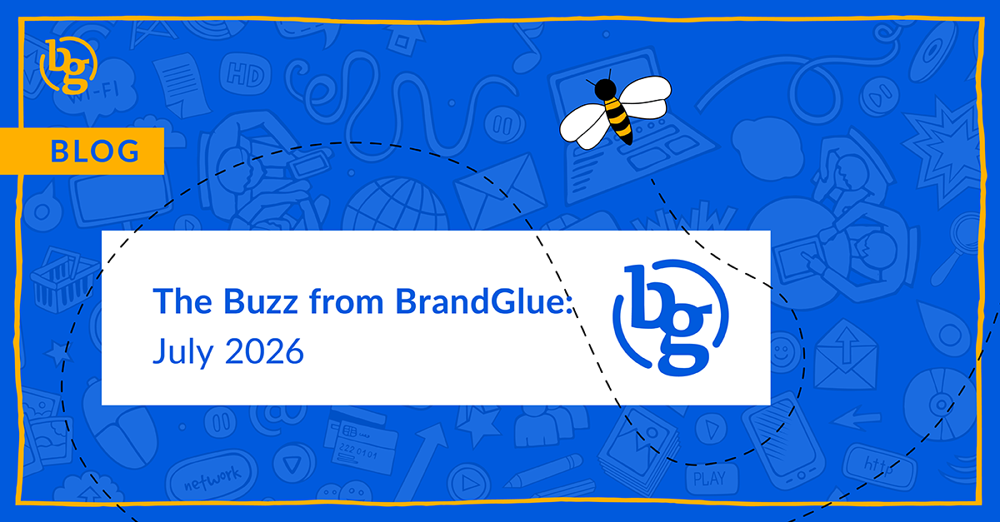

This blog summarizes the major social news and updates that took place in July 2026. From LinkedIn introducing new creative tools to AI content flooding social platforms (including LinkedIn) to Meta launching Muse Image to private ‘likes’ being tested on Threads, it was another busy month in the social sphere. Read on to stay in-the-know. 

### \> [LinkedIn Introduces New Creative Tools](https://www.linkedin.com/business/marketing/blog/linkedin-ads/introducing-linkedins-new-creative-tools-draft-with-ai-brand-kit-and-ad-variants) 

Source: LinkedIn Marketing Blog

We’re big fans of testing and always admit we don’t usually know which variation will win. That is why we always encourage running multiple ad variations with different copy, headlines, graphics, and video. LinkedIn is looking to help marketers who want to take this approach but who may be a little short on time. Brand Kit lets advertisers define colors, fonts, logo, tone of voice, and key messages. This way, every new ad created with their AI tools stays on-brand. We don’t use AI to create our ads, but we will definitely be paying attention to this.

### \> [AI Content is Flooding LinkedIn (And Other Platforms, Too)](https://www.pangram.com/blog/ai-in-your-feed) 

Source: Pangram

Despite LinkedIn’s best efforts, it seems their platform is the one seeing the worst impacts of AI spam. According to Pangram, 41% of all long-form posts on LinkedIn show indicators that they were created by AI tools. Even with LinkedIn saying it would limit the reach of posts found to contain a large amount of AI content, and despite users routinely pushing back against being forced to use AI tools, it seems people are still choosing to use them to promote their content.

### \> [Better AI Image Generation Tools On the Way for Meta](https://www.facebook.com/business/news/muse-image-for-businesses)  

Source: Meta

Anyone who has built a campaign on Meta recognizes it. You upload your image, and the social network immediately tries to get you to accept a dozen more variations that their AI tools generated. Some of the time, they can be helpful, but most of the time, the options are mostly just slightly lightened or darkened, or have a different background. With the introduction of Muse Image, Meta claims that their agentic visual reasoning can understand “complex creative briefs the way a designer would”. This is supposed to lead to more elements being adjusted, new styles, and enhanced variations based on the original creative.

### \> [Future In-App AI on Instagram Tools Come With a Price](https://www.socialmediatoday.com/news/instagram-will-charge-for-ai-access/825021/) 

Source: Social Media Today

Monetizing AI tools has been one of the biggest challenges for social networks. We certainly agree that they aren’t cheap to run, but what is the sweet spot in terms of getting users to sign up for a subscription model? Instagram Chief Adam Mosseri confirmed in a recent Q&A that these tools will be offered free to start, but that there will be a cap on how many times they can be used per day. It remains to be seen if Meta can come up with an offering that is attractive enough that someone needs to pay to use it more than a few times a day.

### \> [New Grok Integration for Ads Manager](https://www.threads.com/@testingcatalog/post/Dak8wLMjTDY?_sp=30316898-5e0a-4c93-9b0f-4a2baf088844.1785352646934) 

Source: Testing Catalog (Threads)

Have questions about your X campaign? Some users can now ask xAI’s Grok chatbot for guidance on their ad strategy. This is another step closer to the company’s goal of agentic ad generation, where the platform would use Grok’s AI tools to build campaigns based on an understanding of the targeted audience and what they might respond to. Of course, AI is only as good as the information it goes off of, and with X being notorious for bots and poor demographic targeting, it remains to be seen how effective these campaigns can be.

### \> [Private Likes Testing Underway on Threads](https://embedsocial.com/blog/new-threads-features-2026/) 

Source: Embed Social

Is a more discreet engagement coming to Threads? Currently being tested with a small group of users, the social network is testing a new Private Likes option that lets users hide their likes from everyone except themselves and the post author. If it is available to you, it will be found when going to Settings > Privacy > Private likes.

**That’s a wrap on the updates!**

Join us again next month as we continue to bring you the latest and greatest updates to help you succeed in the B2B social media marketing community. In the meantime, follow us on [LinkedIn](https://www.linkedin.com/company/brandglue-com/posts/?feedView=all) for additional updates.