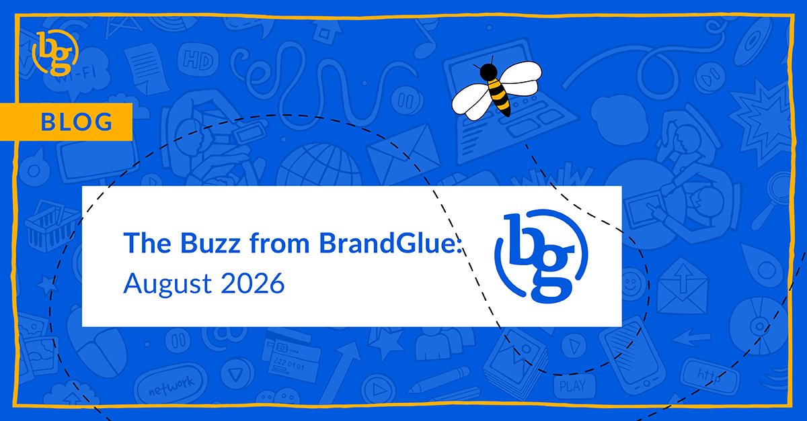

This blog summarizes the major social news and updates that took place in August 2026. From LinkedIn relaying the ideal audience size for paid campaigns to advertisers no longer able to manually control placements for ads on Meta to Instagram launching auto-generated responses to comments, it was another busy month in the social sphere. Read on to stay in-the-know. 

### \> [Your Ideal Target Audience Size on LinkedIn](https://www.linkedin.com/posts/create-your-next-campaign-with-our-four-step-ugcPost-7465332631606407168-M0RN/) 

Source: LinkedIn for Marketing

Every so often, LinkedIn shares a new playbook that contains recommendations for running successful advertising campaigns and engaging your audience. A lot of the time, you’ll get a rehashing of things like video, polls, and carousels, but every so often there is a useful piece of information that can be easy to miss. In this guide, they dedicate an entire slide to explaining why 50K-500K is the ideal audience size for ad campaigns. This is the polar opposite approach of Meta’s: we’ll take your parameters as “suggestions,” but we’re gonna blast this to a broad audience whether you want us to or not.

LinkedIn does say that 1K-50K for retargeting audiences is fine because they’re already warmed up, but it is noteworthy that they recommend staying under 500K for advertising campaigns.

### \> [Meta Ad Placement Controls Going the Way of the Dinosaur](https://www.jonloomer.com/meta-removing-placement-controls-ad-sets/)

Source: Jon Loomer

If you were an advertiser who liked to have more manual control over your placements (e.g., no stories, reels) or platforms (e.g., no Audience Network, separate campaigns for Facebook and Instagram, etc.), those days are coming to an end. Most marketers are now seeing the announcement that changes to placement settings are coming soon. Not only will ad placements and platforms be impacted, but you’ll no longer be able to exclude based on devices or operating systems.

It is important to note that this only applies to Sales and Leads objectives. So if you are still running Traffic or Awareness ads, you should still be able to maintain more of those controls. If you’re running a Sales or Leads campaign and still need to restrict things, the most effective way to limit any of the elements is to set Value Rules. This will allow you to bid more or less based on placement, platform, device, or operating system. From our experience, manually removing placements like Audience Network on Sales or Leads campaigns tends to take more time than it is worth because Meta doesn’t typically burn budget on underperforming channels.

### \> [Auto-Generated Responses for Comments on Instagram ](https://www.jonloomer.com/reply-to-keywords-meta-ads-feature/)

Source: Jon Loomer

You may have seen a new Conversations box that gives you the ability to “Reply to Keywords”. This feature lets you set up to five keywords or phrases that will send an automated private message to a user when they comment with one of those triggers. Your private message can include a link, phone number, or email, but currently it seems this feature is only available for Instagram and not Facebook placements. At this point, it may only make sense if your ads get a high volume of comments and you struggle to keep up with responses.

### \> [Out With the New and In With the Old on X?](https://x.com/XBusiness/status/2092614843220074912?_sp=686fbd42-16ca-4a42-b2d3-c5078039cfb1.1787833113781&s=20) 

Source: X Business

X’s lead gen ads will now include a colored CTA on its promoted posts, with the color based on the main image or video in the ad. If this sounds familiar, it’s because that is how the lead gen ads used to look [10 years ago](https://www.socialmediatoday.com/news/twitter-is-quietly-removing-lead-generation-campaigns/450332/). Will this be a return to glory as we’ve seen for bell-bottom jeans and classic dine-in Pizza Hut locations? Or will X’s historically poor targeting due to limited personal information continue to disappoint advertisers? Only time will tell.

### \> [Threads Insights Now Includes AI Summaries](https://www.threads.com/@jonahmanzano/post/DcQuR2uCbC8) 

Source: Jonah Manzano (Threads)

Some Threads users are now seeing AI-powered summaries in their Insights section. This is designed to give people a quicker read on how their account is doing without spending time digging through the raw metrics. This can definitely be helpful if you are trying to build an active presence on the platform and are short on time.

**That’s a wrap on the updates!**

Join us again next month as we continue to bring you the latest and greatest updates to help you succeed in the B2B social media marketing community. In the meantime, follow us on [LinkedIn](https://www.linkedin.com/company/brandglue-com/posts/?feedView=all) for additional updates.