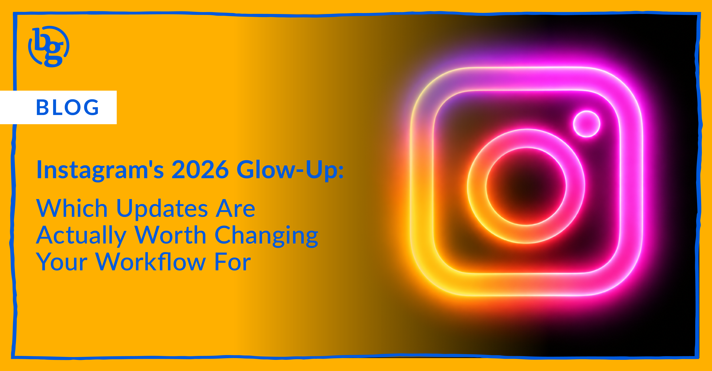

Instagram had a lot going on in 2026. New logo, a grid you can \*finally\* rearrange, captions that don't have to match on every carousel slide, Stories you are able to fix instead of deleting, and a subscription model that could genuinely change how B2B brands drive traffic. That's a lot to catch up on if you've been heads-down just trying to stay on top of content production and campaigns all year. (Missed what changed everywhere else? Catch up on our [August The Buzz from BrandGlue](https://brandglue.com/blog/the-buzz-brandglue-august-2026/) roundup.)

To help you out, we rounded up the five updates worth knowing about, and gave you our honest read on which ones deserve a spot in your social media workflow and which ones you can quietly ignore.

## The New Logo (Interesting, But Don't Overthink It)

Instagram rolled out a refreshed wordmark starting in August, swapping in a bolder, more modern script typeface as part of a bigger brand identity overhaul that also includes new custom fonts (Instagram Sans, Instagram Pen, and Instagram Mono). Jasmine Probst, Instagram's Director of Product Design, [told Meta's design team](https://www.meta.com/design-at-meta/blog/the-new-instagram-brand-identity/) the goal was something that "feels personal, confident and unique."

**The BG take:** This one's purely cosmetic. Nothing to strategize here, just make sure any brand assets or templates referencing the old wordmark get swapped out. You might want to also update the icon for IG in your brand’s website footer. Not a workflow change, just a heads up.

## Reordering Your Grid (Finally)

After [years of people deleting and reposting content](https://www.techtimes.com/articles/318046/20260609/instagram-grid-reorder-ships-globally-ending-years-delete-repost-workarounds.htm) just to move it up the grid, Instagram fully rolled this out globally on June 8. Tap and hold any post, select "Reorder grid," and drag it wherever you want. Changes are instant and visible to everyone who visits the profile.

**The BG take:** Worth exploring, and it's free and easy. If you've got a pinned campaign, a client testimonial, or a top-performing post you want new visitors to see first, this is a simple way to control that first impression without touching your content calendar.

## Unique Captions Per Carousel Slide

Carousels can hold up to 20 photos, and you can toggle on individual captions for each slide instead of one caption covering the whole post. It's opt-in, so nothing changes if you don't touch it.

**The BG take:** This is a genuinely useful one, especially for B2B brands doing educational or thought-leadership carousels. Being able to build out a real narrative arc, slide by slide, instead of cramming everything into one caption block, opens up better storytelling and probably better retention through the swipe. Worth leaning into your own voice here too: [our testing found human-written posts still out-perform AI-generated ones](https://brandglue.com/blog/ai-vs-human-social-media-posts-findings/), so this is a good spot to actually write, not template, each slide. Note: You might have to post natively, as most social tools like Sprout Social and Hootsuite don’t support this feature yet.

## Editing Stories After Posting (Still in Testing)

This is the one everyone's been asking for, but it's not fully here yet. Instagram is testing the ability to edit a live Story instead of deleting and reposting it, but there's a catch: [when you start editing, the original Story disappears and all its likes, reactions, and replies reset to zero](https://www.absolutegeeks.com/article/tech-news/instagram-finally-lets-users-edit-stories-after-posting/). It's also unclear yet whether stickers, music, and links will be editable or just text.

**The BG take:** Not worth building a workflow around this update yet. It's still in testing, iOS-only reports so far, and losing your engagement history to fix a typo isn't much of an upgrade. 

## Meta One (The Big One)

This is a big one. Meta officially [launched Meta One in May](https://techcrunch.com/2026/05/27/meta-officially-launches-instagram-facebook-and-whatsapp-subscriptions-with-more-to-come-including-ai-plans/) as its new umbrella subscription brand for creators and businesses, with two relevant tiers:

* **Meta One Essential ($14.99/mo)** gets you a verified badge, impersonation protection, and an enhanced linksheet.
* **Meta One Advanced ($49.99/mo)** adds featured placement in the Facebook feed, higher search visibility, a bold "Follow" button on Reels, better analytics with competitive insights, and the headline feature: the ability to add clickable links directly in Instagram posts to drive people to your site or shop.

**The BG take:** This is the one worth taking seriously. Links in posts has been an Instagram wishlist item forever, and for B2B brands trying to drive traffic to gated content, demos, or a website, that's a real workflow change, not just a nice-to-have. The Advanced tier's price tag isn't nothing, so it's worth running the math on whether the traffic lift justifies $50 a month per account, but this is the update we'd actually recommend testing.

If you're trying to figure out which of these makes sense for your brand specifically, that's exactly the kind of thing we like to dig into. Reach out and we'll help you sort the shiny from the strategic — or [see what that partnership actually looks like first](https://brandglue.com/blog/partner-b2b-social-first-agency/).

**And let us know, which feature are you most excited about?**