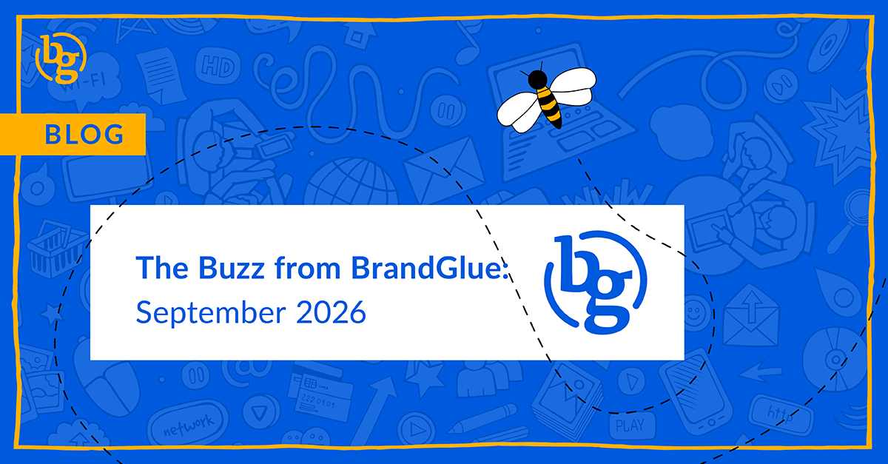

This blog summarizes the major social news and updates that took place in September 2026. From LinkedIn ranking comments based on relevance to help weed out AI slop to the launch of Meta One and what that means for brands to being able to add a tagged post to a brand’s Instagram grid, it was another busy month in the social sphere. Read on to stay in-the-know. 

### [\> LinkedIn Now Ranks Comments by Relevance](https://socialday.live/features/linkedin-ranks-comments-by-relevance-as-30-turn-out-to-be-ai-generated) 

Source: Social Day

LinkedIn seems to have really committed themselves to identifying and rooting out “AI slop” as much as possible. One of their bigger focuses has been on AI-generated comments, which according to their analysis from April-June 2026 accounts for around 30% of responses on the platform. To help get around this and improve the user experience, LinkedIn is ranking comments based on relevance instead of when they were posted. The network says that they are using data like professional interests, connections, and engagement activity to determine which replies matter to an individual user.

With the first reply no longer holding privileged visibility, this will hopefully lead to more substantive discussions in the comment section.

### [\> What Does Meta One Mean for Brands? ](https://www.jonloomer.com/meta-removing-placement-controls-ad-sets/)

Source: Jon Loomer

In an ode to Jerry Seinfeld breaking George’s engagement to Elaine, the big news this month comes courtesy of Meta. Their recently announced subscription plan was touted as having exclusive features that would help brands deepen their reach through new tools that grew depending on how much they were willing to spend.

Unfortunately, as has been the case with most of Meta’s “big announcements” in recent years, this one has been met with substantial backlash due to businesses being limited to two organic posts or comments that include links per month unless they pay for a Meta One plan. So how much do you have to pay if you want to regularly include links in your organic posts? $14.99/month still gets only two, while $49.99/month gets 8, $149.99/month gets 20, and $499.99/month gets unlimited. That’s right. $500 just to post more than 20 links in a month. Worst part? Meta notes this is per page, so you may need to multiply that monthly across the number of connected accounts your business has. Truthfully, we don’t think this sticks, but those AI bills are coming due so we will see.

### [\> Tagged in a Post? Add It to Your Instagram Grid! ](https://www.socialmediatoday.com/news/instagram-lets-users-add-tagged-posts-to-profile-grids/830126/)

Source: Social Media Today

If you’ve ever been tagged in a post by a big brand or just had a partner share one that you really liked, you can now add that post to your main profile grid. When you see a tagged post, the tagged account will see a new “Add to grid” option which then lets it be displayed with a tag icon in the top right of the thumbnail. While this may not seem like a groundbreaking update by any means, it is still a nice low-effort way to amplify content as much as possible to a larger user base.

### [\> Building More Effective Ad Campaigns on X ](https://x.com/XBusiness/status/2092614843220074912)

Source: X Business

Due to X’s poor targeting and lack of reliable demographic data, it has admittedly been years since we have run or even recommend running an ad campaign on X. While most of the tips, such as keeping the ad copy concise and include a strong CTA, aren’t earth shattering, the key events note can be worth paying attention to if your brand has an app that they want to drive installs of. Capitalizing on a real-time event with an app that solves a problem can lead to a big win for your brand.

### [\> Threads: Advertisers No Longer Need an Instagram Account to Run Campaigns](https://www.facebook.com/business/help/1888797071720635)

Source: Meta Business

Going forward, advertisers will no longer need to have a matching username on both Instagram and Threads to run campaigns. If you do not have an Instagram presence, that is no longer a barrier to launching ads natively using your Threads profile. Meta claims that the platform has around 500 million users, and with the way Threads is used being vastly different from how Instagram is, this separation makes sense and will hopefully be another step in allowing both to stand on their own.

**That’s a wrap on the updates!**

Join us again next month as we continue to bring you the latest and greatest updates to help you succeed in the B2B social media marketing community. In the meantime, follow us on [LinkedIn](https://www.linkedin.com/company/brandglue-com/posts/?feedView=all) for additional updates.