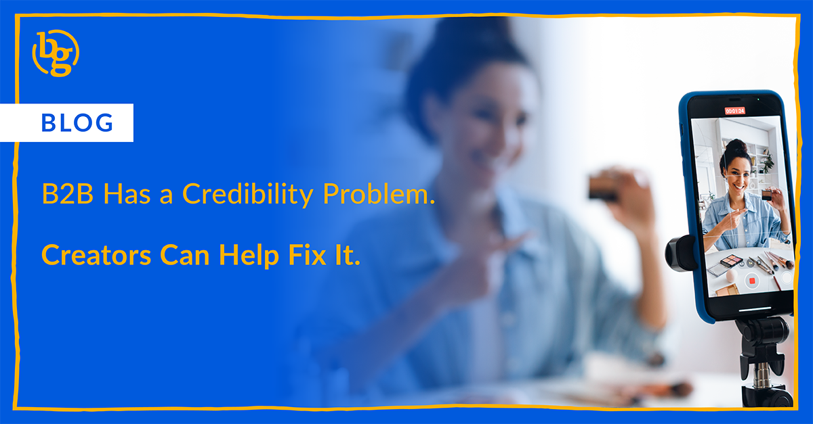

B2B buyers don’t need more brand messaging. They need reasons to believe it. New LinkedIn research shows how creators, executives, employees, and customers can help brands build credibility, and what actually makes their content work.

B2B marketers spend a lot of time figuring out how to get in front of the right people. We target the right job titles, build the right audiences, serve the right ads, retarget, and repeat. But there’s another problem targeting alone can’t solve: Does your audience actually believe you?

That was one of the biggest themes from LinkedIn’s recent [The Credibility Code: Creators Drive Trust at Scale](https://business.linkedin.com/advertise/resources/b2b-institute/credibility-code) webinar. According to research shared by LinkedIn, **40% of B2B deals are lost to indecision rather than competitors**, and the average B2B sales cycle lasts 272 days once a buyer is actually in-market. That means brands aren’t just competing against other companies. They’re competing against uncertainty.

LinkedIn calls the solution “buyability,” or building collective confidence across the buying group so your brand is discoverable, credible, and proven to drive real business outcomes.

We’d put it a little more simply: B2B has a credibility problem. And more corporate content probably isn’t going to fix it.

## Credibility Is a Team Sport

One of the most interesting ideas LinkedIn shared was its “credibility stack.” The basic idea is that credibility doesn’t come from a single source. **The brand sets the point of view, employees humanize it, customers and peers validate it, and creators scale it.**

That matters because the definition of a B2B “creator” has expanded far beyond traditional influencers. An industry expert with 100,000 followers might be part of your creator strategy, but so might an [executive building thought leadership on social media](https://brandglue.com/blog/key-ways-social-media-revolutionize-executive-thought-leadership), an employee explaining a complicated topic, or a customer showing how they actually use your product.

The data shows why those voices matter. LinkedIn shared that employee networks have **12x the reach of company page followers**, and activating employees as creators can generate a **6x engagement lift**. Yet only 3% of employees are currently sharing relevant company content on their feeds.

Customers and peers bring another layer of credibility. According to the research, **82% of buyers say peers are their most trusted source**, and buyers are three times more likely to choose a recommended vendor over a cheaper alternative.

Then there are external creators. LinkedIn reported that **82% of B2B buyers say creator content influences their decisions**, while four in five say creators can reach niche or hard-to-access communities.

Put all of that together, and B2B influencer marketing starts to look less like a standalone tactic and more like part of a much larger credibility strategy.

## Follower Count Isn’t a Strategy

This is something [we’ve been saying for a while](https://brandglue.com/blog/b2b-social-hot-takes), and LinkedIn’s research gives us even more reason to stand by it: The biggest creator isn’t necessarily the best creator.

LinkedIn analyzed 11,000 creator-led Thought Leader Ads, looking at characteristics ranging from creator type and tone to branding, audio, environment, and visual style. The ads were then evaluated for brand recall, consideration, and longer-term brand impact.

Overall, B2B creator-led ads were predicted to drive **1.2x stronger consideration and 1.5x stronger long-term brand impact** than average short-form ads without creators.

But some creator types performed particularly well. Educators generated **1.5x stronger brand impact**, while creators with a clear point of view saw a **43% median engagement uplift**. Executives also stood out, generating **1.4x stronger brand impact and 1.3x stronger consideration**.

For B2B brands, that reinforces something important about influencer selection. Reach matters, but expertise, relevance, credibility, and the ability to communicate a real point of view can matter just as much, if not more.

Sometimes the person your audience needs to hear from isn’t the person with the largest following. It’s the person who actually knows what they’re talking about and can make the audience care.

## B2B Video Doesn't Need to Feel So B2B

Video was another major theme of LinkedIn’s research. The platform is currently seeing **3x more engagement on video than other formats**, along with 1.5x more video views from decision-makers.

But before you book the studio, write the teleprompter script, and start planning a 14-person production crew, there’s an important catch: The less corporate content often performed better. 

LinkedIn found that content combining good production basics with a more natural, lo-fi creator style performed **52% above engagement benchmarks**. Handheld and walk-and-talk content also drove **1.4x stronger brand impact and consideration**.

The takeaway isn’t that B2B brands should start publishing poorly produced videos. Good lighting, clear audio, and thoughtful execution still matter. What doesn’t always help is polishing the personality out of the person on camera.

The best creator content feels like it came from an actual person because it did.

## The First Three Seconds Matter

Getting someone to watch your video is one thing. Getting them to stop scrolling in the first place is another.

LinkedIn found that strong opinions, hot takes, and other pattern interruptions in the opening seconds drove a **40% engagement uplift**, along with 1.5x stronger brand impact and consideration.

That doesn’t mean every executive needs to start posting rage bait. But it might mean we can retire a few videos that begin with, “Hi, I’m \[Name], and today I’m excited to talk to you about…”

Instead, start with the interesting part. What does the creator disagree with? What is the industry getting wrong? What happened that changed their perspective? What would make someone scrolling LinkedIn stop and think, “Wait, what?”

The hook doesn’t need to be controversial. It just needs to give people a reason to keep watching.

## Proof Beats Promotion

If there was one theme running through nearly all of LinkedIn’s findings, it was that buyers want proof, not promises.

Stating a creator’s credentials drove **1.3x stronger brand impact**, while personal or peer stories drove **1.4x stronger brand impact**. Personal anecdotes also delivered a **31% engagement lift**.

Showing the product in action mattered, too. Content featuring screen shares, physical product interactions, live interfaces, and other demonstrations generated **1.4x higher brand impact**. Content addressing real pain points or providing proof also saw 15% higher engagement.

That creates an important distinction for B2B influencer marketing. The goal shouldn’t be to find someone your audience trusts and hand them a list of product talking points. It should be to give that person the information and access they need to show why the product matters in a way their audience will actually believe.

Instead of telling someone, “This platform helps finance teams work more efficiently,” show the task that used to take three hours and how the creator does it now.

One is a claim. The other is proof.

## What This Means for B2B Influencer Marketing

The biggest takeaway for us is that B2B brands shouldn’t think about influencer marketing, executive social, employee advocacy, and customer advocacy as completely separate worlds. They’re different pieces of the same credibility engine.

We’ve seen that firsthand in the B2B influencer programs we manage. The strongest-performing creator partnerships are rarely the ones where a brand hands over a script and asks for a product mention. They’re the ones where the creator has a genuine connection to the topic, a clear point of view, and enough flexibility to explain the value in a way that feels natural to their audience.

Across our programs, we’ve also seen that highly relevant niche creators can outperform larger names when the audience fit is stronger. **In B2B, credibility and context often matter more than raw follower count.**

A strong brand point of view gives people something worth talking about. Executives and employees put actual humans behind that point of view. Customers validate it through real experience. External creators bring independent expertise, established trust, and access to communities the brand might struggle to reach on its own. Paid media can then help the strongest content reach even more of the right people.

And brands don’t need to activate every piece of that ecosystem at once. LinkedIn’s recommendation was to start small with executives and build from there. The same approach can work for a B2B influencer program: Find a few credible voices who genuinely fit your audience, give them room to sound like themselves, test different formats and hooks, put paid support behind what resonates, and learn before you scale.

Because the next phase of B2B marketing probably isn’t about brands figuring out how to talk louder.

**It’s about giving the right people something worth saying and letting them say it like actual humans.**

Ready to build a B2B creator program people actually trust?

From finding the right voices to building partnerships, developing content, and amplifying what works, BrandGlue helps B2B brands create influencer programs built around credibility, not just reach.

[Let’s talk about your influencer strategy](https://brandglue.com/contact/).